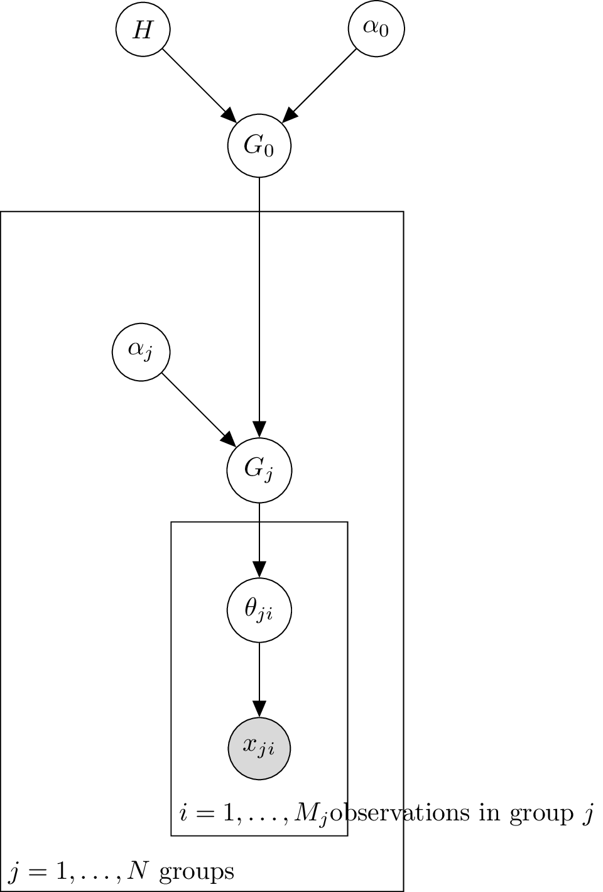

## Introduction

A key characteristic of cancer is the elevated mutation rate in somatic cells. Recognizing the patterns of somatic mutations in cancer is essential for understanding the underlying mechanisms that drive the disease (Fischer et al., 2013). This knowledge is crucial for advancing cancer treatment and prevention.

One type of somatic mutation is the single nucleotide variant (SNV), also referred to as a single base substitution. This involves the replacement of one base pair in the genome with another. There are six possible base pair mutations: C:G\>A:T, C:G\>G:C, C:G\>T:A, T:A\>A:T, T:A\>C:G, and T:A\>G:C. When considering the context of the immediate 5' and 3' neighboring bases, the total number of mutations increases to 96, calculated as $6 \times 4 \times 4 = 96$. These are known as trinucleotide mutation channels. Examples of such mutations include ACA:TGT\>AAA:TTT and ACT:TGA\>AGT:TCA. For simplicity, we will abbreviate these mutations as ACA\>AAA and ACT\>AGT respectively.

## Mutational Signature

A mutational signature $\theta$ with respect to trinucleotide mutation channels is a discrete probability distribution over the 96 mutational channels i.e. $\theta\in \Delta^{96}$ where


$$
\Delta^{n} = \left\{ (x_1, x_2, \ldots, x_{n}) \in \mathbb{R}^{n} \mid x_i \geq 0 \text{ for all } i \text{ and } \sum_{i=1}^{n} x_i = 1 \right\}.
$$


A mutational signature $\theta$ can be visualised as in the following.

<figure>

</figure>

The framework for studying somatic mutations through mutational signatures was introduced in a landmark study by Alexandrov et al. (2013), where over 7,000 bulk-sequenced cancer samples were analyzed. Conceptually, a mutational signature represents a biological process acting on the genome, leaving a distinct imprint captured in a probability vector, $\theta$. Well-established examples include the mutational signatures associated with tobacco exposure and UV light. A comprehensive list of mutational signatures and their proposed underlying biological processes is available through the [COSMIC project](https://cancer.sanger.ac.uk/signatures/sbs/). However, experimentally verifying a mutational signature, or its corresponding probability vector $\theta$, remains a significant challenge.

A particular sample is acted upon by different mutational signatures. The sample-specific mutational signature activity of each mutational signatures has been used clinically to stratify patient cohorts.

To estimate mutational signatures and their activities, Alexandrov et al. (2013) employed Non-Negative Matrix Factorization (NMF). NMF and its variations remain the most widely used methods for estimating mutational signatures and mutational signature activities."

Extracts from different papers on overall legitimacy of mutational signatures and proposed underlying biological process

- <mark class="hltr-green">"Furthermore, while earlier analyses reported single signatures, for example of UV radiation (that is, SBS7)2, more recent studies reported multiple versions of these signatures (that is, SBS7a, SBS7b, SBS7c and SBS7d)3, leading the community to question whether some find­ ings are reflective of biology or are simply mathemat­ ical artefacts. Efforts to experimentally validate these abstract mathematical results are therefore warranted."</mark>
- <mark class="hltr-green">"Regardless of the algorithms used for signature identification, common signatures tend to be consistently identifiable in most cohorts examined,"</mark>
- Whether these new signatures <mark class="hltr-yellow">"true biologically or are merely a mathematical outcome is less clear and awaits independent verification."</mark>
- <mark class="hltr-yellow">"This lack of robustness is often due to the non-uniqueness of the NMF decomposition, which --- for any given matrix --- has a potentially infinite set of valid solutions"</mark>
- <mark class="hltr-yellow">"observed mutation counts and the ones predicted from the given set of signatures"</mark>
- <mark class="hltr-yellow">"still no objective way to determine whether the inferred signatures actually correspond to any known mutational"</mark>
- <mark class="hltr-yellow">"often confirmed through experimental data (Segovia et al., 2015; Drost et al., 2017)."</mark>
  Recommended Material on legitamcy of mutational signatures:
- Koh, G., Degasperi, A., Zou, X., Momen, S., & Nik-Zainal, S. (2021). Mutational signatures: Emerging concepts, caveats and clinical applications. *Nature Reviews Cancer*, *21*(10), 619--637. <https://doi.org/10.1038/s41568-021-00377-7>
- Kaufmann, T. L., & Schwarz, R. F. (2024). Improved identification of cancer mutational processes. *Nature Genetics*, *56*(3), 365--366. <https://doi.org/10.1038/s41588-024-01679-w>
- Apart from that, there's a simulation study, which is quite cool: <https://www.biorxiv.org/content/biorxiv/early/2020/12/15/2020.12.14.422764.full.pdf>

Recommended material on mutational signatures

- Koh, G., Degasperi, A., Zou, X., Momen, S., & Nik-Zainal, S. (2021). Mutational signatures: Emerging concepts, caveats and clinical applications. *Nature Reviews Cancer*, *21*(10), 619--637. <https://doi.org/10.1038/s41568-021-00377-7>
- Alexandrov, L. B., Nik-Zainal, S., Wedge, D. C., Aparicio, S. A. J. R., Behjati, S., Biankin, A. V., Bignell, G. R., Bolli, N., Borg, A., Børresen-Dale, A.-L., Boyault, S., Burkhardt, B., Butler, A. P., Caldas, C., Davies, H. R., Desmedt, C., Eils, R., Eyfjörd, J. E., Foekens, J. A., ... Stratton, M. R. (2013). Signatures of mutational processes in human cancer. *Nature*, *500*(7463), 415--421. <https://doi.org/10.1038/nature12477>

## Dirichlet Process (DP)

A useful mathematical concept for our study will be the Dirichlet Process. The Dirichlet process, $\mathrm{DP}\left(\alpha, H\right)$, is a measure on measures. Hence, a sample $\boldsymbol{G} \sim \mathrm{DP}(\alpha, H)$ from the Dirichlet Process is a probabilty measure. An overview of the Dirichlet Process is given in the following table.

| Parameters   | scaling parameter $\alpha>0$, base probability measure $H$.                                                                                                                                                                                                              |
|--------------|--------------------------------------------------------------------------------------------------------------------------------------------------------------------------------------------------------------------------------------------------------------------------|
| Support      | Space of probability measures with the same support as $H$.                                                                                                                                                                                                              |
| Construction | Let $(e\_1, e\_2, \ldots) \sim \operatorname{Stick}(\alpha)$ and $\boldsymbol{\theta}\_1, \boldsymbol{\theta}\_2, \ldots \stackrel{\text{iid}}{\sim} H$. Then $\boldsymbol{G} = \sum\_{k=1}^{\infty} e\_k \delta\_{\boldsymbol{\theta}\_k} \sim \mathrm{DP}(\alpha, H)$. |

Here, $\operatorname{Stick}$ refers to the stick-breaking process. As seen from its construction, $\boldsymbol{G}$ is a discrete probability measure, meaning it has countable support $\boldsymbol{\theta}\_1, \boldsymbol{\theta}\_2, \ldots$. Dirichlet processes are particularly well-suited for modeling mixtures when the number of components is unknown, providing flexibility in the number of components.

### Mathematical properties of Dirichlet Process

It can be shown that the prior distribution $H$ represents the mean of $\boldsymbol{G}$ in the sense that, for any set $A$,


$$
\mathrm{E}_{\boldsymbol{G} \sim \mathrm{DP}(\alpha, H)}(\boldsymbol{G}(A)) = H(A).
$$


Additionally, as $\alpha \rightarrow \infty$, $\boldsymbol{G}$ converges to $H$ in the weak topology. This implies that the concentration parameter $\alpha$ controls the proximity of $\boldsymbol{G}$ to the base distribution $H$.

In summary, $\boldsymbol{G}$ is distributed around the prior distribution $H$, with the variability governed by the value of $\alpha$.

### References

Recommended material for Dirichlet Process

- I like Lectures 11 and 12 from Jeff Miller's course: <http://jwmi.github.io/BMB/index.html>
- https://en.wikipedia.org/wiki/Dirichlet_process
- https://www.geeksforgeeks.org/dirichlet-process-mixture-models-dpmms/
- https://towardsdatascience.com/dont-be-afraid-of-nonparametric-topic-models-d259c237a840
- https://pawel-czyz.github.io/posts/dirichlet-process.html

NoteBook Impelementation of the Dirichlet Process

- https://datamicroscopes.github.io/ncluster.html
- https://github.com/tdhopper/notes-on-dirichlet-processes/tree/master
- https://github.com/tdhopper/notes-on-dirichlet-processes/blob/master/pages/2015-07-28-dirichlet-distribution-dirichlet-process.ipynb

## Modelling mutational signature with DP

We want to derive a Dirichlet Process model for trinucleotide mutations generated by mutational signatures. We will start with a more intuitive mixture model. Let's consider the trinucleotide mutations in a single sample. Recall that there are 96 trinucleotide mutations. We can encode a trinucleotide mutation as $x\in \\{{1,\ldots, 96}\\}$ .

#### Step 1: Known number of mutational signatures $K$

Let's assume we know the number of acting mutational signatures $K$. Let's assume we observe $M$ trinucleotide mutations. We, model the process generating a trinucleotide mutation by a mixture of acting mutational signatures $\tilde{\theta}\_1, \ldots, \tilde{\theta}\_K$:


$$
\begin{aligned}
\Delta^{K} \ni \boldsymbol{e} \mid \alpha,K & \sim \operatorname{Dir}\left(\frac{\alpha}{K} \cdot \mathbf{1}_K\right) \\
[0,1]\ni \mathrm{P}\left(z_i=k\right) & =e_k \text{ for } i=1,\ldots, M\\
\Delta^{96} \ni \tilde{\theta}_k  & \sim \operatorname{Dir}\left(\frac{1}{96} \cdot \mathbf{1}_{96}\right) 
\text{ for } k=1,\ldots, K\\
\{{1,\ldots, 96}\} \ni x_i \mid z_i=k, \tilde{\theta}_k & \sim \operatorname{Categorical} \left(\tilde{\theta}_{k}\right)  \text{ for } i=1,\ldots, M
\end{aligned}
$$


We assume that we have no initial information distinguishing the components, which is captured by the symmetric prior $\operatorname{Dir}\left(\alpha / K \cdot \mathbf{1}\_K\right)$. Here $\operatorname{Dir}$ is the Dirichlet distribution. The event that the $i$th mutation was generated by the $k$-th mutational signature is denoted as $z\_i=k$. The $i$th mutation was generated by the $k$-th mutational signature with probability $e\_k$. We assign independent and identical prior distributions $\operatorname{Dir}\left(\frac{1}{96} \cdot \mathbf{1}\_{96}\right)$ to the mutational signature of each component. The $k$-th component has the mutational signature $\tilde{\theta}\_k \in \Delta^{96}$. Each trinucleotide mutation $x\_i\in {{1,\ldots, 96}}$ is drawn from a categorical distribution.

##### Graphical model for known number of components $K$

We can visualise the process generating the trinucleotide mutation in a sample as a graphical model:

Here the grey background of the circle behind $x\_i$ indicates that $x\_i$ is an observed variable.

#### Step 2: Equivalent model as mixture

We want to integrate out the indicator variable $z\_i=k$ in our model. Let $H=\operatorname{Dir}\left(\frac{1}{96} \cdot \mathbf{1}\_{96}\right)$. We rewrite the equations from [Final_report#Step 1 Known number of components \$K\$](Final_report#Step 1 Known number of components $K$ ) as follows.


$$
\begin{aligned}
\Delta^{K} \ni\boldsymbol{e} \mid \alpha,K & \sim \operatorname{Dir}\left(\frac{\alpha}{K} \cdot \mathbf{1}_K\right) \\
\Delta^{96} \ni \tilde{\theta}_k & \sim H \text{ for } k=1,\ldots, K\\ 
\Delta^{96} \ni\theta_i & \sim G=\sum_{k=1}^K e_k \delta_{\tilde{\theta}_k}\left(\theta_i\right) \text{ for } i=1,\ldots, M\\
\{{1,\ldots, 96}\} \ni x_i \mid \theta_i & \sim \operatorname{Categorical} \left(\theta_i\right) \text{ for } i=1,\ldots, M 
\end{aligned}
$$


Instead of explicit, component-specific $\theta\_k$, we work with the mixture $\theta\_i$. We draw $\theta\_i$ from $\\{\tilde{\theta}\_1, \ldots, \tilde{\theta}\_K\\}$ with the corresponding probabilities $\\{e\_1, \ldots, e\_K\\}$. Instead of imagining that each data point is first assigned a component and then drawn from the distribution associated with that cluster, we now think of each observation as being associated with parameter $\theta\_i$ drawn from some finite distribution $G$ with support on the $K$ means.

#### Step 3: Unknown, unbounded number of components $K$

Let

$$
\Delta^{\infty} = \left\{ (\theta_1, \theta_2, \ldots, ) \in \mathbb{R}^{\infty} \mid \theta_i \geq 0 \text{ for all } i \text{ and } \sum_{i=1}^{\infty} \theta_i = 1 \right\}.
$$


We would now like to extend this model from [Final_report#Step 2 Equivalent model as mixture](Final_report#Step 2 Equivalent model as mixture ) to work without pre-specifying a fixed number of components $K$. Any $K\in \mathbb{N}$ should be possible but we would prefer small $K$. All this is accomplished by


$$
\begin{aligned}
\Delta^{\infty}\ni \boldsymbol{e} \mid \alpha &\sim \operatorname{Stick}(\alpha)\\
\Delta^{96}\ni \tilde{\theta}_k & \sim H \text{ for } k=1,2,\ldots \\ 
G&=\sum_{k=1}^{\infty} e_k \delta_{\tilde{\theta}_k}\left(\theta_i\right) \\
\Delta^{96}\ni\theta_i & \sim G \text{ for } i=1,\ldots, M \\
\{{1,\ldots, 96}\} \ni x_i \mid \theta_i & \sim \operatorname{Categorical} \left(\theta_i\right) \text{ for } i=1,\ldots, M   
\end{aligned}
$$


Here, $\boldsymbol{e}={e\_1, e\_2, \ldots}$ is generated by the stick-breaking process $\operatorname{Stick}$. The the stick-breaking process induces a distribution on $\Delta^{\infty}$. Intuitively, stick-breaking process work by repeatedly breaking off and discarding a random fraction (sampled from a Beta distribution) of a "stick" that is initially of length 1. Each broken off part of the stick has a length $e\_k$. Instead of finite support, $G$ now has countably infinite support $\\{\tilde{\theta}\_1, \tilde{\theta}\_2, \ldots\\}$. We draw $\theta\_i$ from $\\{\tilde{\theta}\_1, \tilde{\theta}\_2, \ldots\\}$ with the corresponding probabilities $\\{e\_1, e\_2, \ldots\\}$.

#### Step 4: Short hand notation

We are not particularly interested in $e$ and $\theta\_k$ as parameters. We summarize the first three lines in the last equation and say that $G$ was genereated by the Dirichlet Process $\mathrm{DP}$ with the parameters $\alpha$ and $H$. This way the above equations simplify to


$$
\begin{aligned}
G &\sim \mathrm{DP}(\alpha, H)\\ 
\Delta^{96}\ni \theta_i \mid G &\sim G \text{ for } i=1,\ldots, M \\
\{{1,\ldots, 96}\} \ni x_i \mid \theta_i & \sim \operatorname{Categorical} \left(\theta_i\right) \text{ for } i=1,\ldots, M   
\end{aligned}
$$


This concludes our derivation of how we can model trinucleotide mutations with a Dirichlet Process. This presents an alternative approach to estimate mutational signature and signature activity as alternative to the classical approach based on Non-negative Matrix Factorisation used in (Alexandrov, 2013).

##### Graphical Model of Dirichlet Process

We can visualise the Dirichlet process as a graphical model:

<figure>

</figure>

## Hierarchical Dirichlet Process (HDP)

By taking composition of multiple [Dirichlet Processes](Final_report#Dirichlet%20Process%20(DP)%5D), we obtain a Hierarchical Dirichlet Process (HDP). Recall that Dirichlet processes excel at modelling mixtures with an unknown number of components. HDPs are tailored for the situation when we have groups of mixture components and/or hierarchies between mixture components. HDP can be viewed as a non-parametric Bayesian clustering method.

### Example

In the [Final_report#Example](Final_report#Example ) we have trinucleotide mutation of a single sample. When we have multiple samples, we expect that the observed trinucleotide mutations in a sample show clear trends and are more similar within a sample than in another sample.

### Graphical Model of Hierarchical Dirichlet Process

We extend the graphical model from [Final_report#Graphical Model of Dirichlet Process ](Final_report#Graphical Model of Dirichlet Process  ) to include hierarchies:

<figure>

</figure>

### Generating model of Hierarchical Dirichlet Process

We start with the prior distribution $H$. We draw multiple Dirichlet Processes:


$$
\begin{aligned}
G_0 &\sim \mathrm{DP}(\alpha_0, H)\\ 
G_j \mid G_0 &\sim \mathrm{DP}(\alpha_j, G_0) \text{ for } j = 1,2,\ldots N \text{ number of patients }\\
\\ \theta_{j i} \mid G_j &\sim G_j \text{ for } i = 1,2,\ldots M_j \text{ number of observations in group }j \\
\left(x_{ji} \mid \theta_{j i}\right) & \sim \operatorname{Categorical} \left(\theta_{j i}\right) 
\end{aligned}
$$


### Estimation of mutational signature and mutational signature activity

Let's assume we have the mutational signatures $\left(\theta\_k\right)\_{k\in \mathbb{N}}\subset \Delta^{96}$ acting on the genome. Borrowing notation from the model with a finite number of mutational signatures, let $z\_{ji}\in \mathbb{N}$ denote the mutational signature that generated the mutation $x\_{ji}\in \\{1,\ldots,96\\}$. By fitting a HDP to our data we will obtain an estimate $\hat{z}\_{ji}$ of $z\_{ji}$. Our estimate $\hat{\theta}\_k$ for the associated probability vector $\theta\_k \in \Delta^{96}$ of mutational signature $k$ is


$$\hat{\theta}_k=\frac{\sum_{l=1}^{96}\sum_{j=1}^N\sum_{i=1}^{M_j} \mathbb{1}(\hat{z}_{ji}=k)\mathbb{1}(x_{ji}=l)\delta_l}{\sum_{j=1}^N\sum_{i=1}^{M_j} \mathbb{1}(\hat{z}_{ji}=k)},$$

where $\delta\_l\in \Delta^{96}$ has mass $1$ at position $l$. Further, we estimate the mutational signature activity $e\_{kj}$ of mutational signature $k$ in sample $j$ by  

$$\hat{e}_{kj}=1/M_j\sum_{i=1}^{M_j} \mathbb{1}(\hat{z}_{ji}=k).$$


### Advantages of HDP approach compared to the classical NMF approach for mutational signature estimation

The HDP approach offers several advantages over the classical NMF approach. First, it allows for the imposition of group structures and the integration of prior knowledge, such as the expectation that certain features should behave in coordinated ways (Roberts, N.D., 2018). Additionally, HDP enables simultaneous matching of the observed mutational catalogue to an existing signature library while discovering new signatures. This is done by pseudo-counting the existing signature library as observational data. Another key benefit is the ability to easily quantify uncertainty, though some variations of NMF also offer this feature. Finally, HDP facilitates learning the number of signatures directly from the data, which is often challenging with the classical NMF approach due to the difficulty in selecting the appropriate number of signatures.

### References

Python Implementations 1

- https://radimrehurek.com/gensim/models/hdpmodel.html
- Gensim is a Python library for *topic modelling*, *document indexing* and *similarity retrieval* with large corpora. Target audience is the *natural language processing* (NLP) and *information retrieval* (IR) community.
- https://github.com/piskvorky/gensim/blob/develop/gensim/models/hdpmodel.py
- based on https://github.com/blei-lab/online-hdp
- https://towardsdatascience.com/dont-be-afraid-of-nonparametric-topic-models-d259c237a840
- https://towardsdatascience.com/dont-be-afraid-of-nonparametric-topic-models-part-2-python-e5666db347a
- https://github.com/ecoronado92/hdp
- https://github.com/morrisgreenberg/hdp-py

Python Implementations 2

- https://radimrehurek.com/gensim/models/hdpmodel.html
- Gensim is a Python library for *topic modelling*, *document indexing* and *similarity retrieval* with large corpora. Target audience is the *natural language processing* (NLP) and *information retrieval* (IR) community.
- https://github.com/piskvorky/gensim/blob/develop/gensim/models/hdpmodel.py
- based on https://github.com/blei-lab/online-hdp
- https://towardsdatascience.com/dont-be-afraid-of-nonparametric-topic-models-d259c237a840
- https://towardsdatascience.com/dont-be-afraid-of-nonparametric-topic-models-part-2-python-e5666db347a
- https://github.com/ecoronado92/hdp
- https://github.com/morrisgreenberg/hdp-py
- Simple Jupyter notebook: https://github.com/tdhopper/notes-on-dirichlet-processes/blob/master/pages/2015-07-30-sampling-from-a-hierarchical-dirichlet-process.ipynb (just for sampling?)

Recommended Material for HDP

- Teh, Y. W., Jordan, M. I., Beal, M. J., & work(s):, D. M. B. R. (2006). Hierarchical Dirichlet Processes. *Journal of the American Statistical Association*, *101*(476), 1566--1581.
- Used in: Li, Y., Roberts, N. D., Wala, J. A., Shapira, O., Schumacher, S. E., Kumar, K., Khurana, E., Waszak, S., Korbel, J. O., Haber, J. E., Imielinski, M., PCAWG Structural Variation Working Group, Akdemir, K. C., Alvarez, E. G., Baez-Ortega, A., Beroukhim, R., Boutros, P. C., Bowtell, D. D. L., Brors, B., ... Von Mering, C. (2020). Patterns of somatic structural variation in human cancer genomes. *Nature*, *578*(7793), 112--121. <https://doi.org/10.1038/s41586-019-1913-9>
- I like Lectures 11 and 12 from Jeff Miller's course: <http://jwmi.github.io/BMB/index.html>
- [Covering Hierarchical Dirichlet Mixture Models on binary data to enhance genomic stratifications in onco-hematology](https://journals.plos.org/ploscompbiol/article?id=10.1371/journal.pcbi.1011299)
- Alam, Md Hijbul, et al. "Tree-structured hierarchical Dirichlet process." *Distributed Computing and Artificial Intelligence, Special Sessions, 15th International Conference 15*. Springer International Publishing, 2019.
- https://en.wikipedia.org/wiki/Hierarchical_Dirichlet_process
- https://mlg.eng.cam.ac.uk/zoubin/tut06/ywt.pdf

References on HDP for mutational signautre estimation

- Used in: Li, Y., Roberts, N. D., Wala, J. A., Shapira, O., Schumacher, S. E., Kumar, K., Khurana, E., Waszak, S., Korbel, J. O., Haber, J. E., Imielinski, M., PCAWG Structural Variation Working Group, Akdemir, K. C., Alvarez, E. G., Baez-Ortega, A., Beroukhim, R., Boutros, P. C., Bowtell, D. D. L., Brors, B., ... Von Mering, C. (2020). Patterns of somatic structural variation in human cancer genomes. *Nature*, *578*(7793), 112--121. <https://doi.org/10.1038/s41586-019-1913-9>
- https://github.com/nicolaroberts/hdp
- Roberts, N.D., 2018. *Patterns of somatic genome rearrangement in human cancer* (Doctoral dissertation).
- Appendix B [Page 234](zotero://open-pdf/library/items/A44HM2CK?page=234&annotation=FQ4MT4UV)
- Chapter 4 [Page 132](zotero://open-pdf/library/items/A44HM2CK?page=132&annotation=492B8JQX)

