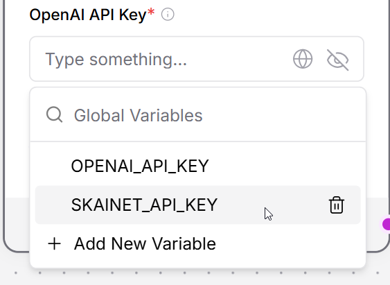

# AI Playground

This repository serves as a starting point for AI topics to be tackled at Herbstretreat 2025.

## Table of Contents
- [Langflow via Docker Compose](#langflow-via-docker-compose)
- [Getting Started with Agentic Flows in Langflow](#getting-started-with-agentic-flows-in-langflow)

This repository includes a Docker Compose setup for running [Langflow](https://github.com/langflow-ai/langflow) locally.

## Langflow via Docker Compose

Compose file: `docker-compose.yml`

Service details:
- Base image: `langflowai/langflow:1.6.7` (custom Dockerfile with automatic document import)
- Port mapping: `7860:7860` (access at http://localhost:7860)
- **Automatic document import**: On startup, the following files from the repo root are automatically uploaded to Langflow and available for use in flows:
  - `content/_index.md` → `repository-homepage.md`
  - `content/authors/admin/_index.md` → `author-information.md`
  - `public/uploads/resume.pdf` → `resume.pdf`
  - `content/publication/preprint/cite.bib` → `publication-preprint-cite.bib`
  - `content/publication/preprint/index.md` → `publication-preprint.md`
  - `assets/media/icons/brands/` → mounted as `brand-icons/` directory

### Prerequisites
- Docker Desktop (Windows / macOS) or Docker Engine (Linux)
- Enough disk space for Langflow data in `./data/langflow`

### Quick Start (Windows cmd.exe)
```
docker compose build
docker compose up -d
```
Then open: http://localhost:7860

**Note**: The first time you run this, it will build a custom Docker image that extends Langflow with automatic document import functionality. Subsequent starts will be faster.

### Stopping & Cleanup
```
docker compose down            # stop and remove container
```
To remove persisted data (IRREVERSIBLE):
```
rmdir /s /q data\langflow
```

### Updating to Latest Image
To rebuild the custom image (e.g., after changing the Dockerfile or entrypoint script):
```
docker compose build
docker compose up -d --force-recreate
```

### Viewing Logs
```
docker compose logs -f langflow
```

### Customizing
Change the port (example 8080) by editing `docker-compose.yml`:
```
    ports:
      - "8080:7860"
    environment:
      - PORT=7860  # Must match the container port (right side of port mapping)
```
**Important:** When changing the port, you must update both:
1. The port mapping (e.g., `"8080:7860"` maps host port 8080 to container port 7860)
2. The `PORT` environment variable to match the container port (right side of mapping)

The entrypoint script uses the `PORT` environment variable (with fallback to 7860) to configure Langflow. The `LANGFLOW_PORT` environment variable is automatically set to match `PORT`.

Optionally set other environment variables (consult Langflow docs):
```
    environment:
      - LANGFLOW_LOG_LEVEL=INFO
```

### Troubleshooting
- Port in use: Change host side of mapping (e.g. `7870:7860`).
- Image not found: Ensure Docker is running and you have network access.

### 2. Start the stack
Run:
```
docker compose build
docker compose up -d
```

**Automatic Document Import**: On container startup, the entrypoint script automatically:
1. Starts Langflow
2. Waits for the API to be ready
3. Uploads all important files from the repository root via the `/api/v2/files/` endpoint:
   - Repository homepage content
   - Author information
   - Resume PDF
   - Publication citations and metadata
4. Makes all files available in Langflow with meaningful names for use in flows

The uploaded files will appear in Langflow's file management interface and can be referenced in your flows.

Once setup is complete, you can test the integration using the example flow: [Basic Prompting for SCM](examples/Basic%20Prompting.json).

## Getting Started with Agentic Flows in Langflow

You can quickly set up an initial agentic flow in Langflow by importing the provided example:

### 1. Import Basic Prompting Flow
- Open Langflow in your browser: [http://localhost:7860](http://localhost:7860)
- Click the **Upload Flow** button (in the sidebar)
- Select and upload `examples/Basic Prompting.json` from this repository
- The flow will appear in your workspace, ready to run and modify

This example demonstrates basic agentic prompting and can be extended with additional tools and logic.

### 2. Reference GOOGLE_AI_STUDIO_API_KEY in the Flow

Reference the `GOOGLE_AI_STUDIO_API_KEY` variable in the flow you just imported. You can obtain your API key from [Google AI Studio](https://aistudio.google.com/api-keys):

