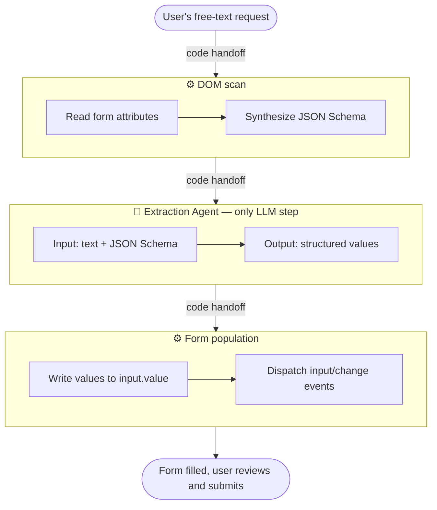

import FormFillDemo from '../../components/FormFillDemo';

Filling out forms is the most common structured-extraction task in the world. A human reads their own unstructured thoughts, types them into labelled boxes, and submits. Increasingly, AI agents are being asked to do the same thing on our behalf — and they are surprisingly bad at it.

The reason isn't the model. Frontier LLMs are excellent at turning free text into structured output. The reason is that HTML forms were designed for humans, and humans tolerate ambiguity that agents don't. A human looking at a field labelled "Departure" knows whether the site expects `Munich`, `München`, or `MUC` based on context, the surrounding UI, or just trial and error. An agent has to guess — and often gets it wrong in ways that are only caught after submission.

Google and Microsoft shipped a partial fix for this in February 2026. [WebMCP](https://webmachinelearning.github.io/webmcp/), now in preview behind a Chrome 146 flag, lets form authors annotate inputs with a natural-language description:

```html
<input name="departure_city"
       toolparamdescription="City the traveler is departing from" />
```

An agent reading this form no longer has to infer the field's purpose from its `name` attribute or from visual layout. That is a real improvement. But it solves only half of the problem.

---

## What descriptions miss

A description tells the model *what* a field is. It does not tell the model what a valid value *looks like*. Those are two different things, and both of them matter.

Consider these three fields:

| Field | Description alone is fine? |
|---|---|
| `departure_city` | No — does the site accept `Munich`, `MUC`, or `Flughafen München`? |
| `insurance_id` | No — what's the format? Hyphens? Length? |
| `date_of_birth` | No — `1985-03-14` or `14.03.1985` or `March 14, 1985`? |

In each case, the description answers the *extraction* question (which part of the user's input maps here), but leaves the *formatting* question open. And formatting is where forms reject you. Every developer who has built against a third-party API has had the experience of knowing exactly which value to send, but not knowing how the recipient wants it encoded.

HTML has partial answers. The `pattern` attribute gives a regex, but a regex validates — it doesn't demonstrate. The `placeholder` attribute shows a hint, but it is unstructured text aimed at humans and often clobbered by screen-reader conventions. The `<datalist>` element offers autocomplete candidates, but only for enumerable options like country codes, not for open-ended fields like city names or member IDs.

None of these give the model what it actually needs: *a small number of concrete, representative values that this particular form is known to accept*.

---

## The proposal: one attribute

```html
<input name="departure_city"
       toolparamdescription="City the traveler is departing from"
       toolparamexamples='["Munich", "MUC", "Berlin Tegel"]' />
```

That's it. A single new attribute, `toolparamexamples`, holding a JSON array of canonical values. It sits next to `toolparamdescription` in WebMCP's existing attribute family and extends it by exactly one slot.

The value of this attribute is much larger than its surface area suggests, because it maps directly to a keyword that already exists in the broader AI ecosystem. JSON Schema has had an `examples` keyword since Draft 6 (2016). OpenAI's structured outputs, Anthropic's tool use, and Gemini's `responseSchema` all consume JSON Schema natively — meaning every frontier LLM provider already knows what to do with `examples` when it appears in a schema. The only thing missing is a way for form authors to declare those examples in the DOM, where the form actually lives.

---

## How it works end to end

The underlying flow is the same pattern I described in [*Agentic vs Workflow-based AI*](https://danielfridljand.de/post/workflow-vs-agent) — use the LLM for exactly one thing (extraction), and let code do the rest:



A small JavaScript library — a few hundred lines — reads the form's attributes, builds a JSON Schema where each property carries its `description` from `toolparamdescription` and its `examples` from `toolparamexamples`, plus whatever existing HTML5 constraints apply (`<option>` values become `enum`, `pattern` stays as `pattern`, `type="email"` becomes `format: "email"`). The library hands the schema and the user's text to any LLM provider, gets back a JSON object, and writes the values into the form. The user reviews and submits.

Nothing about this flow is agent-specific or provider-specific. The same annotated HTML works with OpenAI, Anthropic, Gemini, a local Ollama instance, or a browser's built-in Prompt API. It works with whatever browser-automation agent the user happens to be running. It degrades gracefully — agents that don't know about these attributes see a normal form.

---

## Try it yourself

Below is a small demo. Paste (or write) an unstructured travel request into the text box, and hit **Fill with AI**. The form is annotated with `toolparamdescription` and `toolparamexamples`. You can inspect the HTML to see exactly what is being exposed.

<FormFillDemo client:load />

A few things to notice. First, the model handles synonymy cleanly — if you write `München` or `MUC`, it will produce whichever canonical form the examples suggested. Second, if you omit information (say, leave out the number of passengers), the model leaves that field empty instead of inventing a value. Third, switching between LLM providers changes nothing about the HTML; the schema is the contract.

---

## What's novel, what isn't

`toolparamdescription` is not novel — it's WebMCP's, and it shipped first. What's novel is binding JSON Schema's `examples` keyword to a DOM input, so that the same primitive every LLM SDK already consumes can travel all the way from the form author's hands to the model's context window without any translation layer in between.

The narrowness is the point. A single attribute is trivial to implement, trivial to spec, and hard to argue against. The [WebMCP explainer](https://github.com/webmachinelearning/webmcp/blob/main/docs/explainer.md) explicitly leaves the JSON Schema synthesis algorithm (§4.3) marked as a TODO — meaning the surface is open right now, and the editors are actively soliciting contributions. I'd rather ship one attribute that carries real weight than a whole vocabulary of attributes that don't.

The next step, which I'll write about separately, is a small reference library that implements the attribute against any LLM provider. After that, a proposal upstream to WebMCP. The demo above is the first piece of both.
