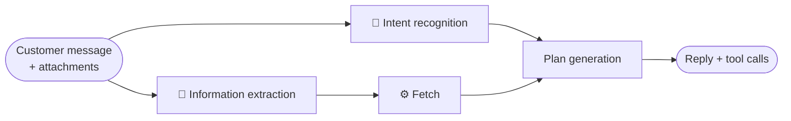
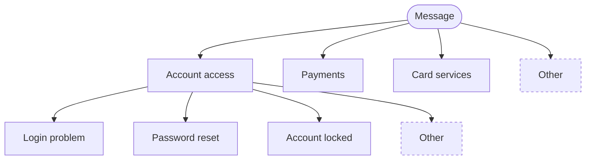
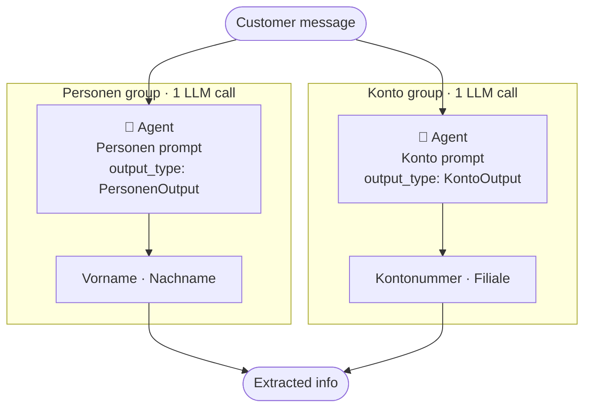
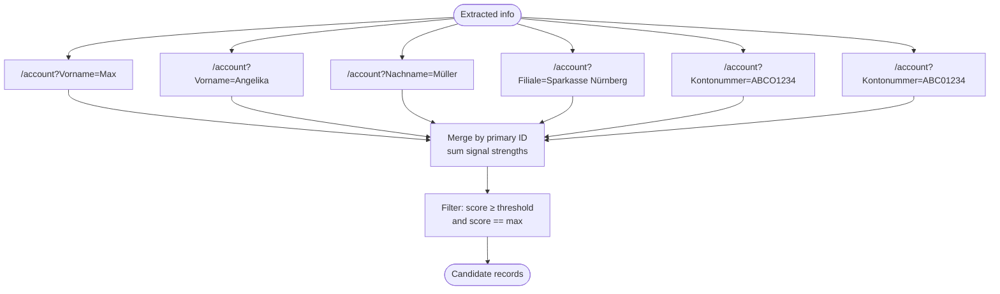
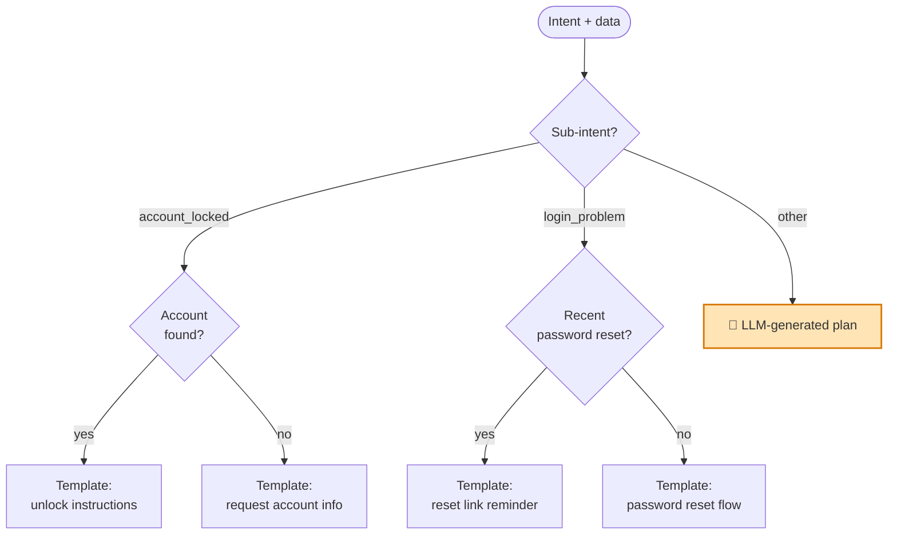

How do you actually automate first-level customer support without the system collapsing into one big agent that nobody can debug? This post describes the architecture we landed on after iterating on a customer support system we built in production. It is a worked instance of the philosophy from [Agentic vs Workflow-based AI](https://danielfridljand.de/post/workflow-vs-agent): decompose the problem, let an LLM do only what only an LLM can do, and put code everywhere else.

The system takes a customer message — email, chat, whatever — and produces two things: a reply (possibly with attachments) and any tool calls needed to resolve the request (invalidate a voucher, file a reimbursement ticket, escalate to a human). Inbound attachments are normalised by a preprocessing layer before anything else runs.

The pipeline has four steps, run as a DAG:

Intent recognition and information extraction have no data dependency on each other, so they run in parallel. Fetch depends only on extraction, and plan generation pulls together the intent and the fetched records.

We will trace one message through all four steps. The running example throughout this post is:

> *Ich bin Kunde bei der Sparkasse Nürnberg, mein Name ist Max Müller, meine Partnerin Angelika Müller, Kontonummer ABCO1234. Wir kommen nicht mehr in unser Konto rein.*

This message is realistic in three useful ways. The intent is slightly ambiguous (login problem? account locked? something else?). There are two people named and we do not yet know whose account is meant. And the account number contains the classic OCR-or-typing ambiguity between `0` and `O` — `ABCO1234` could be `ABC01234`.

---

## Step 1: Intent recognition

The job here is to classify the message into one of a small set of intents — cheaply enough that the downstream pipeline can branch on it.

We use a depth-2 tree of intents. The root has a handful of broad parent intents ("account access", "payments", "card services", …) plus an explicit **"other"** parent. Each parent has a few sub-intents underneath, again plus an "other" within that parent. We run this as two LLM calls: first the parent intent, then — given the parent — the sub-intent from a constrained list. Both calls are simple `Agent` invocations with no tools and a typed `output_type`; see [Type-Safe Hybrid Workflows with Pydantic AI](https://danielfridljand.de/post/pydantic-ai-type-safe-hybrid-workflows) for the mechanics.

A few things worth pulling out.

**The "other" category at every level is the point, not an afterthought.** No matter how carefully you enumerate intents at design time, customer requests do not respect your taxonomy. By modelling "other" explicitly, we make our coverage gap visible: every message that lands in an "other" bucket is a candidate for becoming its own intent in a future iteration cycle. It also gives us a clean place to route the more agentic, less structured downstream handling, as we will see in the plan step.

**Two LLM calls, not one big classifier.** The sub-intents are different for each parent. Asking the model to choose from a flat list of every sub-intent across every parent works worse in practice — the model gets confused between sibling categories from unrelated parents — and the typed contract (a `Literal` of the right sub-intents for the chosen parent) is harder to express. Two narrow calls with constrained output types beat one wide call.

**A tree of arbitrary depth would be more general — but in practice exactly two levels was the sweet spot.** Deeper trees push you toward over-classification and harder labeling; flat lists make the model do too much work in one shot.

**This is the cleanest eval target in the whole pipeline.** A labeled set of historical conversations with their correct (parent, sub) labels gives you precision/recall numbers you can move. We will return to this in the evals section.

For our running example, the parent intent comes out as **account access** and the sub-intent as **account locked** (with some probability mass on **login problem**).

---

## Step 2: Information extraction

In parallel with intent recognition, we extract the structured information the downstream steps will need.

We organise extracted fields into **groups** — small clusters of related fields that get pulled out together in a single LLM call. One group per call, but groups run in parallel. For our running example, the relevant groups are a `Personen` group (names) and a `Konto` group (account identifiers, branch). Each group has its own Pydantic output model and its own prompt, with Pydantic AI handling validation and retry on the typed output — see [the Pydantic AI post](https://danielfridljand.de/post/pydantic-ai-type-safe-hybrid-workflows) for how that wiring works.

Grouping matters for two reasons.

**Field interactions live inside a group.** Take the input "Ich bin Kunde bei der Sparkasse Nürnberg." A naive per-field extraction asks "what is the location?" and "what is the shop name?" independently. Depending on the model, you can get `location=Nürnberg, shop_name=Sparkasse` (information lost) or `location=Nürnberg, shop_name=Sparkasse Nürnberg` (information duplicated). With a group, you can specify in one prompt how the related fields should agree.

**Groups are independent eval targets.** Each group has its own labeled dataset and its own metrics. When extraction quality regresses, you know which group regressed — and you can swap its model, tune its prompt, or even replace it with a small NER model — without touching anything else.

We use a few patterns consistently across groups:

| Pattern | Why |
|---|---|
| All fields optional | Customers rarely include everything; we extract what is there |
| List-valued where ambiguous | If two emails are mentioned, both get returned; downstream disambiguates |
| Automatic alphanumeric variants | `ABCO1234` is stored as `[ABCO1234, ABC01234]` to handle 0/O, 1/I, 5/S confusions |
| Bias toward false positives | Easier to filter spurious matches downstream than to recover lost signal |

Throughout this pipeline we would rather over-extract than under-extract: the fetch step is built to assume that some of what came out of extraction is wrong, and to handle that with scoring rather than by trusting any single field.

For our running example, after extraction we have something like:

- `Personen`: `Vorname: [Max, Angelika]`, `Nachname: [Müller]`
- `Konto`: `Kontonummer: [ABCO1234, ABC01234]`, `Filiale: [Sparkasse Nürnberg]`

---

## Step 3: Fetch

Now we look things up. This step is where extraction's false-positive bias gets paid for: we run the extracted information through API endpoints, score the results, and keep the high-scoring matches.

The approach is a **weighted-scoring fan-out**. For each extracted field, we issue a parallel query to the relevant API endpoint. Each query returns a list of candidate records. We then merge those candidate lists by primary ID, summing a per-field signal-strength weight for every hit. Strong matches accumulate score from multiple fields; weak or spurious extractions contribute little.

The signal-strength weights are assigned per field, based on how discriminating that field is. A first name on its own picks out thousands of customers; an account number picks out one (or none):

| Field | Weight |
|---|---|
| Vorname | 1 |
| Nachname | 2 |
| Filiale | 2 |
| Kontonummer | 5 |

For our running example, suppose the queries return the following hits (simplified):

| Record ID | Matched on | Score |
|---|---|---|
| `acc_001` | Vorname=Max, Nachname=Müller, Filiale=Sparkasse Nürnberg, Kontonummer=ABC01234 | 1 + 2 + 2 + 5 = **10** |
| `acc_017` | Vorname=Angelika, Nachname=Müller | 1 + 2 = 3 |
| `acc_204` | Nachname=Müller | 2 |
| `acc_388` | Vorname=Max | 1 |

`acc_001` dominates: it matched all four discriminating fields, including the strong one. It is the only record at the max score and above threshold, so it is what we pass on. Note that the `0`/`O` variant we generated during extraction is what made the Kontonummer hit possible — the customer wrote `ABCO1234`, the actual account number is `ABC01234`, and the variant trick bridged the gap.

If no record had cleared the threshold, fetch would have returned an empty result, and the plan step would handle that explicitly — typically by asking the customer for more information.

The whole step is plain code. There is no LLM call here at all. The mental model that matters in practice is just: fan out, sum weighted hits, threshold.

---

## Step 4: Plan generation

We now have an intent, a sub-intent, extracted information, fetched records, and metadata about the fetch (how many candidates, top score, etc.). The plan step turns this into a concrete response and a set of tool calls.

**For most of the tree, the plan is hardcoded.** A deep decision tree branches on the inputs and lands on a leaf with a pre-written message template (filled with variables) plus any tool calls. This is where the actual business logic of customer support lives — the tribal knowledge about which combinations of intent and state should get which response. Growing this tree is the central activity of operating the system over time, and it is the same kind of work as growing any business workflow: deterministic branches added one by one as patterns emerge in real traffic. The case for keeping this part of the system in code rather than handing it to an agent is made at length in [Agentic vs Workflow-based AI](https://danielfridljand.de/post/workflow-vs-agent).

**The leaves under "other" branches are the exception.** When the intent fell into one of the "other" buckets at intent classification, we do not have a hardcoded plan — by construction, we have not seen enough of these to write one. Those leaves use an LLM agent with access to the fetched data and a constrained set of tools to propose a plan. Only those leaves are LLM-driven; the rest of the tree is deterministic. The amber leaf in the diagram above is the only one that calls an LLM at planning time.

Every "other"-driven LLM plan is a candidate for being promoted to a hardcoded leaf once the pattern is clear enough. That promotion loop — observe, label, generalise, hardcode — is how the system gets less LLM-dependent over time, not more.

For our running example, the path is: parent = `account_access` → sub = `account_locked` → `account_found = yes` → the "unlock instructions" template, parametrised with the matched account.

For high-stakes actions — anything touching money, account access, or external systems with side effects — the generated plan is reviewed by a human before execution. The orchestration for that (durable waits, signals, deterministic recovery across restarts) is covered in [Temporal for Human-in-the-Loop](https://danielfridljand.de/post/temporal-human-in-the-loop).

---

## Why decomposing pays off: evals

The thing that makes this architecture sustainable in production is that every step is independently evaluable.

- **Intent.** Labeled set of conversations and their correct (parent, sub) intents. Precision, recall, confusion matrix. When a class regresses, you see it the same day.
- **Extraction.** One eval suite per group. Field-level precision and recall against labeled ground truth. False-positive rate is allowed to be non-zero — it is the design.
- **Fetch.** Deterministic, so the eval is integration-test shaped. Given an extraction output and a fixed fixture of API responses, does the right record come out on top? When weights or thresholds change, you re-run the suite and check.
- **Plan.** For hardcoded leaves, ordinary unit tests. For the LLM-fallback leaves under "other", a golden-set eval on a labeled sample of "other"-routed conversations.

Contrast this with a single end-to-end agent that takes the message and produces the response. The only eval you have there is end-to-end quality — "did the customer get a good answer?" — and when it regresses, you have no idea which part broke. You are stuck staring at prompts and hoping. Decomposed pipelines turn one mushy evaluation into four sharp ones, and that is what lets you keep improving the system in production without breaking what already worked.

A useful side effect of the "other" buckets is that they are a self-curating queue of training data for future iteration. Every message that lands in an "other" leaf is a candidate for becoming a new intent, a new extraction group, or a new hardcoded plan branch. The system tells you where to dig.

---

## Closing

The pattern, summarised: decompose into typed steps, use LLMs only where they earn their place, model coverage gaps explicitly with "other" buckets, and bias every step toward making the next one's job tractable. What is worth saying is that, taken together, they produce a system you can actually evolve in production — one where regressions are localizable, evals are sharp, and the long tail is a queue you work through, not a fire you fight.

Two natural extensions from here. The first is human-in-the-loop approval for high-stakes plans, which is exactly the territory of [Temporal for Human-in-the-Loop](https://danielfridljand.de/post/temporal-human-in-the-loop) — durable waits, signals, and deterministic recovery across restarts. The second is the question of whether the same decomposition works for adjacent problems: triage in operations, intake in legal, claims processing in insurance. The shapes look similar, and the central move — separating the "what" (an LLM picks a typed plan) from the "do" (code executes it) — is general.
