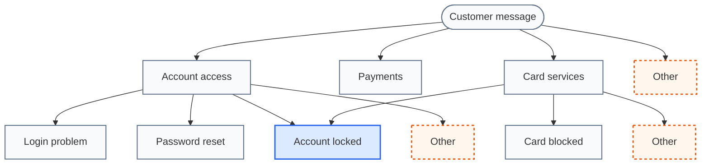
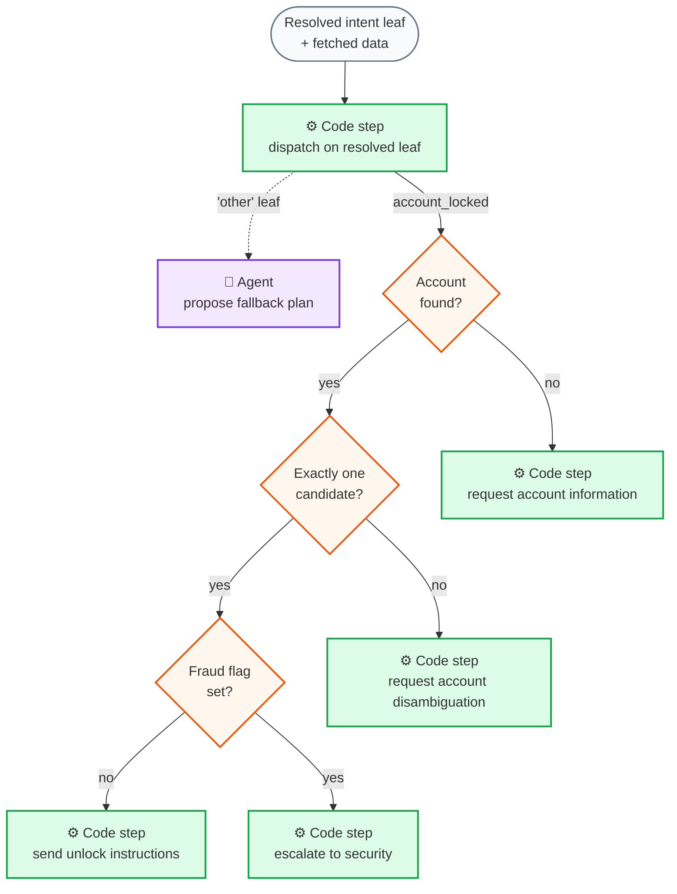

How do you automate first-level customer support without building one big, opaque agent? This post presents the architecture we reached in production: decompose the problem, let LLMs handle interpretation, and keep everything else in code. It is a worked example of [Agentic vs Workflow-based AI](https://danielfridljand.de/post/workflow-vs-agent).

The system turns a customer message into a reply, possibly with attachments, and any required tool calls: invalidating a voucher, filing a reimbursement ticket, or escalating to a human. A preprocessing layer first normalises inbound attachments.

In the diagrams, **🤖 Agent** is autonomous, **🧠 LLM-assisted step** is a constrained model call, **⚙️ Code step** is deterministic logic, and **🔌 External tool/API** is an external dependency.

The pipeline has four steps, run as a DAG:

```mermaid
flowchart TD
    INPUT(["Customer message<br/>+ attachments"])
    L1["🧠 LLM-assisted step<br/>intent recognition"]
    L2["🧠 LLM-assisted step<br/>information extraction"]
    C1["⚙️ Code step<br/>fetch and score records"]
    C2["⚙️ Code step<br/>dispatch and plan generation"]
    A1["🤖 Agent<br/>fallback for an 'other' intent"]
    OUT(["Reply + tool calls"])

    INPUT -->|"message"| L1
    INPUT -->|"message"| L2
    L2 -->|"structured fields"| C1
    L1 -->|"resolved intent leaf"| C2
    C1 -->|"candidate records"| C2
    C2 -->|"known leaf"| OUT
    C2 -.->|"'other' leaf"| A1
    A1 -->|"proposed plan"| OUT

    classDef agent fill:#f3e8ff,stroke:#7c3aed,stroke-width:2px
    classDef llm fill:#dbeafe,stroke:#2563eb,stroke-width:2px
    classDef code fill:#dcfce7,stroke:#16a34a,stroke-width:2px
    classDef terminal fill:#f8fafc,stroke:#64748b,stroke-width:1.5px
    class A1 agent
    class L1,L2 llm
    class C1,C2 code
    class INPUT,OUT terminal
```

Intent recognition and extraction run in parallel. Fetch uses the extracted fields; plan generation combines its results with the resolved intent. Known intents follow code, while an "other" intent uses the fallback agent.

We will trace this message through all four steps:

> *I bank with Northstar Bank's Riverton branch. My name is Alex Carter, and my partner is Jamie Carter. Our account number is NSBO1234. We can no longer access the account.*

All details are fictional. The example contains three common complications: an ambiguous intent, two named people, and a `0`/`O` ambiguity in the account number (`NSBO1234` or `NSB01234`).

---

## Step 1: Intent recognition

We classify the message against a **rooted DAG of intents, biased toward depth 2**. The root contains broad intents ("account access", "payments", "card services", …) and an explicit "other"; most parents contain a few sub-intents and another "other". One constrained LLM call selects the parent, then another selects among its children. These Pydantic AI `Agent` calls have no tools or open-ended loop and return typed outputs. [Type-Safe Hybrid Workflows with Pydantic AI](https://danielfridljand.de/post/pydantic-ai-type-safe-hybrid-workflows) covers the mechanics.

```mermaid
flowchart TD
    R(["Customer message"])
    R --> P1["Account access"]
    R --> P2["Payments"]
    R --> P3["Card services"]
    R --> POT["Other"]

    P1 --> P1A["Login problem"]
    P1 --> P1B["Password reset"]
    P1 --> LOCKED["Account locked"]
    P1 --> P1OT["Other"]

    P3 --> P3A["Card blocked"]
    P3 --> LOCKED
    P3 --> P3OT["Other"]

    classDef intent fill:#f8fafc,stroke:#64748b,stroke-width:1.5px
    classDef selected fill:#dbeafe,stroke:#2563eb,stroke-width:2px
    classDef fallback fill:#fff7ed,stroke:#ea580c,stroke-width:2px,stroke-dasharray:4 4
    class R,P1,P2,P3,P1A,P1B,P3A intent
    class LOCKED selected
    class POT,P1OT,P3OT fallback
```

**Depth 2 is a bias, not a rule.** Specific parents can resolve at depth 1; rare branches may need a third level. Two is usually deep enough to keep each classification narrow without over-classifying or making labels harder to maintain.

**Shared leaves make this a DAG, not a tree.** **Account locked** belongs under both **Account access** and **Card services**. Once either path reaches that leaf, handling is identical. A tree would duplicate the unlock flow; a DAG keeps one plan and makes downstream logic depend on the leaf, not the route.

**"Other" makes coverage gaps explicit.** Requests outside the taxonomy land in a visible queue for future intents and route cleanly to less structured handling.

**Two narrow calls beat one wide classifier.** Each parent exposes only its reachable children as a typed `Literal`, avoiding confusion between unrelated categories. Shared leaves simply appear in more than one parent's options.

Intent recognition is also the pipeline's cleanest eval target: labeled conversations yield precision, recall, and a confusion matrix.

Our example resolves to **account access → account locked**, the same leaf a card-PIN lockout could reach through **card services**.

---

## Step 2: Information extraction

In parallel with intent recognition, separate LLM-assisted steps extract **groups** of related fields. Our example uses `People` (names) and `Account` (identifiers and branch). Each group has its own prompt and Pydantic output model, including validation and retries. [The Pydantic AI post](https://danielfridljand.de/post/pydantic-ai-type-safe-hybrid-workflows) shows the wiring.

```mermaid
flowchart TD
    MSG(["Customer message"])

    subgraph people["People group"]
        P_STEP["🧠 LLM-assisted step<br/>People prompt<br/>output: PeopleOutput"]
        P_FIELDS["Given name · Family name"]
        P_STEP -->|"typed fields"| P_FIELDS
    end

    subgraph account["Account group"]
        A_STEP["🧠 LLM-assisted step<br/>Account prompt<br/>output: AccountOutput"]
        A_FIELDS["Account number · Branch"]
        A_STEP -->|"typed fields"| A_FIELDS
    end

    MSG -->|"message"| P_STEP
    MSG -->|"message"| A_STEP
    P_FIELDS --> OUT(["Extracted information"])
    A_FIELDS --> OUT

    classDef llm fill:#dbeafe,stroke:#2563eb,stroke-width:2px
    classDef data fill:#f8fafc,stroke:#64748b,stroke-width:1.5px
    class P_STEP,A_STEP llm
    class MSG,P_FIELDS,A_FIELDS,OUT data
```

**Groups preserve field relationships.** A single prompt can partition "Northstar Bank's Riverton branch" consistently instead of extracting the bank and branch independently and duplicating or losing information.

**Groups are independent eval targets.** A regression is isolated to one dataset and component, which can be tuned, moved to another model, or replaced with NER without affecting the rest.

Across groups, we use the same patterns:

| Pattern | Why |
|---|---|
| All fields optional | Customers rarely include everything; we extract what is there |
| List-valued where ambiguous | If two emails are mentioned, both get returned; downstream disambiguates |
| Automatic alphanumeric variants | `NSBO1234` is stored as `[NSBO1234, NSB01234]` to handle 0/O, 1/I, 5/S confusions |
| Bias toward false positives | Easier to filter spurious matches downstream than to recover lost signal |

We deliberately over-extract: fetch treats every field as fallible and scores the combined evidence.

The example yields:

- `People`: `Given name: [Alex, Jamie]`, `Family name: [Carter]`
- `Account`: `Account number: [NSBO1234, NSB01234]`, `Branch: [Riverton]`

---

## Step 3: Fetch

Fetch uses a **weighted-scoring fan-out** to absorb extraction's false positives. Each field triggers a parallel API query; candidate lists are merged by primary ID, adding a field-specific weight for every hit. Strong records accumulate evidence while spurious fields contribute little.

```mermaid
flowchart TD
    EX(["Extracted information"])
    Q1["🔌 External tool/API<br/>given_name=Alex<br/>given_name=Jamie"]
    Q2["🔌 External tool/API<br/>family_name=Carter<br/>branch=Riverton"]
    Q3["🔌 External tool/API<br/>account_number=NSBO1234<br/>account_number=NSB01234"]
    C1["⚙️ Code step<br/>merge by primary ID<br/>and sum signal strengths"]
    C2["⚙️ Code step<br/>keep the maximum score<br/>above the threshold"]
    OUT(["Candidate records"])

    EX -->|"parallel queries"| Q1
    EX -->|"parallel queries"| Q2
    EX -->|"parallel queries"| Q3
    Q1 -->|"candidate hits"| C1
    Q2 -->|"candidate hits"| C1
    Q3 -->|"candidate hits"| C1
    C1 -->|"scored records"| C2
    C2 --> OUT

    classDef code fill:#dcfce7,stroke:#16a34a,stroke-width:2px
    classDef tool fill:#fef3c7,stroke:#d97706,stroke-width:2px
    classDef terminal fill:#f8fafc,stroke:#64748b,stroke-width:1.5px
    class C1,C2 code
    class Q1,Q2,Q3 tool
    class EX,OUT terminal
```

Weights reflect how discriminating each field is: a first name matches many customers, while an account number matches one or none.

| Field | Weight |
|---|---|
| Given name | 1 |
| Family name | 2 |
| Branch | 2 |
| Account number | 5 |

The example produces these simplified hits:

| Record ID | Matched on | Score |
|---|---|---|
| `acc_001` | Given name=Alex, Family name=Carter, Branch=Riverton, Account number=NSB01234 | 1 + 2 + 2 + 5 = **10** |
| `acc_017` | Given name=Jamie, Family name=Carter | 1 + 2 = 3 |
| `acc_204` | Family name=Carter | 2 |
| `acc_388` | Given name=Alex | 1 |

`acc_001` is the sole maximum above the threshold, so it wins. Its account-number hit comes from the generated `0`/`O` variant: the customer wrote `NSBO1234`, while the record contains `NSB01234`.

If nothing clears the threshold, fetch returns no record and the plan can request more information. This step is plain code: fan out, sum weighted hits, threshold.

---

## Step 4: Plan generation

Plan generation receives the **resolved intent leaf**, extracted fields, fetched records, and fetch metadata. Dispatch is therefore a keyed lookup, not another classification: converging paths share one plan, so `account_locked` behaves the same whether reached through account access or card services.

Each known leaf owns a small decision tree over the fetched data: was a record found, is there one candidate, is it flagged? Branches end in a pre-written template plus any tool calls. These trees encode the business logic and grow as patterns emerge. [Agentic vs Workflow-based AI](https://danielfridljand.de/post/workflow-vs-agent) explains why we keep them in code.

```mermaid
flowchart TD
    ROOT(["Resolved intent leaf<br/>+ fetched data"])
    C1["⚙️ Code step<br/>dispatch on resolved leaf"]
    A1["🤖 Agent<br/>propose fallback plan"]
    D1{"Account<br/>found?"}
    D2{"Exactly one<br/>candidate?"}
    D3{"Fraud flag<br/>set?"}
    C2["⚙️ Code step<br/>request account information"]
    C3["⚙️ Code step<br/>request account disambiguation"]
    C4["⚙️ Code step<br/>send unlock instructions"]
    C5["⚙️ Code step<br/>escalate to security"]

    ROOT --> C1
    C1 -.->|"'other' leaf"| A1
    C1 -->|"account_locked"| D1
    D1 -->|"no"| C2
    D1 -->|"yes"| D2
    D2 -->|"no"| C3
    D2 -->|"yes"| D3
    D3 -->|"no"| C4
    D3 -->|"yes"| C5

    classDef agent fill:#f3e8ff,stroke:#7c3aed,stroke-width:2px
    classDef code fill:#dcfce7,stroke:#16a34a,stroke-width:2px
    classDef decision fill:#fff7ed,stroke:#ea580c,stroke-width:2px
    classDef terminal fill:#f8fafc,stroke:#64748b,stroke-width:1.5px
    class A1 agent
    class C1,C2,C3,C4,C5 code
    class D1,D2,D3 decision
    class ROOT terminal
```

**"Other" leaves are the exception.** With no hardcoded plan, the pipeline's only autonomous agent inspects the fetched data and proposes one using constrained tools. Repeated patterns are promoted to hardcoded leaves through an observe, label, generalise, hardcode loop, reducing LLM dependence over time.

Our `account_locked` example finds one unflagged record, `acc_001`, and lands on the parametrised "unlock instructions" template.

Plans involving money, account access, or side effects require human review. [Temporal for Human-in-the-Loop](https://danielfridljand.de/post/temporal-human-in-the-loop) covers durable waits, signals, and recovery across restarts.

---

## Why decomposing pays off: evals

Each step has its own evaluation:

- **Intent:** precision, recall, and a confusion matrix over labeled parent/sub-intents.
- **Extraction:** field-level precision and recall for each group, allowing the intended false-positive bias.
- **Fetch:** integration tests over extracted fields, fixed API responses, weights, and thresholds.
- **Plan:** unit tests for known leaves; a labeled golden set for fallback plans.

A monolithic agent offers only end-to-end quality, making regressions hard to locate. Decomposition isolates them. Meanwhile, "other" buckets form a self-curating queue for new intents, extraction groups, or hardcoded branches.

---

## Closing

Decompose into typed steps, reserve LLMs for interpretation, encode known execution in code, and make coverage gaps explicit with "other". The result is an evolvable system where regressions are easy to locate and the long tail is manageable. The same pattern extends naturally to operations triage, legal intake, and insurance claims.
