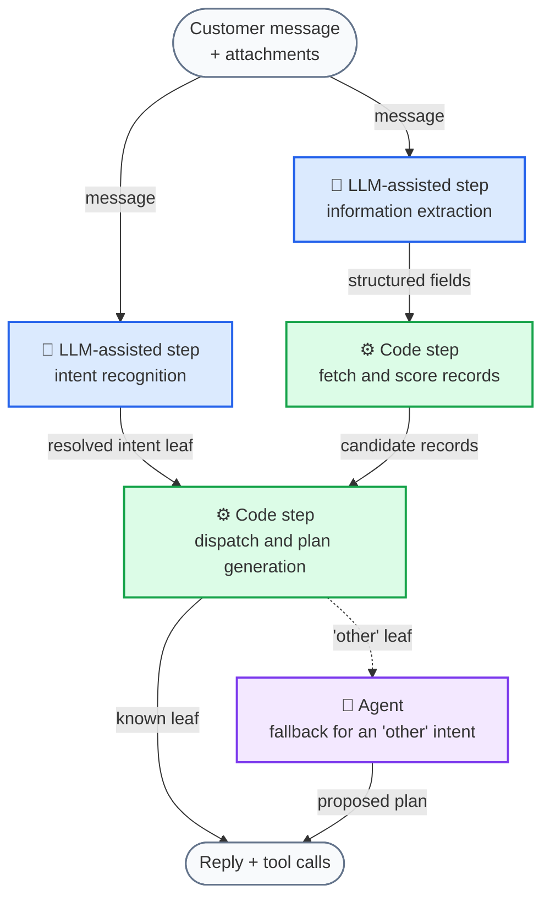
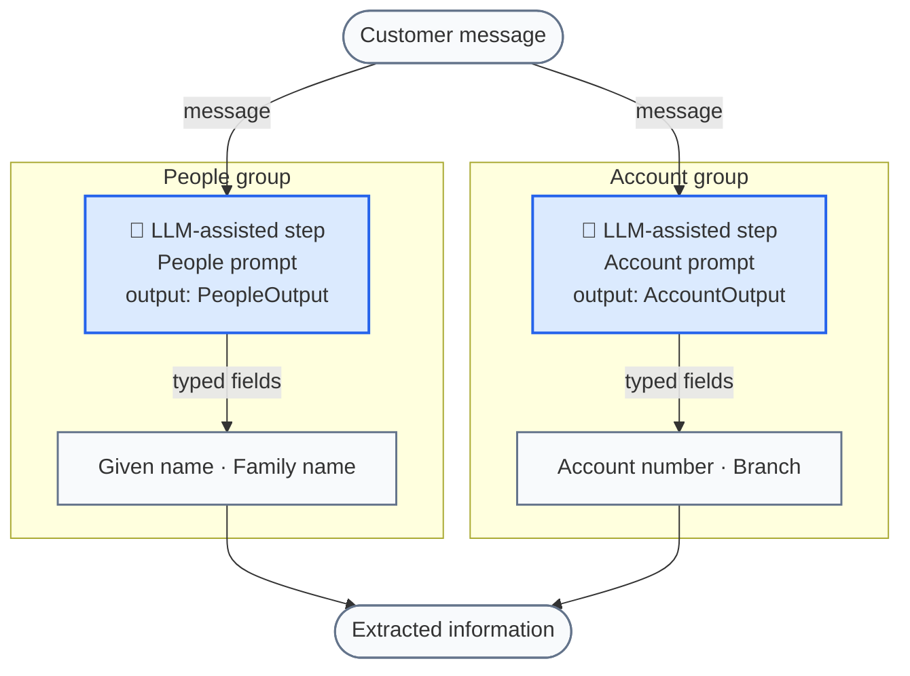
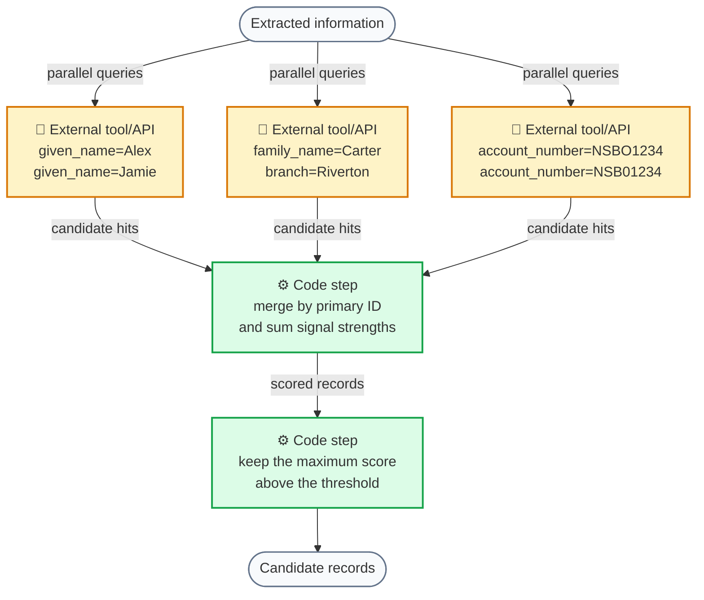

How do you actually automate first-level customer support without the system collapsing into one big agent that nobody can debug? This post describes the architecture we landed on after iterating on a customer support system we built in production. It is a worked instance of the philosophy from [Agentic vs Workflow-based AI](https://danielfridljand.de/post/workflow-vs-agent): decompose the problem, let an LLM do only what only an LLM can do, and put code everywhere else.

The system takes a customer message — email, chat, whatever — and produces two things: a reply (possibly with attachments) and any tool calls needed to resolve the request (invalidate a voucher, file a reimbursement ticket, escalate to a human). Inbound attachments are normalised by a preprocessing layer before anything else runs.

Across the diagrams, the notation is consistent: **🤖 Agent** means an autonomous component that chooses actions and uses tools; **🧠 LLM-assisted step** means a constrained model call with a defined output; **⚙️ Code step** means deterministic application logic; and **🔌 External tool/API** means a dependency outside the workflow.

The pipeline has four steps, run as a DAG:

```mermaid
flowchart TD
    INPUT(["Customer message<br/>+ attachments"])
    L1["🧠 LLM-assisted step<br/>intent recognition"]
    L2["🧠 LLM-assisted step<br/>information extraction"]
    C1["⚙️ Code step<br/>fetch and score records"]
    C2["⚙️ Code step<br/>dispatch and plan generation"]
    A1["🤖 Agent<br/>fallback for an 'other' intent"]
    OUT(["Reply + tool calls"])

    INPUT -->|"message"| L1
    INPUT -->|"message"| L2
    L2 -->|"structured fields"| C1
    L1 -->|"resolved intent leaf"| C2
    C1 -->|"candidate records"| C2
    C2 -->|"known leaf"| OUT
    C2 -.->|"'other' leaf"| A1
    A1 -->|"proposed plan"| OUT

    classDef agent fill:#f3e8ff,stroke:#7c3aed,stroke-width:2px
    classDef llm fill:#dbeafe,stroke:#2563eb,stroke-width:2px
    classDef code fill:#dcfce7,stroke:#16a34a,stroke-width:2px
    classDef terminal fill:#f8fafc,stroke:#64748b,stroke-width:1.5px
    class A1 agent
    class L1,L2 llm
    class C1,C2 code
    class INPUT,OUT terminal
```

Intent recognition and information extraction have no data dependency on each other, so they run in parallel. Fetch depends only on extraction. Plan generation combines the resolved intent leaf with the fetched records: known leaves follow deterministic code, while an "other" leaf uses the fallback agent.

We will trace one message through all four steps. The running example throughout this post is:

> *I bank with Northstar Bank's Riverton branch. My name is Alex Carter, and my partner is Jamie Carter. Our account number is NSBO1234. We can no longer access the account.*

Northstar Bank, its Riverton branch, the people, and the account details are all fictional.

This message is realistic in three useful ways. The intent is slightly ambiguous (login problem? account locked? something else?). There are two people named and we do not yet know whose account is meant. And the account number contains the classic OCR-or-typing ambiguity between `0` and `O` — `NSBO1234` could be `NSB01234`.

---

## Step 1: Intent recognition

The job here is to classify the message into one of a small set of intents — cheaply enough that the downstream pipeline can branch on it.

We classify against a **rooted DAG of intents — a single entry point, biased toward depth 2**. The root has a handful of broad parent intents ("account access", "payments", "card services", …) plus an explicit **"other"** parent. Most parents have a few sub-intents underneath, again plus an "other" within that parent. We run this as two LLM-assisted steps: first the parent intent, then — given the parent — the sub-intent from a constrained list. Pydantic AI exposes each call through its `Agent` class, but architecturally these are constrained LLM-assisted steps: they have no tools or open-ended reasoning loop and return a typed `output_type`. See [Type-Safe Hybrid Workflows with Pydantic AI](https://danielfridljand.de/post/pydantic-ai-type-safe-hybrid-workflows) for the mechanics.

```mermaid
flowchart TD
    R(["Customer message"])
    R --> P1["Account access"]
    R --> P2["Payments"]
    R --> P3["Card services"]
    R --> POT["Other"]

    P1 --> P1A["Login problem"]
    P1 --> P1B["Password reset"]
    P1 --> LOCKED["Account locked"]
    P1 --> P1OT["Other"]

    P3 --> P3A["Card blocked"]
    P3 --> LOCKED
    P3 --> P3OT["Other"]

    classDef intent fill:#f8fafc,stroke:#64748b,stroke-width:1.5px
    classDef selected fill:#dbeafe,stroke:#2563eb,stroke-width:2px
    classDef fallback fill:#fff7ed,stroke:#ea580c,stroke-width:2px,stroke-dasharray:4 4
    class R,P1,P2,P3,P1A,P1B,P3A intent
    class LOCKED selected
    class POT,P1OT,P3OT fallback
```

Two of those edges are worth staring at: **Account locked** is a child of *both* **Account access** and **Card services**, and **Payments** has no children drawn at all. Those are the two structural choices that make this a DAG rather than a tree.

A few things worth pulling out.

**Depth 2 is a bias, not a rule.** Some parent intents are already specific enough to act on — they resolve at depth 1, and the second call either returns a trivial "no further breakdown" sub-intent or is skipped entirely (Payments, above, is one such parent in the diagram). Others, in rare cases, earn a third level. We default to depth 2 because it is the sweet spot — deeper structure pushes you toward over-classification and harder labeling, flatter structure makes a single call do too much — but we do not force every branch to bottom out at exactly two levels. The depth is whatever a branch needs, with two as the gravitational center.

**A sub-intent can live under more than one parent — which is why it is a DAG, not a tree.** The same handling leaf is frequently reachable from different first-level intents. A customer who locked themselves out by mistyping their online-banking password lands on **account access → account locked**; a customer who triggered the same lockout by entering the wrong card PIN at an ATM arrives via **card services → account locked**. Different first-level intent, different path, *same leaf* — once you are there, the unlock handling is identical. In a strict tree you would have to duplicate that leaf under both parents and keep the two copies in sync as the unlock flow evolves. Modelling intents as a DAG lets the paths converge on one shared leaf, so everything downstream branches on the leaf you reached, not on the route you took to get there.

**The "other" category at every level is the point, not an afterthought.** No matter how carefully you enumerate intents at design time, customer requests do not respect your taxonomy. By modelling "other" explicitly, we make our coverage gap visible: every message that lands in an "other" bucket is a candidate for becoming its own intent in a future iteration cycle. It also gives us a clean place to route the more agentic, less structured downstream handling, as we will see in the plan step.

**Two LLM-assisted steps, not one wide classifier.** The reachable sub-intents differ by parent. Asking the model to choose from a flat list of every sub-intent across every parent works worse in practice — the model gets confused between sibling categories from unrelated parents — and the typed contract (a `Literal` of the sub-intents reachable from the chosen parent) is harder to express. Two narrow calls with constrained output types beat one wide call. The shared-leaf case costs nothing here: a sub-intent that sits under two parents simply appears in both parents' `Literal`s.

**This is the cleanest eval target in the whole pipeline.** A labeled set of historical conversations with their correct (parent, sub) labels gives you precision/recall numbers you can move. We will return to this in the evals section.

For our running example, the parent intent comes out as **account access** and the sub-intent as **account locked** (with some probability mass on **login problem**) — the very same `account locked` leaf a card-PIN lockout would have reached from the other side of the DAG.

---

## Step 2: Information extraction

In parallel with intent recognition, we extract the structured information the downstream steps will need.

We organise extracted fields into **groups** — small clusters of related fields that get pulled out together in a single LLM-assisted step. One group per step, but the groups run in parallel. For our running example, the relevant groups are `People` (names) and `Account` (account identifiers and branch). Each group has its own Pydantic output model and prompt, with Pydantic AI handling validation and retries on the typed output — see [the Pydantic AI post](https://danielfridljand.de/post/pydantic-ai-type-safe-hybrid-workflows) for how that wiring works.

```mermaid
flowchart TD
    MSG(["Customer message"])

    subgraph people["People group"]
        P_STEP["🧠 LLM-assisted step<br/>People prompt<br/>output: PeopleOutput"]
        P_FIELDS["Given name · Family name"]
        P_STEP -->|"typed fields"| P_FIELDS
    end

    subgraph account["Account group"]
        A_STEP["🧠 LLM-assisted step<br/>Account prompt<br/>output: AccountOutput"]
        A_FIELDS["Account number · Branch"]
        A_STEP -->|"typed fields"| A_FIELDS
    end

    MSG -->|"message"| P_STEP
    MSG -->|"message"| A_STEP
    P_FIELDS --> OUT(["Extracted information"])
    A_FIELDS --> OUT

    classDef llm fill:#dbeafe,stroke:#2563eb,stroke-width:2px
    classDef data fill:#f8fafc,stroke:#64748b,stroke-width:1.5px
    class P_STEP,A_STEP llm
    class MSG,P_FIELDS,A_FIELDS,OUT data
```

Grouping matters for two reasons.

**Field interactions live inside a group.** Take the phrase "Northstar Bank's Riverton branch." A naive per-field extraction asks for the bank and branch independently. Depending on the model, you can get `bank=Northstar Bank, branch=Riverton` or duplicate the location in both fields. With a group, one prompt can specify how the related fields should be partitioned and kept consistent.

**Groups are independent eval targets.** Each group has its own labeled dataset and its own metrics. When extraction quality regresses, you know which group regressed — and you can swap its model, tune its prompt, or even replace it with a small NER model — without touching anything else.

We use a few patterns consistently across groups:

| Pattern | Why |
|---|---|
| All fields optional | Customers rarely include everything; we extract what is there |
| List-valued where ambiguous | If two emails are mentioned, both get returned; downstream disambiguates |
| Automatic alphanumeric variants | `ABCO1234` is stored as `[ABCO1234, ABC01234]` to handle 0/O, 1/I, 5/S confusions |
| Bias toward false positives | Easier to filter spurious matches downstream than to recover lost signal |

Throughout this pipeline we would rather over-extract than under-extract: the fetch step is built to assume that some of what came out of extraction is wrong, and to handle that with scoring rather than by trusting any single field.

For our running example, after extraction we have something like:

- `People`: `Given name: [Alex, Jamie]`, `Family name: [Carter]`
- `Account`: `Account number: [NSBO1234, NSB01234]`, `Branch: [Riverton]`

---

## Step 3: Fetch

Now we look things up. This step is where extraction's false-positive bias gets paid for: we run the extracted information through API endpoints, score the results, and keep the high-scoring matches.

The approach is a **weighted-scoring fan-out**. For each extracted field, we issue a parallel query to the relevant API endpoint. Each query returns a list of candidate records. We then merge those candidate lists by primary ID, summing a per-field signal-strength weight for every hit. Strong matches accumulate score from multiple fields; weak or spurious extractions contribute little.

```mermaid
flowchart TD
    EX(["Extracted information"])
    Q1["🔌 External tool/API<br/>given_name=Alex<br/>given_name=Jamie"]
    Q2["🔌 External tool/API<br/>family_name=Carter<br/>branch=Riverton"]
    Q3["🔌 External tool/API<br/>account_number=NSBO1234<br/>account_number=NSB01234"]
    C1["⚙️ Code step<br/>merge by primary ID<br/>and sum signal strengths"]
    C2["⚙️ Code step<br/>keep the maximum score<br/>above the threshold"]
    OUT(["Candidate records"])

    EX -->|"parallel queries"| Q1
    EX -->|"parallel queries"| Q2
    EX -->|"parallel queries"| Q3
    Q1 -->|"candidate hits"| C1
    Q2 -->|"candidate hits"| C1
    Q3 -->|"candidate hits"| C1
    C1 -->|"scored records"| C2
    C2 --> OUT

    classDef code fill:#dcfce7,stroke:#16a34a,stroke-width:2px
    classDef tool fill:#fef3c7,stroke:#d97706,stroke-width:2px
    classDef terminal fill:#f8fafc,stroke:#64748b,stroke-width:1.5px
    class C1,C2 code
    class Q1,Q2,Q3 tool
    class EX,OUT terminal
```

The signal-strength weights are assigned per field, based on how discriminating that field is. A first name on its own picks out thousands of customers; an account number picks out one (or none):

| Field | Weight |
|---|---|
| Given name | 1 |
| Family name | 2 |
| Branch | 2 |
| Account number | 5 |

For our running example, suppose the queries return the following hits (simplified):

| Record ID | Matched on | Score |
|---|---|---|
| `acc_001` | Given name=Alex, Family name=Carter, Branch=Riverton, Account number=NSB01234 | 1 + 2 + 2 + 5 = **10** |
| `acc_017` | Given name=Jamie, Family name=Carter | 1 + 2 = 3 |
| `acc_204` | Family name=Carter | 2 |
| `acc_388` | Given name=Alex | 1 |

`acc_001` dominates: it matched all four discriminating fields, including the strong one. It is the only record at the maximum score and above the threshold, so it is what we pass on. The `0`/`O` variant generated during extraction made the account-number hit possible: the customer wrote `NSBO1234`, the actual account number is `NSB01234`, and the variant bridged the gap.

If no record had cleared the threshold, fetch would have returned an empty result, and the plan step would handle that explicitly — typically by asking the customer for more information.

The whole step is plain code. There is no LLM-assisted step here at all. The mental model that matters in practice is just: fan out, sum weighted hits, threshold.

---

## Step 4: Plan generation

Plan generation starts from a **fully resolved leaf of the intent DAG** plus the extracted information, the fetched records, and metadata about the fetch (how many candidates, top score, etc.). The intent question is already answered — that happened in Step 1 — so the plan step does not re-classify anything. It turns the leaf and the data into a concrete response and a set of tool calls.

**Dispatching on the leaf is a lookup, not a decision.** Because the leaf was already resolved upstream, the planner indexes straight into the plan registered for that leaf; it never re-asks "which intent is this?". And because intent classification already collapsed any converging paths onto one shared leaf (Step 1), the dispatch never has to care which parent the customer came in through — the `account_locked` leaf has exactly one plan, whether the lockout started from account access or from a card PIN.

**Inside a leaf's plan, almost every branch is a question about the fetched data.** Each leaf carries a small decision tree, but the leaf has fixed the *intent*, so what is left to decide is purely a function of what we found: did fetch return an account? one candidate or several? is it flagged? Those answers route to a pre-written message template (filled with variables) plus any tool calls. This is where the actual business logic of customer support lives — the tribal knowledge about which combinations of state should get which response. Growing these per-leaf plans is the central activity of operating the system over time, and it is the same kind of work as growing any business workflow: deterministic branches added one by one as patterns emerge in real traffic. The case for keeping this part of the system in code rather than handing it to an agent is made at length in [Agentic vs Workflow-based AI](https://danielfridljand.de/post/workflow-vs-agent).

```mermaid
flowchart TD
    ROOT(["Resolved intent leaf<br/>+ fetched data"])
    C1["⚙️ Code step<br/>dispatch on resolved leaf"]
    A1["🤖 Agent<br/>propose fallback plan"]
    D1{"Account<br/>found?"}
    D2{"Exactly one<br/>candidate?"}
    D3{"Fraud flag<br/>set?"}
    C2["⚙️ Code step<br/>request account information"]
    C3["⚙️ Code step<br/>request account disambiguation"]
    C4["⚙️ Code step<br/>send unlock instructions"]
    C5["⚙️ Code step<br/>escalate to security"]

    ROOT --> C1
    C1 -.->|"'other' leaf"| A1
    C1 -->|"account_locked"| D1
    D1 -->|"no"| C2
    D1 -->|"yes"| D2
    D2 -->|"no"| C3
    D2 -->|"yes"| D3
    D3 -->|"no"| C4
    D3 -->|"yes"| C5

    classDef agent fill:#f3e8ff,stroke:#7c3aed,stroke-width:2px
    classDef code fill:#dcfce7,stroke:#16a34a,stroke-width:2px
    classDef decision fill:#fff7ed,stroke:#ea580c,stroke-width:2px
    classDef terminal fill:#f8fafc,stroke:#64748b,stroke-width:1.5px
    class A1 agent
    class C1,C2,C3,C4,C5 code
    class D1,D2,D3 decision
    class ROOT terminal
```

The green dispatch node is a keyed lookup on the already-known leaf, not a re-classification. Everything below the `account_locked` edge is a question about the fetched data — found, count, flags — landing on a deterministic template plus any tool calls.

**The "other" leaves are the exception.** When the message resolves to one of the "other" leaves during intent recognition, we do not have a hardcoded plan — by construction, we have not seen enough examples to write one. Those leaves use the purple fallback agent, which can inspect the fetched data and use a constrained tool set to propose a plan. It is the only autonomous agent in the pipeline; every known leaf follows deterministic code.

Every plan produced by the fallback agent is a candidate for being promoted to a hardcoded leaf once the pattern is clear enough. That promotion loop — observe, label, generalise, hardcode — is how the system gets less LLM-dependent over time, not more.

For our running example, the resolved leaf is `account_locked`. Dispatch hands off to its plan, which then asks only fetched-data questions: account found? — yes, `acc_001`; one candidate? — yes, it was the sole record above threshold in Step 3; fraud flag set? — no. That lands on the "unlock instructions" template, parametrised with the matched account.

For high-stakes actions — anything touching money, account access, or external systems with side effects — the generated plan is reviewed by a human before execution. The orchestration for that (durable waits, signals, deterministic recovery across restarts) is covered in [Temporal for Human-in-the-Loop](https://danielfridljand.de/post/temporal-human-in-the-loop).

---

## Why decomposing pays off: evals

The thing that makes this architecture sustainable in production is that every step is independently evaluable.

- **Intent.** Labeled set of conversations and their correct (parent, sub) intents. Precision, recall, confusion matrix. When a class regresses, you see it the same day.
- **Extraction.** One eval suite per group. Field-level precision and recall against labeled ground truth. False-positive rate is allowed to be non-zero — it is the design.
- **Fetch.** Deterministic, so the eval is integration-test shaped. Given an extraction output and a fixed fixture of API responses, does the right record come out on top? When weights or thresholds change, you re-run the suite and check.
- **Plan.** For hardcoded leaves, ordinary unit tests. For the LLM-fallback leaves under "other", a golden-set eval on a labeled sample of "other"-routed conversations.

Contrast this with a single end-to-end agent that takes the message and produces the response. The only eval you have there is end-to-end quality — "did the customer get a good answer?" — and when it regresses, you have no idea which part broke. You are stuck staring at prompts and hoping. Decomposed pipelines turn one mushy evaluation into four sharp ones, and that is what lets you keep improving the system in production without breaking what already worked.

A useful side effect of the "other" buckets is that they are a self-curating queue of training data for future iteration. Every message that lands in an "other" leaf is a candidate for becoming a new intent, a new extraction group, or a new hardcoded plan branch. The system tells you where to dig.

---

## Closing

The pattern, summarised: decompose into typed steps, use LLMs only where they earn their place, model coverage gaps explicitly with "other" buckets, and bias every step toward making the next one's job tractable. What is worth saying is that, taken together, they produce a system you can actually evolve in production — one where regressions are localizable, evals are sharp, and the long tail is a queue you work through, not a fire you fight.

Two natural extensions from here. The first is human-in-the-loop approval for high-stakes plans, which is exactly the territory of [Temporal for Human-in-the-Loop](https://danielfridljand.de/post/temporal-human-in-the-loop) — durable waits, signals, and deterministic recovery across restarts. The second is the question of whether the same decomposition works for adjacent problems: triage in operations, intake in legal, claims processing in insurance. The shapes look similar, and the central move — using typed LLM-assisted steps for interpretation while keeping execution in code — is general.
