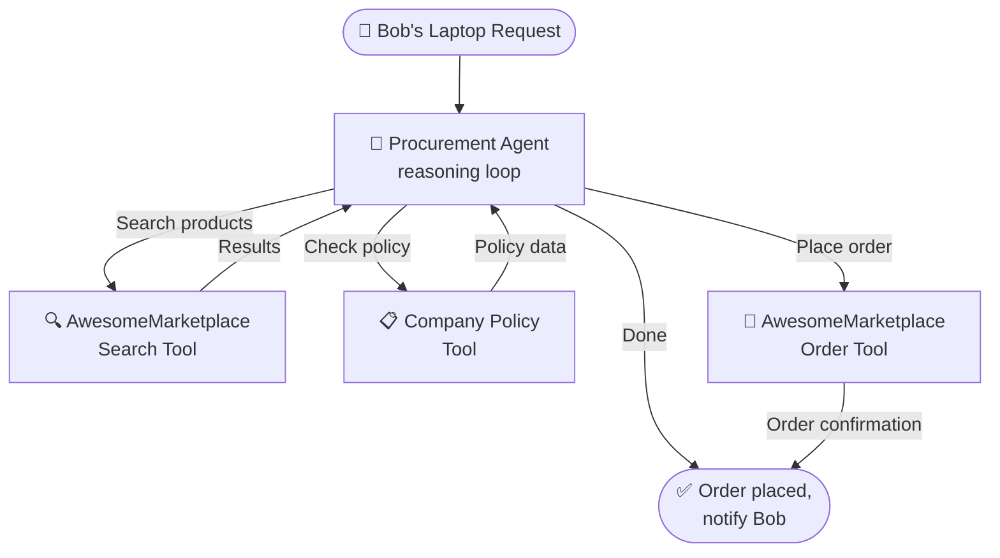
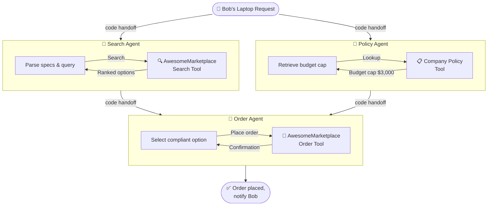
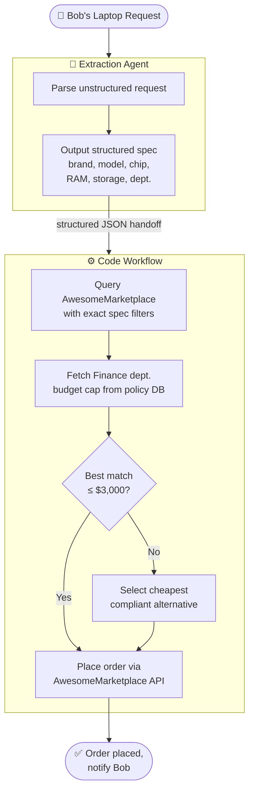

Progress in the frontier AI models has allowed coding agents to tackle ever more complex and long-running tasks.
Coding Benchmark are saturated more and more and the progress is very impressive.
In many benchmarks, the coding agents get extrem flexibility e.g. simply terminal access (https://www.tbench.ai/), it tries things things and iterates until a given task is done.
Software is usually a combination of code snippets LLMs have seen during training plenty of time and the fact that coding agents can iterate and evaluate progress allows them so solve very complex tasks.

However, outside of coding tasks AI workflows still rule over agentic approaches. Let's take the following example: Employer Bob from OilVentures sends the following request to his procurement department:

> I need a new Laptop for my work. I would like:
> - MacBook Pro
> - M4 Max Chip
> - 16 inch
> - 32GB RAM
> - 1TB Storage
> I am working in the finance department. Can you please find the best options for me and make the purchase?

The procurement department often gets requests for new laptops. They want to automate this.
At the AwesomeMarketplace, they need specify the brand, the model, the chip, RAM and storage to filter for a laptop.
The maximum allowance per company policy for a laptop at OilVentures is $3000 for the finance department.

# The fully agentic approach
The Procurement agent gets Access to the AwesomeMarketplace search, the company policy and can place Product orders on AwesomeMarketplace.

# Specialised multi-agent
We have one agent for the search, one for the policy and one for the order placement. We transition between the agents via regular Code.

# The specialised agent approach
We have one agent which extracts the relevant information from the request and then we have a regular code workflow which does the search, checks the policy and places the order.

- Auditability
- Policy enforcement

https://danielfridljand.de/post/pydantic-ai-type-safe-hybrid-workflows