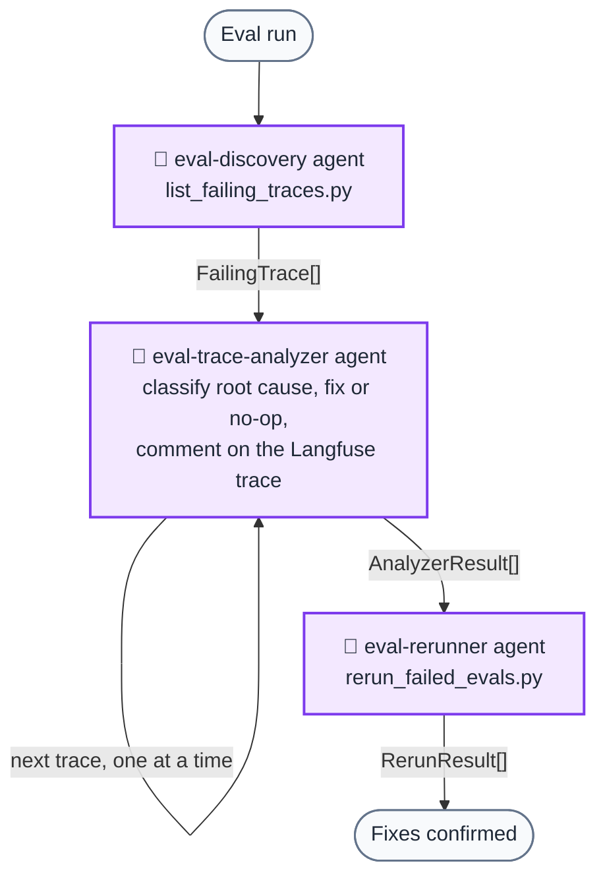

In [a recent AI-powered support project](/post/first-level-support-automation), [Langfuse](https://langfuse.com/) connected production monitoring, evaluation history, and a Cursor-based triage loop. What mattered was keeping enough context to turn an evaluation failure into the right kind of fix.

## 1. Monitoring production and evaluation flows

We treat observability as a port: the app depends on a `MonitoringPort` interface, and the Langfuse implementation lives in an adapter. That keeps the core logic free of SDK details and makes it easy to test with a no-op or mock.

The adapter exposes an `observe` decorator that wraps any function and sends a span to Langfuse. We use it on intent classification, extraction, and the later steps (fetch, plan, message). Each trace gets provenance metadata—git commit, branch, deploy env—so we can tie a run to a code version. We also set session IDs when we have them (e.g. from the chat UI), so we can group traces by conversation.

We also log input/output token counts and the model name on the current observation. Langfuse can then infer or display cost per call and per trace, showing which step and model is expensive during evals or production traffic.

At startup we register prompts (e.g. intent classification, information extraction) with Langfuse. That gives a single place to see which prompt versions are in use and to compare runs when we change a prompt.

## 2. Persisting runs and traces for later review

Evaluations are separate from unit tests: they measure performance over time and are built around **Langfuse datasets and dataset runs**. We keep evaluation data in git (e.g. JSONL files); a script syncs them into Langfuse as datasets. Each evaluation run loads a dataset, runs the task per item, applies evaluators, records scores on each trace, and links traces to dataset items. So in Langfuse we get **one trace per test case**, with input, output, and scores.

Evaluators return structured scores (e.g. intent match, correct tools selected, resolution helpfulness). We record them on the trace and also compute run-level aggregates—accuracy, pass rate, mean latency—and attach them to the dataset run. That way we can compare runs side by side: "this run after the prompt change" vs "last week's run."

We don't throw away runs. We can open any past run, drill into a failed case, and see the full trace: which step failed, what the model saw and returned, and what the scorer said.

## 3. Turning failures into targeted fixes

Persisted traces become useful when they feed back into the codebase. A single Cursor command (`/langfuse-triage-failures`) runs a triage loop with three specialized subagents.

The analyzer agents run one trace at a time because each may modify source files. The orchestrator hands off the next trace only after the previous one has returned its `AnalyzerResult`, avoiding conflicts between parallel edits.

Each handoff carries a typed payload—`FailingTrace` from discovery, `AnalyzerResult` from the analyzer, `RerunResult` from the rerunner—defined in a single contracts file that all agents reference. This keeps the pipeline consistent when agents are swapped or updated.

### Root-cause categories

The analyzer classifies each failure into one of seven categories, each with its own remediation guide:

| Category | What it means | Where to fix |
|---|---|---|
| `eval_data_wrong` | Ground truth or test fixture is incorrect | Update eval JSONL |
| `mock_server_mismatch` | Mock doesn't match the real API contract | Fix mock server response |
| `missing_mock_get_endpoint` | GET endpoint missing from mock | Add endpoint to mock |
| `missing_mock_post_endpoint` | POST endpoint missing from mock | Add endpoint to mock |
| `prompts_behavior` | Model does wrong thing due to prompt wording | Edit prompt template |
| `system_behavior` | Code-level bug independent of prompts | Fix application code |
| `something_else` | Likely flakiness or LLM non-determinism | Re-run; document if recurring |

For `something_else` the agent posts a comment on the Langfuse trace and returns `implemented_fix: "no_code_change"`—no code is touched. Everything is still logged so we can spot recurring patterns.

The analyzer is prohibited from editing raw customer-interaction fixtures: they are real inputs, and editing one would make a test pass without making the system any better. If a raw case fails because the message itself is messy, the fix goes into the prompt or comparison logic, not the fixture file. That boundary is written into the agent's system prompt rather than left to convention.

## 4. Fix eval data before prompts

Each failure still requires a choice: fix the *evaluation data* (ground truth and false-positive patterns) or the *model behavior* (prompts and system behavior). Mixing them wastes time and can make the metrics less trustworthy.

Fix eval data first. If the ground truth is wrong or the pattern matching is too strict, any metric you compute is misleading. You might "improve" precision by tightening a prompt when the real fix is correcting an over-broad ground-truth pattern. Symptoms include a high unknown-positive count (model outputs that don't match any pattern), or patterns that are too narrow or too loose.

Fix prompts after the eval data reflects what the model *should* do. Low precision or recall then points to the prompt: the model consistently misses a class of real issues (false negatives) or flags things it shouldn't (false positives), while the patterns are already correct.

In practice this means running two distinct workflows:

- **Improve eval data:** Fetch traces with unknown positives, classify each one as true positive or false positive, update the JSONL pattern files, re-run to confirm counts moved correctly. Do not touch prompts here.
- **Improve metrics:** With eval data stable, analyze failure patterns (grouped false negatives and false positives), edit the relevant prompt template, re-run and compare precision/recall/F1 before and after.

Keeping these separate also prevents a common trap: adding ground-truth patterns to "fix" metrics instead of actually improving the model. If you do that, your eval data drifts away from reality and future metrics become meaningless.

## What closes the loop

Together, these make a failed evaluation traceable from production context to root cause, code change, and rerun. More importantly, they keep a bad label from being "fixed" with a prompt change, or bad model behavior hidden by changing the label.
