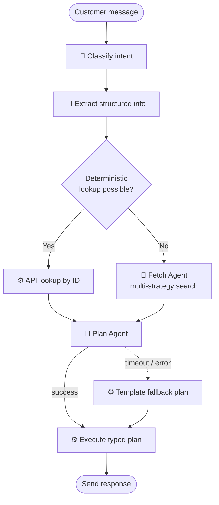

A customer writes in: *"Hey, I haven't received my tickets for tonight's 8pm Dune screening."*

What your support automation does next has at least four distinct decisions baked into it:

1. What is this person asking for — a refund, schedule info, a missing-ticket issue?
2. What order are they talking about? Do we have enough info to pull it up directly, or do we need to search?
3. What should we actually do — resend the tickets, issue a refund, escalate to a human?
4. What do we say back?

Each step has a different shape. Some are one-shot classifications an LLM handles in a single call. Some are straight database lookups that shouldn't touch an LLM at all. Some genuinely need an agent that can try a few strategies before giving up. And all of them need to produce outputs typed well enough for downstream code to trust them.

In [my last post](https://danielfridljand.de/post/agentic-vs-workflow-based-ai) I argued that business automation should use LLMs only where they add irreplaceable value. This post is about how to actually build that without ending up with three libraries, three validation strategies, and three different ways of handling timeouts.

## One primitive, three levels of agency

[Pydantic AI](https://ai.pydantic.dev/) gives you a single primitive — `Agent` — and lets you scale it across the whole spectrum:

- **Deterministic**: no agent at all, just code.
- **LLM-assisted**: an `Agent` with no tools. One LLM call, one validated output.
- **Agentic**: an `Agent` with tools, timeouts, and a typed fallback.

The *contract* is the same in all three cases. You declare an `output_type` — a Pydantic model — and the caller gets back a validated instance of it. Whether that instance came from a compile-time constant, a single LLM call, or an agent that looped through five tool calls is an implementation detail of that one step.

That uniformity is what makes the whole thing work. Swapping a step between deterministic and LLM-assisted, or between LLM-assisted and full agent, is a local change — the code around it doesn't notice.

## Step 1: LLM-assisted (classification + extraction)

Intent classification is the simplest shape. One input, one output, no tools.

```python
class IntentClassification(BaseModel):
    intent: Literal["ticket_delivery", "refund", "schedule", "inquiry"]
    confidence: float

classifier = Agent(
    model=model,
    system_prompt=CLASSIFIER_PROMPT,
    output_type=IntentClassification,
    output_retries=3,
)

result = await classifier.run(conversation_text)
# result.output is already an IntentClassification instance
```

If the model hallucinates an intent not in the `Literal`, Pydantic validation fails and Pydantic AI retries. If it keeps failing, we raise — and in production that gets caught and treated as "unclassified," which routes to a human.

Extraction uses the same shape, with an intent-specific output model:

```python
class TicketDeliveryInfo(BaseModel):
    email: str | None
    transaction_id: str | None
    movie: str | None
    showtime: datetime | None
```

Every field is optional because people don't always include everything. The point isn't to get a complete record — it's to get *whatever is there* in a typed form so the next step can branch on it.

## Step 2: Deterministic where possible

If we extracted a transaction ID, we don't need an LLM to look it up. We just call the API.

```python
async def fetch_transaction(info: TicketDeliveryInfo) -> FetchResult:
    if info.transaction_id:
        if tx := await api.get_by_id(info.transaction_id):
            return FetchResult(transaction=tx)
    if info.email and info.showtime:
        if tx := await api.get_by_email_and_showtime(info.email, info.showtime):
            return FetchResult(transaction=tx)
    # Exhausted deterministic options — escalate to the agent
    return await fetch_agent_run(info)
```

Most real requests have enough structure that they resolve without an LLM. You only pay for the agent on the ambiguous cases — which keeps latency and cost low on the happy path.

## Step 3: Agentic when you need judgment

When the deterministic path runs out of leads, the fetch agent takes over. It has a set of tools — search by email, fuzzy movie title, date range — and decides what to try.

```python
fetch_agent = Agent(
    model=model,
    system_prompt=FETCH_AGENT_PROMPT,
    output_type=FetchResult,
    tools=[search_by_email, search_by_movie_and_date, list_recent_orders],
)

async def fetch_agent_run(info: TicketDeliveryInfo) -> FetchResult:
    try:
        async with asyncio.timeout(10):
            result = await fetch_agent.run(info.model_dump_json())
            return result.output
    except (asyncio.TimeoutError, Exception) as e:
        log.warning("fetch agent failed", error=e)
        return FetchResult(transaction=None, error_code="AGENT_FAILED")
```

Two things worth calling out. First, the `output_type` is still `FetchResult`. On timeout or exception, we construct one with `transaction=None` — downstream code doesn't need to special-case "did the agent work?" because the shape is the same either way. Second, every LLM call is wrapped in an explicit timeout. An agent without a timeout is a production incident waiting to happen.

## The plan agent: let the LLM decide, let code do

This is the pattern I find most useful — and the one I'd put in any talk about hybrid workflows.

Once we have the transaction, we need to decide what to *do*. The agent produces a typed plan; code executes it.

```python
class ResendTickets(BaseModel):
    action: Literal["resend_tickets"]
    transaction_id: str
    email: str

class IssueRefund(BaseModel):
    action: Literal["issue_refund"]
    transaction_id: str
    amount_cents: int

class Escalate(BaseModel):
    action: Literal["escalate_to_human"]
    reason: str

ActionItem = Union[ResendTickets, IssueRefund, Escalate]

class ResolutionPlan(BaseModel):
    actions: list[ActionItem]
    customer_message: str

plan_agent = Agent(
    model=model,
    system_prompt=PLANNER_PROMPT,
    output_type=ResolutionPlan,
)
```

The `Literal` field on each action is what makes the union discriminated — Pydantic picks the right variant at validation time. Downstream, the executor just pattern-matches:

```python
async def execute_plan(plan: ResolutionPlan) -> None:
    for action in plan.actions:
        match action:
            case ResendTickets():
                await ticketing.resend(action.transaction_id, action.email)
            case IssueRefund():
                await payments.refund(action.transaction_id, action.amount_cents)
            case Escalate():
                await support.create_ticket(action.reason)
    await messaging.send(plan.customer_message)
```

The LLM decides *what* the plan is. Code *does* the plan — with all the boring reliability stuff (retries, idempotency keys, audit logs) living where it belongs.

And when the plan agent fails? We build a fallback plan of the same type:

```python
def fallback_plan() -> ResolutionPlan:
    return ResolutionPlan(
        actions=[Escalate(action="escalate_to_human", reason="planner unavailable")],
        customer_message=TEMPLATES["generic_apology"],
    )
```

The executor has no idea whether this came from the LLM or the fallback. That's the point.

## The whole pipeline

Putting it together:



Notice how much of the pipeline is *not* an LLM call. The LLM sits in a few specific places where it genuinely earns its keep — parsing messy input, picking a plan from a typed menu, writing customer-facing prose. Everything else is code.

## What this actually buys you

**Failure modes become typed values.** Every way an LLM call can go wrong — malformed output, timeout, the model refusing — gets caught by the runner and turned into an instance of the step's output type with an error field set. Downstream code doesn't need to know an error happened; it just sees `transaction=None`, or a fallback plan, or a template message. The blast radius of "the LLM did something weird" stops at the runner for that step.

**The agency-level decision becomes local.** When a step you thought needed an agent turns out to be solvable with deterministic code, you delete the agent and keep the same `output_type`. When a step you thought was deterministic starts failing on edge cases, you swap in an agent without touching anything around it. The unit of change is one function.

**You stop over-engineering with agents.** Once you're counting LLM calls in a pipeline — because each one has a typed output, a timeout, a fallback, and a bill — the temptation to make everything agentic goes away. You start asking *"does this step actually need to choose actions, or does it just need to return a struct?"* And most of the time the answer is the second one.

If you’re building agents or support automation that need both "simple" LLM steps and "full" agentic flows, Pydantic AI’s single abstraction plus a clear split between LLM-assisted and agentic steps is a good fit. You get type safety everywhere and a simple rule for when to use which kind of workflow.
