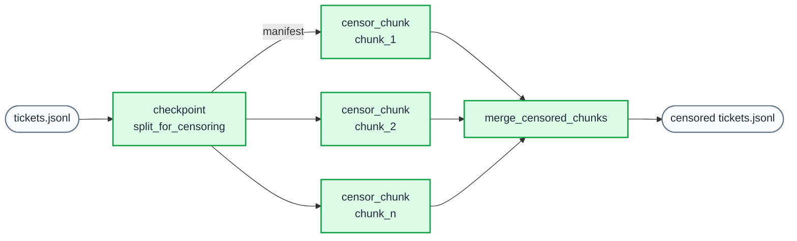

On a recent project, I had to classify a couple of thousand customer support tickets, prepare training data, and keep every run reproducible. The example is based on a real project, with details changed to protect the client's privacy. The expensive steps, mainly LLM calls and PII censoring, did not work well as a sequence of standalone scripts. I used [Snakemake](https://snakemake.readthedocs.io/) to make the dependencies explicit and rerun only what had changed.

## The challenge

The tickets came from the client's helpdesk system. We wanted to classify each one by **customer intent** (e.g. billing questions, technical issues, feedback) for a later [first-level customer support AI agent](/post/first-level-support-automation). The work was iterative: define intents, run an LLM over the tickets, inspect what remained unclassified or misclassified, refine the taxonomy, and repeat. Without a workflow engine, each pass meant manual scripts, ad-hoc reruns, and duplicated work.

## Pipeline overview

The Snakemake pipeline has 19+ stages. At a high level it:

1. **Ingests** raw ticket data (filter by segment, subsample if needed).
2. **Cleans and normalises** tickets (flag conversation-style tickets, fix malformed records, extract a consistent set of fields).
3. **Censors sensitive data** so downstream steps and training data never see PII.
4. **Classifies comment authors** (customer vs agent vs unknown) using an LLM where metadata was missing.
5. **Labels tickets by intent** with an LLM, split into chunks that run in parallel, as in the censoring step described below.
6. **Produces two outputs**: a censored dataset for training, and an uncensored (in-memory/view-only) path for inspection in a Streamlit app.
7. **Prepares training data**: filter to labelled tickets, drop non-actionable intents, balanced subsample per intent, truncate agent resolution, and transform into the final training format.

The rule graph below gives a bird’s-eye view of the workflow and its dependencies.


*Drawn before the pipeline has split the tickets into chunks, so the per-chunk rules described below don't appear yet; Snakemake adds them once it knows how many chunks there are.*

## The ticket shape

Tickets were standard helpdesk exports. Each ticket had:

- **Identifiers and metadata**: ticket ID, channel (e.g. email, chat), satisfaction score when available.
- **Comments**: a time-ordered list of entries, each with timestamp, body text, and an author role (customer, agent, or sometimes unknown when the export didn’t carry that information).

The pipeline first reduced each ticket to a fixed set of fields (IDs, channel, satisfaction, comment list with normalised author and body). Sensitive content in comment bodies was then censored (e.g. names, emails) so that all downstream steps—including LLM labelling—operated on safe, anonymised text. Below is one example ticket, with all identifying details replaced by dummy data and uninteresting fields omitted, to illustrate the structure:

```json
{
  "id": 10001,
  "subject": "Card not received",
  "channel": "email",
  "comments": [
    {
      "body": "Hello,\n\nI requested a replacement card last week and it still hasn't arrived.\nSent from my iPhone",
      "created_at": "2025-01-14T10:01:57Z",
      "author_role": "customer"
    },
    {
      "body": "Hello,\n\nI have re-issued your card.\nI am also attaching the confirmation to this email, just in case.\n\nKind regards,\nSupport Team",
      "created_at": "2025-01-14T10:14:46Z",
      "author_role": "agent"
    }
  ],
  "customer_intent": "CardNotReceived"
}
```

Because each ticket is one record holding all of its comments, the chunks below are sets of whole tickets: a ticket's comments never end up in two different chunks.

## Three ways Snakemake helped

### 1. Scatter–gather for expensive steps

The heaviest steps were: PII censoring, LLM-based author classification, and LLM-based intent labelling. Running them over a couple of thousand tickets in one go would have been slow and brittle. So we used a **scatter–gather** pattern. The censoring step uses Microsoft Presidio with multilingual NLP models to detect PII, then replaces it with realistic synthetic data via Faker, maintaining consistency within each ticket.

1. **Scatter**: A checkpoint rule splits the extracted tickets into chunks (e.g. 500 tickets per chunk) and writes a manifest of chunk filenames.
2. **Process in parallel**: Each chunk is processed by its own rule (e.g. `censor_chunk`, `classify_authors_chunk`, `label_llm_chunk`). Snakemake can run these in parallel with `--cores N`.
3. **Gather**: A merge rule collects all chunk outputs into a single file (e.g. censored tickets, author-labelled tickets, or per-model label CSVs).



Example: the censoring stage is implemented as a checkpoint split, a parameterised chunk rule, and a merge that uses a function to discover chunk names from the manifest:

```python
checkpoint split_for_censoring:
    input:
        input_path = "data/tickets/06_extracted/tickets.jsonl"
    output:
        manifest = "data/tickets/07_chunks_uncensored/manifest.txt"
    params:
        output_dir = "data/tickets/07_chunks_uncensored",
        chunk_size = config.get("parameters", {}).get("chunk_size", 500)
    shell:
        "uv run src/processing/split_tickets.py {input.input_path} {params.output_dir} --chunk-size {params.chunk_size}"
```

```python
rule censor_chunk:
    input:
        chunk = "data/tickets/07_chunks_uncensored/chunk_{i}.jsonl",
        config = "config.yaml"
    output:
        censored = "data/tickets/08_chunks_censored/chunk_{i}.jsonl"
    shell:
        "uv run src/processing/censor_sensitive_data.py {input.chunk} {output.censored} --config {input.config}"
```

```python
rule merge_censored_chunks:
    input:
        chunks = get_censored_chunks
    output:
        output_path = "data/tickets/09_censored/tickets.jsonl"
    params:
        input_dir = "data/tickets/08_chunks_censored"
    shell:
        "uv run src/processing/merge_tickets.py {params.input_dir} {output.output_path}"
```

`get_censored_chunks` reads the manifest produced by the checkpoint and returns the list of censored chunk paths, so the merge rule stays correct even when the number of chunks changes. The same pattern is reused for author classification and for LLM labelling (with labels stored per model so we could experiment with different models).

### 2. Incremental reruns

Because we refined customer intents iteratively, we often re-ran the pipeline after changing only the intent definitions or a few scripts. Snakemake reruns a rule only when its inputs, parameters or code change, so each pass recomputed the rules that depended on what had changed and reused everything else. That saved a lot of time during the iterative refinement phase.

The **checkpoint** does a different job. The number of chunks is known only after the split has run, and the checkpoint tells Snakemake to re-evaluate the DAG at that point, so the merge rules wait for every chunk that actually exists.

### 3. Dependency management and reproducibility

With 19+ steps, two output paths (censored for training, uncensored for viewing), and several scatter–gather phases, hand-managing the order of operations would have been error-prone. Snakemake’s DAG took care of it: we just declared inputs and outputs for each rule, and the correct execution order and parallelisation followed. That gave:

- **Reproducibility**: The pipeline is fully specified in the Snakefile and config, so a rerun takes the same steps in the same order. The LLM labels themselves are not bit-for-bit reproducible.
- **Transparency**: The rule graph (as in the figure above) makes the pipeline's structure visible at a glance, which helps both debugging and onboarding.

The pipeline is also model-agnostic: labels are stored per-model (e.g. `data/tickets/13_labeled/Qwen_Qwen3-Coder-480B/`), allowing easy experimentation with different LLMs without reprocessing tickets.

## Outcome

The pipeline processed the full ticket set into 20+ customer intent categories. We could refine the taxonomy without rerunning unrelated work, and the final stages produced the datasets needed to train a first-level customer support AI agent in a separate repo.
