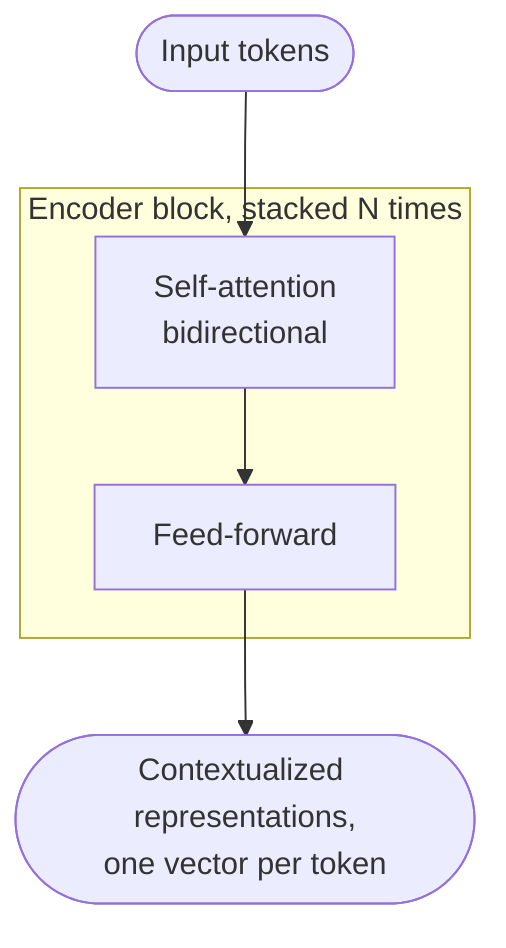
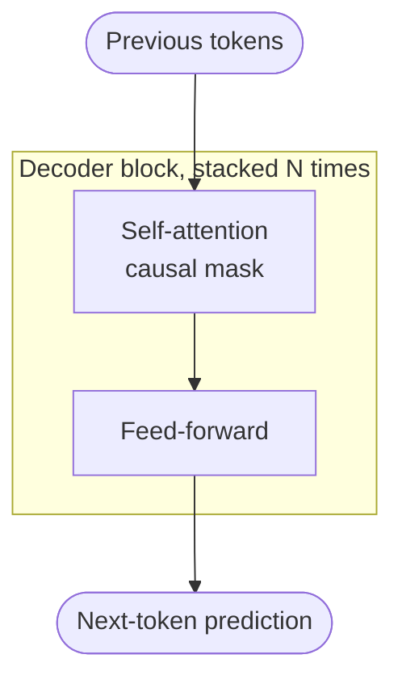

This is a short follow-up to [From Kernel Regression to Self-Attention](/post/kernel-to-attention) and [Masked Self-Attention](/post/masked-attention). The first post derived self-attention. The second added a causal mask. This one zooms out one level: self-attention is a *mechanism*, but BERT, GPT, and T5 are *architectures* built by stacking it. They all use self-attention. They differ in *how* they stack it.

If you have ever wondered why the original Transformer paper had both an "encoder" and a "decoder," but BERT is called "encoder-only" and GPT is called "decoder-only" — this post is for you.

---

## 1. The original Transformer

The original Transformer ([Vaswani et al., 2017](https://arxiv.org/abs/1706.03762)) was built for machine translation. It has two halves: an *encoder* that reads the source sentence (English, say), and a *decoder* that generates the target sentence (German), one token at a time.

```mermaid
flowchart TD
    SRC([Source tokens\n"the cat sat"])
    TGT([Target tokens so far\n"die Katze"])

    subgraph E ["Encoder block, stacked N times"]
        E1[Self-attention\nbidirectional]
        E1 --> E2[Feed-forward]
    end

    subgraph D ["Decoder block, stacked N times"]
        D1[Self-attention\ncausal mask]
        D1 --> D2[Cross-attention]
        D2 --> D3[Feed-forward]
    end

    SRC --> E1
    TGT --> D1
    E -->|K, V to cross-attention| D
    D3 --> OUT([Next target token\n"saß"])
```

Three pieces are at work:

- **Encoder self-attention** is bidirectional. Every position in the source sentence can attend to every other position. There is nothing to hide — the whole source sentence is visible at once.
- **Decoder self-attention** is causal-masked. As the decoder generates the target, position $i$ can only attend to positions $1, \ldots, i$. This is exactly the mask from the [previous post](/post/masked-attention).
- **Cross-attention** is the bridge between the two halves. Inside the decoder, queries come from the decoder itself, but keys and values come from the encoder's final output. This is what lets each target token attend to every source token — the mechanism by which "die Katze saß" gets aligned with "the cat sat."

The encoder and decoder are each a stack of identical blocks. In the original paper, $N = 6$ for both.

---

## 2. Encoder-only: BERT and friends

If your task is *understanding* — sentence classification, named entity recognition, embedding generation — you do not need to generate text. You just need a contextualized representation of every input token. Drop the decoder; keep the encoder.



This is BERT ([Devlin et al., 2018](https://arxiv.org/abs/1810.04805)) and its successors — RoBERTa, DeBERTa, ModernBERT. Without a decoder there is no autoregressive generation, so there is no need for a causal mask. Every position attends to every other position. Useful, since classifying a word benefits from seeing what comes after it as well as before.

---

## 3. Decoder-only: GPT, Llama, Claude

If your task is *open-ended generation* — chat, completion, code — you only need to produce tokens one at a time, each conditioned on the past. Keep the decoder side; drop the encoder.



Notice what is *not* there: cross-attention. In the original Transformer, the decoder block had three sub-layers — masked self-attention, cross-attention to the encoder, and feed-forward. Without an encoder, there is nothing to cross-attend to, so the cross-attention layer is dropped entirely. What is left in each block is just masked self-attention and a feed-forward network.

This is what "decoder-only" means in practice. The name is slightly misleading: what made the original decoder a *decoder* was its cross-attention layer, and decoder-only models do not have it. A more honest name would be "causal-masked Transformer." But the name stuck because, like the original decoder, these models generate autoregressively — they emit tokens left to right, conditioning each on what has already been produced.

GPT, Llama, Mistral, and Claude are all decoder-only. The architecture won because most useful tasks — coding, writing, conversation, reasoning — can be framed as next-token prediction, and decoder-only models scale cleanly without the encoder–decoder split.

---

## 4. Side by side

| Architecture     | Self-attention   | Cross-attention | Examples                         | Best for                |
|------------------|------------------|-----------------|----------------------------------|-------------------------|
| Encoder-only     | Bidirectional    | None            | BERT, RoBERTa, ModernBERT        | Understanding           |
| Decoder-only     | Causal-masked    | None            | GPT, Llama, Claude               | Open-ended generation   |
| Encoder–decoder  | Both kinds       | Yes             | T5, BART, original Transformer   | Sequence-to-sequence    |

The choice is task-driven. Need a representation? Encoder-only. Need to generate text from scratch? Decoder-only. Need to generate text *conditioned on a different sequence* (translation, summarization, structured generation from long input)? Encoder–decoder.

A practical note: encoder–decoder models like T5 ([Raffel et al., 2019](https://arxiv.org/abs/1910.10683)) and BART are still actively used for sequence-to-sequence tasks where the input and output are clearly distinct. But the gravitational center of the field has shifted to decoder-only, because anything you can frame as "continue this text" — which turns out to be a lot — can be done by a decoder-only model with the right prompt.

---

## Summary

Self-attention is the *mechanism*. The three Transformer families are different ways to stack it.

- **Encoder-only** uses bidirectional self-attention. Everything sees everything.
- **Decoder-only** uses causal-masked self-attention. The future is hidden.
- **Encoder–decoder** uses both, plus a cross-attention bridge from decoder to encoder.

In all three, the underlying attention layer is the same scaled-dot-product self-attention from [the kernel regression derivation](/post/kernel-to-attention). The architectural differences are entirely about *which positions can see which* — controlled by masks and by which sequence each query reads from.

---

*Built on the notation in [From Kernel Regression to Self-Attention](/post/kernel-to-attention) and [Masked Self-Attention](/post/masked-attention). Original architecture: Vaswani et al., "[Attention Is All You Need](https://arxiv.org/abs/1706.03762)", NeurIPS 2017. BERT: Devlin et al., "[BERT: Pre-training of Deep Bidirectional Transformers for Language Understanding](https://arxiv.org/abs/1810.04805)", 2018. T5: Raffel et al., "[Exploring the Limits of Transfer Learning with a Unified Text-to-Text Transformer](https://arxiv.org/abs/1910.10683)", 2019.*
