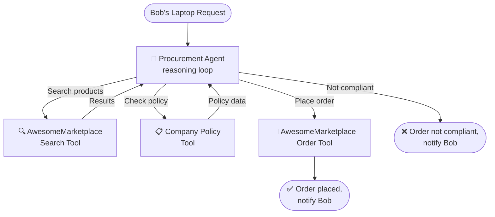
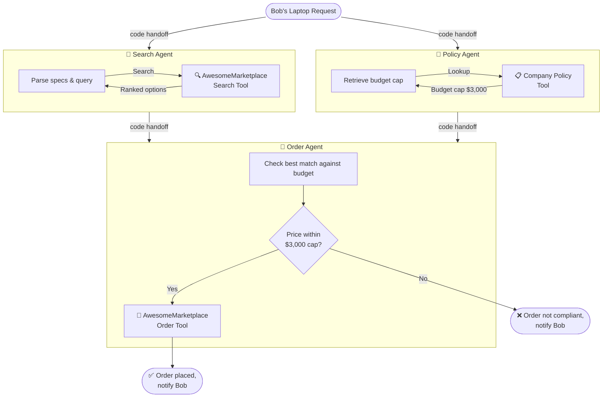
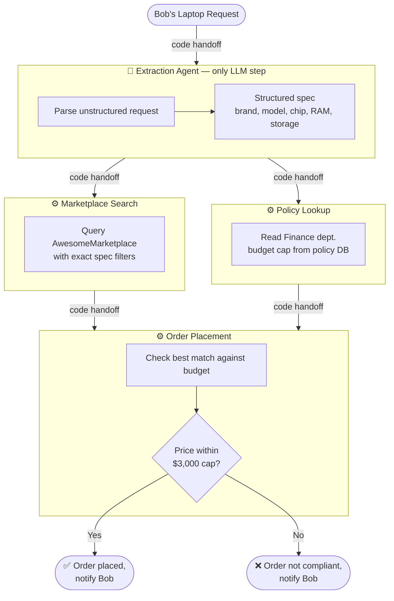

Progress in frontier AI models has allowed coding agents to tackle ever more complex and long-running tasks. Benchmarks are saturating fast, and the trajectory is genuinely impressive.

What makes coding agents so effective is a combination of three things. First, software is largely composed of patterns LLMs have seen countless times during training — syntax, idioms, libraries, algorithms. Second, code gives you *automated evaluation for free*. You run it, and you get a compiler error, a failing test, or a stack trace. The agent doesn't need to know whether it's right — the environment tells it. Third, and most importantly, agents can iterate cheaply. A bad attempt costs a few seconds of compute and nothing irreversible happens. In many benchmarks, coding agents are given nothing but terminal access — like [tbench](https://www.tbench.ai/) — and are left to try things, observe results, and loop until the task is done. That tight feedback loop is what allows them to crack problems that would have seemed out of reach just a year ago.

But this combination — abundant training data, automated feedback, and cheap retries — is specific to code. Most business tasks don't have any of it. There is no compiler for procurement policy. LLMs haven't seen your internal approval chains or vendor contracts during training. And placing a wrong order isn't something you can just undo and retry. To understand what this means in practice, let's walk through a concrete example.

---

## The scenario

Bob from OilVentures sends the following request to his procurement department:

> I need a new laptop for my work. I would like:
> - MacBook Pro
> - M4 Max Chip
> - 16 inch
> - 32GB RAM
> - 1TB Storage
>
> I am working in the finance department. Can you please find the best options for me and make the purchase?

The procurement department handles requests like this regularly and wants to automate it. Two constraints are relevant:

- **AwesomeMarketplace** (their vendor) requires brand, model, chip, RAM, and storage to filter products.
- **OilVentures policy** caps laptop spend at **$3,000** for the finance department.

We'll look at three ways to automate this.

---

## 1. The fully agentic approach

A single Procurement Agent gets access to all three tools — marketplace search, company policy, and order placement — and figures out the rest on its own.

This looks elegant, but it has a serious problem: there is no guarantee the agent will check the policy *before* placing the order. It might. It might not. And if it places a non-compliant order, you only find out after the fact. Unlike coding tasks — where a failed test is cheap and reversible — a wrongly submitted purchase order has real consequences. As the ServiceNow CEO [put it](https://open.spotify.com/episode/11xeL3QCAF77z1vxOp0am0?si=fc70f33f0dd64ab4): people forgive other people for making mistakes. They don't forgive software.

---

## 2. The specialised multi-agent approach

Rather than one agent doing everything, we give each task its own dedicated agent with a single tool. Regular code orchestrates the handoffs between them, and Search and Policy agents run in parallel.

This is better. Each agent has a narrow, well-defined job, and code controls the sequencing — so we know the policy check always happens before the order. But three LLM calls for what is largely a structured task still feels like overkill. The Search and Policy agents are essentially doing retrieval with a thin reasoning wrapper. We're paying the cost of LLM unpredictability where we don't need to.

---

## 3. The hybrid approach: extraction agent + code workflow

The key insight is that there is only *one* genuinely hard part of Bob's request: parsing his free-text message into a structured spec the marketplace API can consume. Everything after that — the search, the policy check, the order — can be handled deterministically by regular code.

### Verify the distribution before you design

Why is this even tractable? Why isn't every Bob's request a unique snowflake? Because real business processes rarely are. If you took a sample of past procurement requests and asked an small LLM to bucket them into a small number of intent categories — laptops with specs, peripherals, software licenses, replacement orders, vendor onboarding — you'd typically find that the vast majority fall into a handful of buckets. The long tail is real, but the head of the distribution dominates.

This isn't an assumption. It's something you verify empirically before designing the system: take a few hundred historical requests, cluster them, and look at the coverage. If 80% of your traffic falls into a dozen well-defined intents, the hybrid approach is on solid ground. If your distribution is genuinely flat — every request its own snowflake — you have a different problem, and probably need a different architecture. Skipping this check is how teams end up building agentic monoliths for tasks that turn out to be 90% structured.

### Why this works better than the agentic alternatives

**Use code where code is enough.** The Marketplace Search and Policy Lookup endpoints are unlikely to change often. Implementing a robust integration with exponential backoff, error handling, and retries is a one-time investment — and it'll be more reliable than an agent figuring out how to interact with them on the fly, every time.

**Scope the LLM to what only an LLM can do.** Extracting structured information from unstructured text is a well-defined task. You can build targeted evals, iterate on prompts, use a cheaper model — or even swap the LLM out for a Named Entity Recognition model if your input vocabulary is bounded enough. None of that is possible when the LLM is entangled with search, policy, and ordering logic.

**Don't ask an LLM to enforce rules it hasn't seen.** LLMs have seen code countless times in their training data. They have *not* seen your specific business requirements, procurement policies, or vendor contracts. A deterministic policy check is a hard `if` statement. It cannot be reasoned around, hallucinated, or skipped.

**Iteration is targeted and predictable.** This is the reason that matters most once a system is in production. Real users will report problems: a request gets misinterpreted, a policy update changes the rules, a vendor adds a new product line. With a workflow, fixes are local. You change the extraction prompt, you add a branch in the policy code, you adjust an API call — and you know what will happen on the next request of that shape. With an agent, your tools for change are blunter. You can edit the system prompt, you can rephrase a policy document, but you're nudging behaviour, not specifying it. The first instinct when something breaks in an agentic system is to tweak the prompt and hope. Hoping doesn't scale, and it doesn't survive a code review either.

**Auditability comes for free.** Every step after extraction is regular code. You can log it, test it, and trace it exactly like any other software. When something does go wrong, you know exactly where to look.

---

This is the pattern I'd reach for first in any process automation task: verify that the input distribution is concentrated, use an LLM to bridge the gap between human language and structured data, and let code do the rest. For a deeper dive into how to implement this cleanly with PydanticAI, see [this post](https://danielfridljand.de/post/pydantic-ai-type-safe-hybrid-workflows).