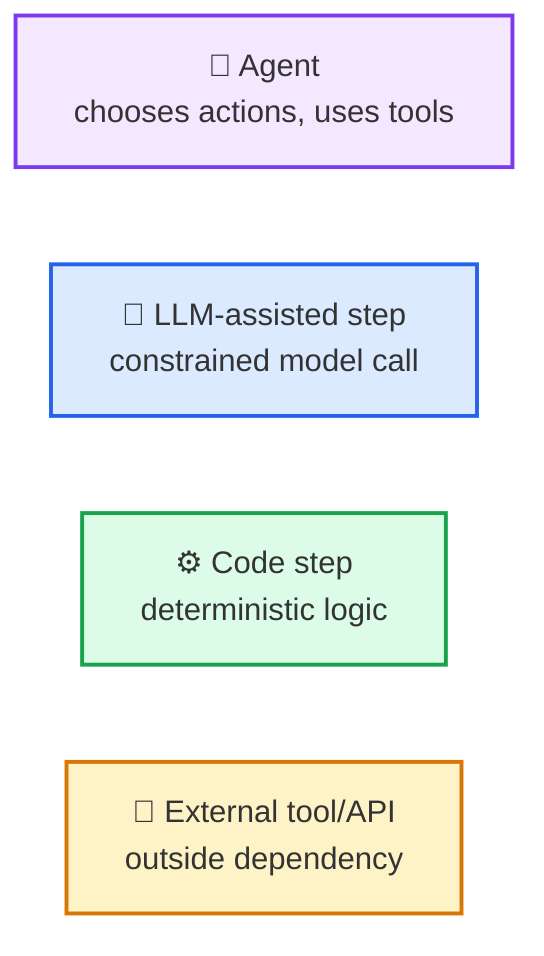
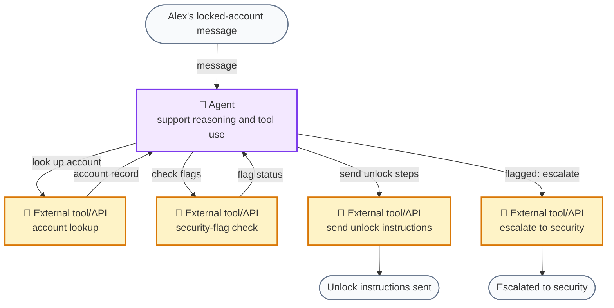
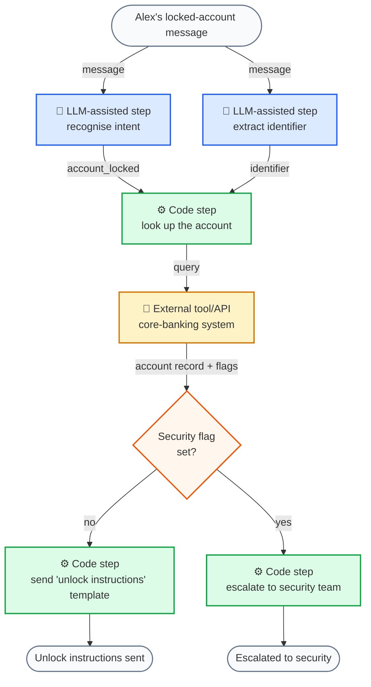

## TL;DR
The first architectural decision in an LLM automation is how much of the work the model does and how much code does. We put code in charge of sequencing and gave the LLM one narrow job. That was right for the head of the ticket distribution and wrong for the tail. Next time I would invert the order and start with the agent.

## The task

Customers wrote in to our first-level support team at Northstar Bank with messages like this:

> Hi, I'm Alex Carter and I bank with your Riverton branch. My account number is NSB01234 and I can't get in any more; it keeps saying the account is locked. Can you help me get back in?

The running example is based on a real project, but the details have been changed to protect the client's privacy.

An early decision in a project like this: how much of the work does the model do, and how much does code do? It shapes a lot downstream.

Two facts pushed us toward code. The first is that LLMs haven't seen your internal escalation rules or customer records during training. The second is that nothing here plays the role a compiler or test suite plays for a coding agent: no automatic verdict tells the system whether the reply it wrote was any good, so someone who knows the bank has to read it and judge. That second fact has [a post of its own](/post/the-missing-compiler); this one is about who decides the order of operations.

Either way, my instinct was to lean on workflows and keep the LLM on a short leash.

---

## The fully agentic approach

The first design we considered was a single Support Agent that held every tool — account lookup, security-flag check, send unlock instructions, escalate to security — and wrote the customer's reply itself.

The diagrams in this post use four shapes:

```mermaid
flowchart LR
    LA["🤖 Agent<br/>chooses actions, uses tools"]
    LL["🧠 LLM-assisted step<br/>constrained model call"]
    LC["⚙️ Code step<br/>deterministic logic"]
    LT["🔌 External tool/API<br/>outside dependency"]

    classDef agent fill:#f3e8ff,stroke:#7c3aed,stroke-width:2px
    classDef llm fill:#dbeafe,stroke:#2563eb,stroke-width:2px
    classDef code fill:#dcfce7,stroke:#16a34a,stroke-width:2px
    classDef tool fill:#fef3c7,stroke:#d97706,stroke-width:2px
    class LA agent
    class LL llm
    class LC code
    class LT tool
```

```mermaid
flowchart TD
    INPUT(["Alex's locked-account message"])
    A1["🤖 Agent<br/>support reasoning and tool use"]
    T1["🔌 External tool/API<br/>account lookup"]
    T2["🔌 External tool/API<br/>security-flag check"]
    T3["🔌 External tool/API<br/>send unlock instructions"]
    T4["🔌 External tool/API<br/>escalate to security"]
    OUT1(["Unlock instructions sent"])
    OUT2(["Escalated to security"])

    INPUT -->|"message"| A1
    A1 -->|"look up account"| T1
    T1 -->|"account record"| A1
    A1 -->|"check flags"| T2
    T2 -->|"flag status"| A1
    A1 -->|"send unlock steps"| T3
    T3 --> OUT1
    A1 -->|"flagged: escalate"| T4
    T4 --> OUT2

    classDef agent fill:#f3e8ff,stroke:#7c3aed,stroke-width:2px
    classDef tool fill:#fef3c7,stroke:#d97706,stroke-width:2px
    classDef terminal fill:#f8fafc,stroke:#64748b,stroke-width:1.5px
    class A1 agent
    class T1,T2,T3,T4 tool
    class INPUT,OUT1,OUT2 terminal
```

This looks elegant, but nothing in it guarantees that the agent checks the security flag *before* sending unlock instructions.
That would be an expensive mistake, and a system that decides the order of its own safety checks in free text is exposed to prompt injection.
As the ServiceNow CEO [put it](https://open.spotify.com/episode/11xeL3QCAF77z1vxOp0am0?si=fc70f33f0dd64ab4): people forgive other people for making mistakes. They don't forgive software.

In practice, though, a different complaint drove the decision: stakeholders said the agent's replies didn't match the established message templates.
We tried to fix that with prompt engineering, but asking an LLM to be reliably deterministic works against its nature.

## The workflow approach

We labelled and clustered roughly 2,300 past tickets with an AI-assisted, iterative process. A handful of intents accounted for the large majority of them, which encouraged us to try a workflow.

To get both the ordering guarantee and the fixed templates, we kept code in charge of the sequencing and reserved the LLM for the *one* hard part of Alex's message:
interpreting it, recognising that this is an *account-locked* request and pulling out the identifier (the account number, or the name and branch).
Everything after that (the lookup, the flag check, the reply) is deterministic, so code runs the steps in a fixed order and the flag check always happens before any unlock instructions go out.

```mermaid
flowchart TD
    INPUT(["Alex's locked-account message"])
    L1["🧠 LLM-assisted step<br/>recognise intent"]
    L2["🧠 LLM-assisted step<br/>extract identifier"]
    C1["⚙️ Code step<br/>look up the account"]
    T1["🔌 External tool/API<br/>core-banking system"]
    D1{"Security flag<br/>set?"}
    C2["⚙️ Code step<br/>send 'unlock instructions' template"]
    C3["⚙️ Code step<br/>escalate to security team"]
    OUT1(["Unlock instructions sent"])
    OUT2(["Escalated to security"])

    INPUT -->|"message"| L1
    INPUT -->|"message"| L2
    L1 -->|"account_locked"| C1
    L2 -->|"identifier"| C1
    C1 -->|"query"| T1
    T1 -->|"account record + flags"| D1
    D1 -->|"no"| C2
    D1 -->|"yes"| C3
    C2 --> OUT1
    C3 --> OUT2

    classDef llm fill:#dbeafe,stroke:#2563eb,stroke-width:2px
    classDef code fill:#dcfce7,stroke:#16a34a,stroke-width:2px
    classDef tool fill:#fef3c7,stroke:#d97706,stroke-width:2px
    classDef decision fill:#fff7ed,stroke:#ea580c,stroke-width:2px
    classDef terminal fill:#f8fafc,stroke:#64748b,stroke-width:1.5px
    class L1,L2 llm
    class C1,C2,C3 code
    class T1 tool
    class D1 decision
    class INPUT,OUT1,OUT2 terminal
```

For this one intent, the workflow was the clear fit: explicit logic, a small state space, and — because code selects the reply — a template that is guaranteed rather than prompted for.

Two consequences:

- **Scope the LLM to what only an LLM can do.** Recognising the intent and extracting an identifier from free text is a well-defined task. You can build targeted evals, iterate on the prompt, drop to a cheaper model, or swap the LLM for a Named Entity Recognition model.
- **Iteration is targeted and predictable.** When a message is misread or a policy changes, the fix is local: edit the extraction prompt, add a branch, adjust one API call, and you know what the next message of that shape will do.

The production version of this pattern, scaled up to a four-step pipeline, is in [Architecture of a First-Level Support Automation](/post/first-level-support-automation); the typing that holds the seams together is in [Type-Safe Hybrid Workflows with Pydantic AI](/post/pydantic-ai-type-safe-hybrid-workflows).

## The state space wasn't bounded

We ran that pipeline in shadow deployment — it drafted a reply to every incoming ticket, subject-matter experts graded the drafts, and nothing went to a customer. Each round of their feedback landed a new branch in the tree, and for a while that worked.

But a *true* workflow needs a deterministic mapping from customer intent plus [fetched data](/post/first-level-support-automation#step-3-fetch) to a helpful reply.

That mapping is a grid: every message shape against every state the record behind it can be in:

| | Verified, no flags | Security flag | Account closed |
|---|---|---|---|
| **Locked account** | Send unlock instructions | Escalate to security | ? |
| **Missing payment** | ? | ? | ? |
| **Change of details** | ? | ? | ? |

Every question mark is a business rule someone has to decide, write down, and keep current. Even this 3×3 toy leaves seven open cells, and we had many more than three of each.
The fat head we measured was a head in *messages*, not in cells — and since a more specific template needs a more specific leaf, the tree grew faster than it covered them.

## Bolting an agent onto the tree

Eventually the workflow just wasn't expressive enough, so we bolted an agent onto the tree as a fallback for the `other` leaves it couldn't cover ([the fallback in the plan-generation step](/post/first-level-support-automation#step-4-plan-generation)):

```mermaid
flowchart TD
    INPUT(["Customer request"])
    D{"Known intent leaf?"}
    C["⚙️ Code step<br/>hardcoded plan"]
    A["🤖 Agent<br/>fallback for 'other' leaves"]
    OUT(["Response + tool calls"])

    INPUT --> D
    D -->|"known leaf"| C
    D -.->|"'other'"| A
    C --> OUT
    A --> OUT

    classDef agent fill:#f3e8ff,stroke:#7c3aed,stroke-width:2px
    classDef code fill:#dcfce7,stroke:#16a34a,stroke-width:2px
    classDef decision fill:#fff7ed,stroke:#ea580c,stroke-width:2px
    classDef terminal fill:#f8fafc,stroke:#64748b,stroke-width:1.5px
    class A agent
    class C code
    class D decision
    class INPUT,OUT terminal
```

Code was the default; the agent was the dashed exception, and it only ever got the scraps the code hadn't reached yet.

The grading criterion worked against it, too. We scored on template match — the requirement we had been given — rather than on whether
the end-customer's issue got resolved. So an agent that wrote a clearer, more helpful answer in its own words still scored badly,
purely for departing from a template. We were asking the agent to be a worse workflow.

## Next time: start with the agent

Invert the order, following Will Larson's [Building internal agents](https://lethain.com/agents-series/) series: start with the agent. A path graduates into a workflow only once it shows up often and the agent handles it unreliably, or when the action is irreversible enough that you don't want a model deciding it.

Picture the [diagram above](#bolting-an-agent-onto-the-tree) with the default flipped: the agent is the solid path that every request takes, and code is the dashed exception, carved out one hardened branch at a time. Code paths are grown *out of* proven agent behaviour, not assumed up front. It is also the shortest path into shadow deployment, since an agent with a set of tools is much less to build than a tree of intents, plans and templates.

The caveats are real, though:

- **The agent doesn't shrink the grid, it just spares you enumerating it.** That is a real advantage, since enumerating it was exactly where we hit the wall. But not having to write a cell down is not the same as landing on the right one more often; only the feedback loop settles that, filling the grid with evidence instead of anticipation.
- **The agent arrives no better informed than the tree did.** The first of the two facts above doesn't move: how Alex Carter gets back into their account lives in the bank's rules and its records, not in the training data.
- **Grounding in historical tickets is not a clean fix.** The obvious remedy is to point the agent at resolved tickets, but those are full of conflicting, low-quality resolutions. The tree, for all its gaps, was at least a single curated source of truth.
- **Privacy and security are hard to get right.** Those same historical tickets are full of personal data. An agent that retrieves and reasons over them is a far larger exposure surface than a fixed tree.

## What actually settles it

Neither design tells you which cells of that grid matter. A workflow makes you guess them up front; an agent lets you skip writing them down. Only evidence from people who know the business settles which paths are worth freezing into code — which is why I'd now build [that loop](/post/the-missing-compiler) before committing to either architecture, and check that [the arithmetic works at all](/post/approval-rate-is-not-savings) before building anything.
