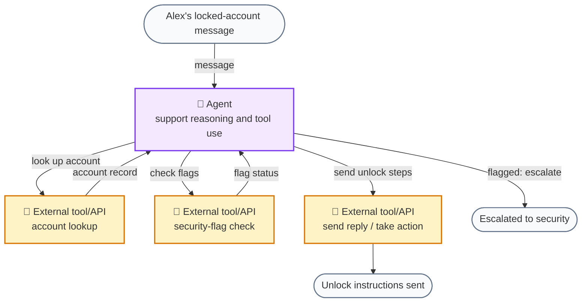
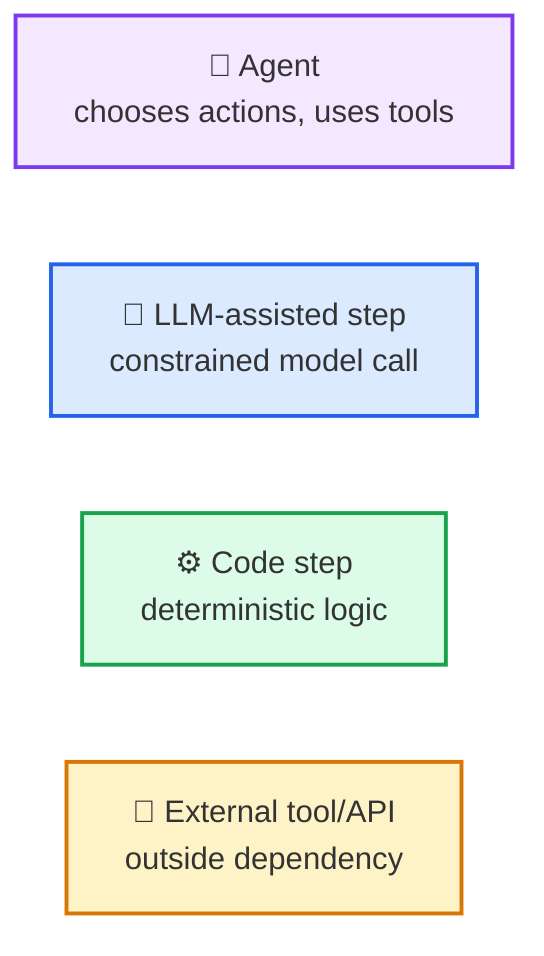
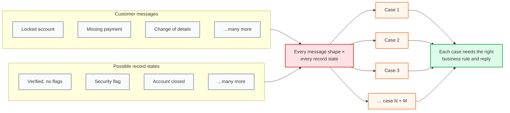
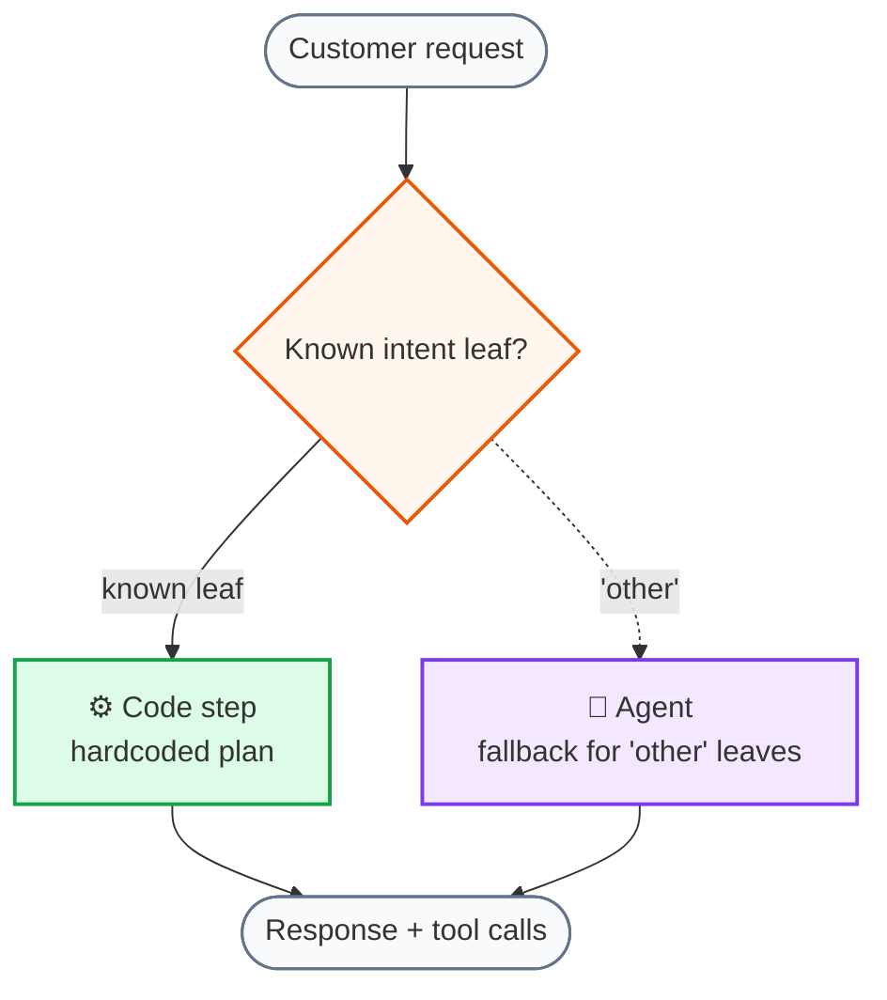
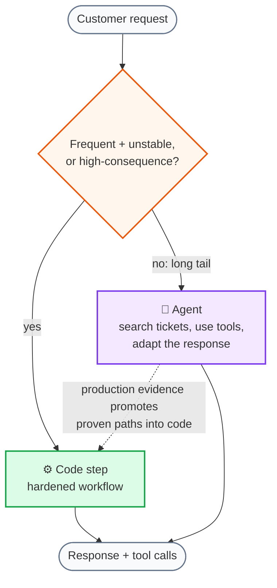

Progress in frontier AI models has allowed coding agents to tackle ever more complex and long-running tasks, and benchmarks are saturating fast.

What makes coding agents so effective is a combination of three things:
1. Software is largely composed of patterns LLMs have seen countless times during training: syntax, idioms, libraries.
2. The [agentic loop](https://www.deeplearning.ai/the-batch/issue-359) provides a tight feedback loop. Looping on results from tests, linters and compiler errors, the agent can handle a wide range of problems without human intervention.
3. These iterations are cheap.

In many benchmarks, coding agents are given nothing but terminal access, like [tbench](https://www.tbench.ai/), and are left to try things, observe results, and loop until the task is done. This is the extreme agentic approach.
But this combination is specific to code. Let's consider the following automation task:

Customers wrote in to our first-level support team at Northstar Bank with messages like this:

> Hi, I'm Alex Carter and I bank with your Riverton branch. My account number is NSB01234 and I can't get in any more; it keeps saying the account is locked. Can you help me get back in?

Point for point, none of the three conditions holds:

1. LLMs haven't seen your internal escalation rules or customer records during training.
2. The AI system has no feedback readily available from a compiler or test suite.
3. Handing account access to the wrong person is very expensive.

Every project like this starts with one decision: how much of the work does the model do, and how much does code do? It gets made early, and it shapes a lot downstream.

Given the three points above, my instinct for business automation has been to lean on workflows and keep the LLM on a short leash.
The first half of this post walks through one clean slice of a support-automation project I worked on and makes that case.
The second half complicates it: across the full system I followed exactly that instinct, built the workflow, and hit its limits.
The problem had far more combinations than any tree I could hardcode. The bottom line is inconclusive.
I hope this project write up helps you find your balance between agentic and workflow approaches in your own work.

The running example is based on a real project, but the details have been changed to protect the client's privacy.

---

## The fully agentic approach

The first design we considered was a single Support Agent with every tool (account lookup, the security-flag check, and the two actions: send unlock instructions, escalate to security) writing the customer's reply itself.

```mermaid
flowchart TD
    INPUT(["Alex's locked-account message"])
    A1["🤖 Agent<br/>support reasoning and tool use"]
    T1["🔌 External tool/API<br/>account lookup"]
    T2["🔌 External tool/API<br/>security-flag check"]
    T3["🔌 External tool/API<br/>send reply / take action"]
    OUT1(["Unlock instructions sent"])
    OUT2(["Escalated to security"])

    INPUT -->|"message"| A1
    A1 -->|"look up account"| T1
    T1 -->|"account record"| A1
    A1 -->|"check flags"| T2
    T2 -->|"flag status"| A1
    A1 -->|"send unlock steps"| T3
    T3 --> OUT1
    A1 -->|"flagged: escalate"| OUT2

    classDef agent fill:#f3e8ff,stroke:#7c3aed,stroke-width:2px
    classDef tool fill:#fef3c7,stroke:#d97706,stroke-width:2px
    classDef terminal fill:#f8fafc,stroke:#64748b,stroke-width:1.5px
    class A1 agent
    class T1,T2,T3 tool
    class INPUT,OUT1,OUT2 terminal
```

The legend:

```mermaid
flowchart LR
    LA["🤖 Agent<br/>chooses actions, uses tools"]
    LL["🧠 LLM-assisted step<br/>constrained model call"]
    LC["⚙️ Code step<br/>deterministic logic"]
    LT["🔌 External tool/API<br/>outside dependency"]

    classDef agent fill:#f3e8ff,stroke:#7c3aed,stroke-width:2px
    classDef llm fill:#dbeafe,stroke:#2563eb,stroke-width:2px
    classDef code fill:#dcfce7,stroke:#16a34a,stroke-width:2px
    classDef tool fill:#fef3c7,stroke:#d97706,stroke-width:2px
    class LA agent
    class LL llm
    class LC code
    class LT tool
```

This looks elegant, but nothing in it guarantees that the agent checks the security flag *before* sending unlock instructions.
That would be an expensive mistake, and a system that decides the order of its own safety checks in free text is exposed to prompt injection.
As the ServiceNow CEO [put it](https://open.spotify.com/episode/11xeL3QCAF77z1vxOp0am0?si=fc70f33f0dd64ab4): people forgive other people for making mistakes. They don't forgive software.

Our more immediate problem was a different one: stakeholders complained that the agent's replies didn't match the established message templates.
We tried to fix that with prompt engineering, but asking an LLM to be reliably deterministic works against its nature.

## We looked at the data

We labelled and clustered roughly 2,300 past tickets with an AI-assisted, iterative process: about 80% fell into a handful of intents.
The long tail was real, but the head of the distribution dominated. This encouraged us to try a workflow approach.

## The workflow approach

To fix both problems, we kept code in charge of the sequencing and reserved the LLM for the *one* genuinely hard part of Alex's message:
interpreting it, recognising that this is an *account-locked* request and pulling out the identifier (the account number, or the name and branch).
Everything after that (the lookup, the flag check, the reply) is deterministic, so code runs the steps in a fixed order and the flag check always happens before any unlock instructions go out.

```mermaid
flowchart TD
    INPUT(["Alex's locked-account message"])
    L1["🧠 LLM-assisted step<br/>recognise intent"]
    L2["🧠 LLM-assisted step<br/>extract identifier"]
    C1["⚙️ Code step<br/>look up the account"]
    T1["🔌 External tool/API<br/>core-banking system"]
    D1{"Security flag<br/>set?"}
    C2["⚙️ Code step<br/>send 'unlock instructions' template"]
    C3["⚙️ Code step<br/>escalate to security team"]
    OUT1(["Unlock instructions sent"])
    OUT2(["Escalated to security"])

    INPUT -->|"message"| L1
    INPUT -->|"message"| L2
    L1 -->|"account_locked"| C1
    L2 -->|"identifier"| C1
    C1 -->|"query"| T1
    T1 -->|"account record + flags"| D1
    D1 -->|"no"| C2
    D1 -->|"yes"| C3
    C2 --> OUT1
    C3 --> OUT2

    classDef llm fill:#dbeafe,stroke:#2563eb,stroke-width:2px
    classDef code fill:#dcfce7,stroke:#16a34a,stroke-width:2px
    classDef tool fill:#fef3c7,stroke:#d97706,stroke-width:2px
    classDef decision fill:#fff7ed,stroke:#ea580c,stroke-width:2px
    classDef terminal fill:#f8fafc,stroke:#64748b,stroke-width:1.5px
    class L1,L2 llm
    class C1,C2,C3 code
    class T1 tool
    class D1 decision
    class INPUT,OUT1,OUT2 terminal
```

For this one intent, the workflow was the clear fit. The lookup, the flag rule, and the two replies have explicit logic and a small state space.
Code makes those rules reliable and auditable, and because code selects the reply, the response matches our established template by construction.
The LLM only bridges human language and structured data.

### Why workflows win for a bounded problem

Once the distribution checks out, code earns its place at almost every step:

- **Use code where code is enough.** The account lookup and flag check rarely change. A robust integration (exponential backoff, error handling, retries) is a one-time investment, and it will be more reliable than an agent working out how to call them on the fly, every time. The same goes for policy: models have seen countless lines of code in training, but they have *not* seen your bank's security rules. "Escalate a flagged account instead of unlocking it" is a hard `if` statement; it cannot be reasoned around, hallucinated, or skipped.
- **Scope the LLM to what only an LLM can do.** Recognising the intent and extracting an identifier from free text is a well-defined task. You can build targeted evals, iterate on the prompt, drop to a cheaper model, or swap the LLM for a Named Entity Recognition model if your vocabulary is bounded enough. None of that is possible once the LLM is entangled with lookup, policy, and messaging.
- **Iteration is targeted and predictable.** When a message is misread or a policy changes, the fix is local: edit the extraction prompt, add a branch, adjust one API call, and you know what the next message of that shape will do. With an agent, your only tool is a system-prompt edit, and you can't predict what it does to the cases that already worked.
- **Auditability comes for free.** Every step after interpretation is ordinary code. You can log it, test it, and trace it exactly like any other software.

## Growing the workflow with a feedback loop

We built the full [four-step pipeline](/post/first-level-support-automation) and ran it in a setup that made iteration cheap. The system went live in **shadow deployment**, where responses were graded by subject-matter experts but never shown to customers, so a wrong answer had almost no blast radius.

We only switched it on once the system looked good enough on historic tickets. We could replay the customer messages, but not the state of the bank's records at the time each ticket was written, so every offline run fetched today's data and graded it against a reply written months earlier.

We had a tight process to translate [external feedback loop](https://www.deeplearning.ai/the-batch/issue-359) into code changes:

1. Subject-matter experts graded a batch of shadow responses and left free-text feedback.
2. I added a comment on what the solution should look like from a technical perspective.
3. Cursor turned each piece of feedback into a fix, usually a new branch in the tree.
4. It added the case to an eval set and re-ran the whole suite.

## 80% was both the target and the problem

We reached an approval rate of 80% on shadow tickets: subject-matter experts judged four out of five generated responses good enough to send.
That was the ballpark we had promised the client, and on paper it was a success.

It did not translate into the cost reduction the client's private-equity owner was underwriting.
An 80% approval rate is not an 80% cut in support effort: nobody can tell in advance which fifth is wrong, so a human still reads all of them.

## The problem wasn't bounded

A handful of recurring intents really did account for most of the volume.
But a *true* workflow needs a deterministic mapping from customer intent plus [fetched data](/post/first-level-support-automation#step-3-fetch) to a helpful reply.

The mapping we were trying to write down is this:

```mermaid
flowchart LR
    subgraph M["Customer messages"]
        M1["Locked account"]
        M2["Missing payment"]
        M3["Change of details"]
        MX["…many more"]
    end

    subgraph S["Possible record states"]
        S1["Verified, no flags"]
        S2["Security flag"]
        S3["Account closed"]
        SX["…many more"]
    end

    PRODUCT["Every message shape ×<br/>every record state"]

    C1["Case 1"]
    C2["Case 2"]
    C3["Case 3"]
    CN["… case N × M"]

    RULES["Each case needs the right<br/>business rule and reply"]

    M --> PRODUCT
    S --> PRODUCT
    PRODUCT --> C1
    PRODUCT --> C2
    PRODUCT --> C3
    PRODUCT --> CN
    C1 --> RULES
    C2 --> RULES
    C3 --> RULES
    CN --> RULES

    classDef input fill:#f8fafc,stroke:#64748b,stroke-width:1.5px
    classDef explosion fill:#fee2e2,stroke:#dc2626,stroke-width:2px
    classDef case fill:#fff7ed,stroke:#ea580c,stroke-width:1.5px
    classDef rule fill:#dcfce7,stroke:#16a34a,stroke-width:2px
    class M1,M2,M3,MX,S1,S2,S3,SX input
    class PRODUCT explosion
    class C1,C2,C3,CN case
    class RULES rule
```

Our response made it worse: we kept splitting each intent into finer sub-intents (the same request, just a more specific template), which grew the tree faster than it covered new cases.

There's an echo of Rich Sutton's [*The Bitter Lesson*](http://www.incompleteideas.net/IncIdeas/BitterLesson.html) here: hand-encoded human knowledge (our intent tree) tends to lose over time to general methods that scale with compute,
and as models get cheaper and better that trade only tilts further toward the agent.

## Bolting an agent onto the tree

Eventually the workflow just wasn't expressive enough, so we bolted an agent onto the tree as a fallback for the `other` leaves it couldn't cover ([the fallback in the plan-generation step](/post/first-level-support-automation#step-4-plan-generation)):

```mermaid
flowchart TD
    INPUT(["Customer request"])
    D{"Known intent leaf?"}
    C["⚙️ Code step<br/>hardcoded plan"]
    A["🤖 Agent<br/>fallback for 'other' leaves"]
    OUT(["Response + tool calls"])

    INPUT --> D
    D -->|"known leaf"| C
    D -.->|"'other'"| A
    C --> OUT
    A --> OUT

    classDef agent fill:#f3e8ff,stroke:#7c3aed,stroke-width:2px
    classDef code fill:#dcfce7,stroke:#16a34a,stroke-width:2px
    classDef decision fill:#fff7ed,stroke:#ea580c,stroke-width:2px
    classDef terminal fill:#f8fafc,stroke:#64748b,stroke-width:1.5px
    class A agent
    class C code
    class D decision
    class INPUT,OUT terminal
```

Code was the default; the agent was the dashed exception, reached only when no hardcoded leaf matched, and it only ever got the scraps the code hadn't reached yet.

## Asking the agent to be a worse workflow

I optimised for what the client *said* he wanted, not what he needed: he wanted replies that matched his templates;
what he needed was a system that resolves his end-customers' issues. So an agent that wrote a clearer, more helpful answer in its own words still "lost",
purely for departing from the template.

## What I would do differently

### Start with the agent

A workflow with an agent bolted onto a few paths still wasn't flexible enough to express every customer inquiry and state. Next time I would invert the order and try the approach from Will Larson's [Building internal agents](https://lethain.com/agents-series/) series: start with the agent. A path graduates into a workflow only once it shows up often and the agent handles it unreliably, or when the action is irreversible enough that you don't want a model deciding it:

```mermaid
flowchart TD
    INPUT(["Customer request"])
    D{"Frequent + unstable,<br/>or high-consequence?"}
    C["⚙️ Code step<br/>hardened workflow"]
    A["🤖 Agent<br/>search tickets, use tools,<br/>adapt the response"]
    OUT(["Response + tool calls"])

    INPUT --> D
    D -->|"yes"| C
    D -->|"no: long tail"| A
    C --> OUT
    A --> OUT
    A -.->|"production evidence promotes<br/>proven paths into code"| C

    classDef agent fill:#f3e8ff,stroke:#7c3aed,stroke-width:2px
    classDef code fill:#dcfce7,stroke:#16a34a,stroke-width:2px
    classDef decision fill:#fff7ed,stroke:#ea580c,stroke-width:2px
    classDef terminal fill:#f8fafc,stroke:#64748b,stroke-width:1.5px
    class A agent
    class C code
    class D decision
    class INPUT,OUT terminal
```

It's the same picture as the one above with the default flipped, and the dashed edge is the whole point: code paths are grown *out of* proven agent behaviour, not assumed up front.

The agentic approach has real caveats, though:

- **Privacy and security are hard to get right.** To be useful on the long tail, the agent needs to draw on historical tickets, which are full of personal data. An agent that retrieves and reasons over them is a far larger exposure surface than a fixed tree.
- **The agent doesn't shrink the problem, it just defers it.** It faces the same product of message and state, and it has to land on the same business rule; all it changes is that nobody has to enumerate the cases in advance. That is a real advantage (enumerating them was exactly where we hit the wall), but it isn't the same as being right more often. Neither I, nor OpenAI, nor Anthropic know how Alex Carter gets back into her account: that knowledge lives inside the bank, not in the training data. The obvious remedy is to ground the agent in resolved historical tickets, but those are full of conflicting, low-quality resolutions, where the tree, for all its gaps, was a single curated source of truth.

### Get into shadow deployment sooner

The first change buys the second one. An agent with a set of tools is much less to build than a tree of intents, plans and templates, so starting agentic is also the shortest path to having *something* in front of graders.

The shadow deployment went live once the offline numbers on historic tickets looked acceptable.
That has it backwards. The offline number was the unreliable one, graded without the records the original human agent actually saw, while shadow deployment
was the only setting where the pipeline ran against real state and was judged on the thing that mattered.

### Invest in the external feedback loop, and don't build it yourself

Look again at the three conditions from the top of this post: a coding agent gets its feedback for free from the compiler and the test suite.
A support system gets none unless you build it. The external loop *is* the missing compiler, and under an agent-first design it's the only thing
that tells you which paths are worth freezing into code. Related reading: [harness engineering](https://openai.com/index/harness-engineering/).

Don't build the whole loop yourself. A narrow review screen for the subject-matter experts is worth writing; the machinery behind it isn't.
Langfuse's annotation queues as the backend, with a thin custom frontend on its API, would have been the better trade. That deserves a post of its own.

Workflow-vs-agent is an empirical question. Build the instrument that can answer it first, whichever side you start on.
