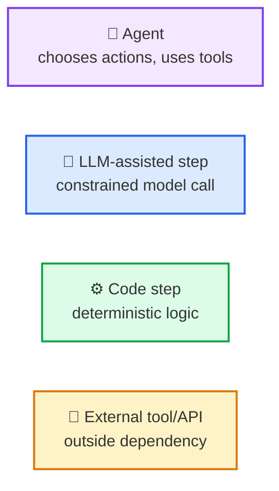

## TL;DR
Automating manual workflows with LLMs is [widely piloted and rarely scaled](https://www.mckinsey.com/capabilities/quantumblack/our-insights/the-state-of-ai). This post is a report from one first-level support automation project.
Main takeaway: Invest in the external feedback loop early to develop in a data-driven way.

## Intro
Progress in frontier AI models has allowed coding agents to tackle ever more complex and long-running tasks, fast enough that benchmarks keep needing to be replaced: [SWE-bench Verified](https://www.swebench.com/verified.html) is close to saturated.

What makes coding agents so effective is a combination of two things:
1. Software is largely composed of patterns LLMs have seen countless times during training: syntax, idioms, libraries.
2. The [agentic loop](https://www.deeplearning.ai/the-batch/issue-359) provides a tight feedback loop. Looping on results from tests, linters and compiler errors, the agent can handle a wide range of problems without human intervention.

In benchmarks like [tbench](https://www.tbench.ai/), that is all the scaffolding an agent gets: a terminal, and permission to loop.
But this combination is specific to code. Let's consider the following automation task:

Customers wrote in to our first-level support team at Northstar Bank with messages like this:

> Hi, I'm Alex Carter and I bank with your Riverton branch. My account number is NSB01234 and I can't get in any more; it keeps saying the account is locked. Can you help me get back in?

Point for point, neither condition holds:

1. LLMs haven't seen your internal escalation rules or customer records during training.
2. There is no compiler or test suite to tell the system whether the reply it wrote was any good. The only verdict available is a human one: someone who knows the bank has to read the reply and judge it.

An early decision in projects like this: how much of the work does the model do, and how much does code do? It shapes a lot downstream. Given both points above, my instinct has been to lean on workflows and keep the LLM on a short leash.

The running example is based on a real project, but the details have been changed to protect the client's privacy.

---

## The fully agentic approach

The first design we considered was a single Support Agent that held every tool — account lookup, security-flag check, send unlock instructions, escalate to security — and wrote the customer's reply itself.

The diagrams in this post use four shapes:

```mermaid
flowchart LR
    LA["🤖 Agent<br/>chooses actions, uses tools"]
    LL["🧠 LLM-assisted step<br/>constrained model call"]
    LC["⚙️ Code step<br/>deterministic logic"]
    LT["🔌 External tool/API<br/>outside dependency"]

    classDef agent fill:#f3e8ff,stroke:#7c3aed,stroke-width:2px
    classDef llm fill:#dbeafe,stroke:#2563eb,stroke-width:2px
    classDef code fill:#dcfce7,stroke:#16a34a,stroke-width:2px
    classDef tool fill:#fef3c7,stroke:#d97706,stroke-width:2px
    class LA agent
    class LL llm
    class LC code
    class LT tool
```

```mermaid
flowchart TD
    INPUT(["Alex's locked-account message"])
    A1["🤖 Agent<br/>support reasoning and tool use"]
    T1["🔌 External tool/API<br/>account lookup"]
    T2["🔌 External tool/API<br/>security-flag check"]
    T3["🔌 External tool/API<br/>send unlock instructions"]
    T4["🔌 External tool/API<br/>escalate to security"]
    OUT1(["Unlock instructions sent"])
    OUT2(["Escalated to security"])

    INPUT -->|"message"| A1
    A1 -->|"look up account"| T1
    T1 -->|"account record"| A1
    A1 -->|"check flags"| T2
    T2 -->|"flag status"| A1
    A1 -->|"send unlock steps"| T3
    T3 --> OUT1
    A1 -->|"flagged: escalate"| T4
    T4 --> OUT2

    classDef agent fill:#f3e8ff,stroke:#7c3aed,stroke-width:2px
    classDef tool fill:#fef3c7,stroke:#d97706,stroke-width:2px
    classDef terminal fill:#f8fafc,stroke:#64748b,stroke-width:1.5px
    class A1 agent
    class T1,T2,T3,T4 tool
    class INPUT,OUT1,OUT2 terminal
```

This looks elegant, but nothing in it guarantees that the agent checks the security flag *before* sending unlock instructions.
That would be an expensive mistake, and a system that decides the order of its own safety checks in free text is exposed to prompt injection.
As the ServiceNow CEO [put it](https://open.spotify.com/episode/11xeL3QCAF77z1vxOp0am0?si=fc70f33f0dd64ab4): people forgive other people for making mistakes. They don't forgive software.

In practice, though, a different complaint drove the decision: stakeholders said the agent's replies didn't match the established message templates.
We tried to fix that with prompt engineering, but asking an LLM to be reliably deterministic works against its nature.

## The workflow approach

We labelled and clustered roughly 2,300 past tickets with an AI-assisted, iterative process. A handful of intents accounted for the large majority of them, which encouraged us to try a workflow.

To get both the ordering guarantee and the fixed templates, we kept code in charge of the sequencing and reserved the LLM for the *one* genuinely hard part of Alex's message:
interpreting it, recognising that this is an *account-locked* request and pulling out the identifier (the account number, or the name and branch).
Everything after that (the lookup, the flag check, the reply) is deterministic, so code runs the steps in a fixed order and the flag check always happens before any unlock instructions go out.

```mermaid
flowchart TD
    INPUT(["Alex's locked-account message"])
    L1["🧠 LLM-assisted step<br/>recognise intent"]
    L2["🧠 LLM-assisted step<br/>extract identifier"]
    C1["⚙️ Code step<br/>look up the account"]
    T1["🔌 External tool/API<br/>core-banking system"]
    D1{"Security flag<br/>set?"}
    C2["⚙️ Code step<br/>send 'unlock instructions' template"]
    C3["⚙️ Code step<br/>escalate to security team"]
    OUT1(["Unlock instructions sent"])
    OUT2(["Escalated to security"])

    INPUT -->|"message"| L1
    INPUT -->|"message"| L2
    L1 -->|"account_locked"| C1
    L2 -->|"identifier"| C1
    C1 -->|"query"| T1
    T1 -->|"account record + flags"| D1
    D1 -->|"no"| C2
    D1 -->|"yes"| C3
    C2 --> OUT1
    C3 --> OUT2

    classDef llm fill:#dbeafe,stroke:#2563eb,stroke-width:2px
    classDef code fill:#dcfce7,stroke:#16a34a,stroke-width:2px
    classDef tool fill:#fef3c7,stroke:#d97706,stroke-width:2px
    classDef decision fill:#fff7ed,stroke:#ea580c,stroke-width:2px
    classDef terminal fill:#f8fafc,stroke:#64748b,stroke-width:1.5px
    class L1,L2 llm
    class C1,C2,C3 code
    class T1 tool
    class D1 decision
    class INPUT,OUT1,OUT2 terminal
```

For this one intent, the workflow was the clear fit: explicit logic, a small state space, and — because code selects the reply — a template that is guaranteed rather than prompted for.

Two consequences :

- **Scope the LLM to what only an LLM can do.** Recognising the intent and extracting an identifier from free text is a well-defined task. You can build targeted evals, iterate on the prompt, drop to a cheaper model, or swap the LLM for a Named Entity Recognition model.
- **Iteration is targeted and predictable.** When a message is misread or a policy changes, the fix is local: edit the extraction prompt, add a branch, adjust one API call, and you know what the next message of that shape will do.

## Growing the workflow with a feedback loop

We built the full [four-step pipeline](/post/first-level-support-automation) and ran it in a setup that made iteration safe. The system went live in **shadow deployment**, where responses were graded by subject-matter experts but never shown to customers, so a wrong answer had little blast radius.

We had a tight process to translate that external feedback into code changes:

1. Subject-matter experts graded a batch of shadow responses and left free-text feedback.
2. I added a comment on what the solution should look like from a technical perspective.
3. Cursor implemented the feedback, usually a new branch in the tree.
4. Cursor added the case to an eval set
5. CI re-ran the eval suite.

Step 1 was the bottleneck: the loop runs on subject-matter expert time — one more item in a day that is
already full, for people who may suspect they are training their own replacement. We were fortunate on both counts: our main point of contact was genuinely enthusiastic and not worried about being automated away, and top-down pressure
from the client's private-equity owner drove up both the quantity and the quality of the feedback.

## The state space wasn't bounded

Each round of feedback landed a new branch, and for a while that worked.
But a *true* workflow needs a deterministic mapping from customer intent plus [fetched data](/post/first-level-support-automation#step-3-fetch) to a helpful reply.

That mapping is a grid: every message shape against every state the record behind it can be in:

| | Verified, no flags | Security flag | Account closed |
|---|---|---|---|
| **Locked account** | Send unlock instructions | Escalate to security | ? |
| **Missing payment** | ? | ? | ? |
| **Change of details** | ? | ? | ? |

Every question mark is a business rule someone has to decide, write down, and keep current. Three intents against three record states leaves seven open cells, and we had many more than three of each.
The fat head we measured was a head in *messages*; the grid is what those messages had to be resolved against.

The template requirement forced the split: a more specific template needs a more specific leaf. So the tree grew faster than it covered cells.

## Bolting an agent onto the tree

Eventually the workflow just wasn't expressive enough, so we bolted an agent onto the tree as a fallback for the `other` leaves it couldn't cover ([the fallback in the plan-generation step](/post/first-level-support-automation#step-4-plan-generation)):

```mermaid
flowchart TD
    INPUT(["Customer request"])
    D{"Known intent leaf?"}
    C["⚙️ Code step<br/>hardcoded plan"]
    A["🤖 Agent<br/>fallback for 'other' leaves"]
    OUT(["Response + tool calls"])

    INPUT --> D
    D -->|"known leaf"| C
    D -.->|"'other'"| A
    C --> OUT
    A --> OUT

    classDef agent fill:#f3e8ff,stroke:#7c3aed,stroke-width:2px
    classDef code fill:#dcfce7,stroke:#16a34a,stroke-width:2px
    classDef decision fill:#fff7ed,stroke:#ea580c,stroke-width:2px
    classDef terminal fill:#f8fafc,stroke:#64748b,stroke-width:1.5px
    class A agent
    class C code
    class D decision
    class INPUT,OUT terminal
```

Code was the default; the agent was the dashed exception, and it only ever got the scraps the code hadn't reached yet.

It was also set up to lose. I optimised for what the client *said* they wanted, not what they needed: replies that matched the established templates,
rather than a system that resolves their end-customers' issues. The graders scored against the templates, so an agent that wrote a clearer,
more helpful answer in its own words still scored badly, purely for departing from one. We were asking the agent to be a worse workflow.

## 80% was both the target and the problem

We reached an approval rate of 80% on shadow tickets: subject-matter experts judged four out of five generated responses good enough to send.
That was the ballpark we had promised the client, and on paper it was a success.

It did not translate into the cost reduction the private-equity owner was underwriting.
An 80% approval rate is not an 80% cut in support effort: nobody can tell in advance which fifth is wrong, so a human still reads all of them.

Volume decided the rest. The ticket queue we were automating ran at roughly a dozen tickets a day, so even a flawless system was competing for a small slice of one person's time, against the cost of building and maintaining it.

## What I would do differently

### Do the arithmetic with the client first

Whether an automation like this pays for itself is an ROI calculation, and it needs realistic parameters before the project starts.

### Start with the agent

Next time I would invert the order and try the approach from Will Larson's [Building internal agents](https://lethain.com/agents-series/) series: start with the agent. A path graduates into a workflow only once it shows up often and the agent handles it unreliably, or when the action is irreversible enough that you don't want a model deciding it.

Picture the diagram above with the default flipped: the agent is the solid path that every request takes, and code is the dashed exception, carved out one hardened branch at a time. That flip is the whole point — code paths are grown *out of* proven agent behaviour, not assumed up front.

The agentic approach has real caveats, though:

- **The agent doesn't shrink the grid, it just spares you enumerating it.** That is a real advantage, since enumerating it was exactly where we hit the wall. But not having to write a cell down is not the same as landing on the right one more often; only the feedback loop settles that, filling the grid with evidence instead of anticipation.
- **The knowledge that fills the grid is the bank's, not the model's.** Neither I, nor OpenAI, nor Anthropic know how Alex Carter gets back into their account. That lives in the bank's rules and its records, not in the training data, and an agent arrives no better informed than the tree did.
- **Grounding in historical tickets is not a clean fix.** The obvious remedy is to point the agent at resolved tickets, but those are full of conflicting, low-quality resolutions. The tree, for all its gaps, was at least a single curated source of truth.
- **Privacy and security are hard to get right.** Those same historical tickets are full of personal data. An agent that retrieves and reasons over them is a far larger exposure surface than a fixed tree.

### Get into shadow deployment sooner

Starting agentic buys this one. An agent with a set of tools is much less to build than a tree of intents, plans and templates, so starting agentic is also the shortest path to having *something* in front of graders.

The shadow deployment went live only once the offline numbers on historic tickets looked acceptable.
That has it backwards. Replaying a historic ticket replays the customer's message, but not the state of the bank's records at the time it was written;
shadow deployment was the only setting where the pipeline ran against real state and was judged on the thing that mattered.
We gated the trustworthy signal behind the untrustworthy one.

### Invest in the external feedback loop, and don't build it yourself

Look again at the two conditions from the top of this post. The second is the one that never resolves itself: a coding agent is handed its verdict, automatically, every time it runs.
A support system has no such verdict unless you build one. The external loop *is* the missing compiler, and under an agent-first design it's the only thing
that tells you which paths are worth freezing into code. Related reading: [harness engineering](https://openai.com/index/harness-engineering/).

Don't build the whole loop yourself. A narrow review screen for the subject-matter experts is worth writing; the machinery behind it isn't.
Langfuse's annotation queues as the backend, with a thin custom frontend on its API, would have been the better trade. That deserves a post of its own.