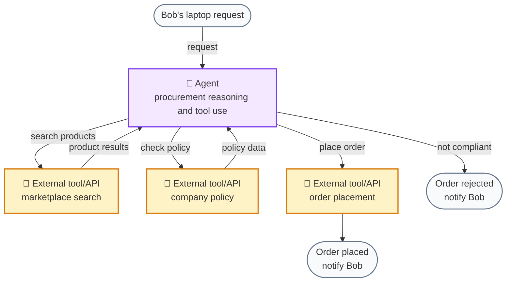
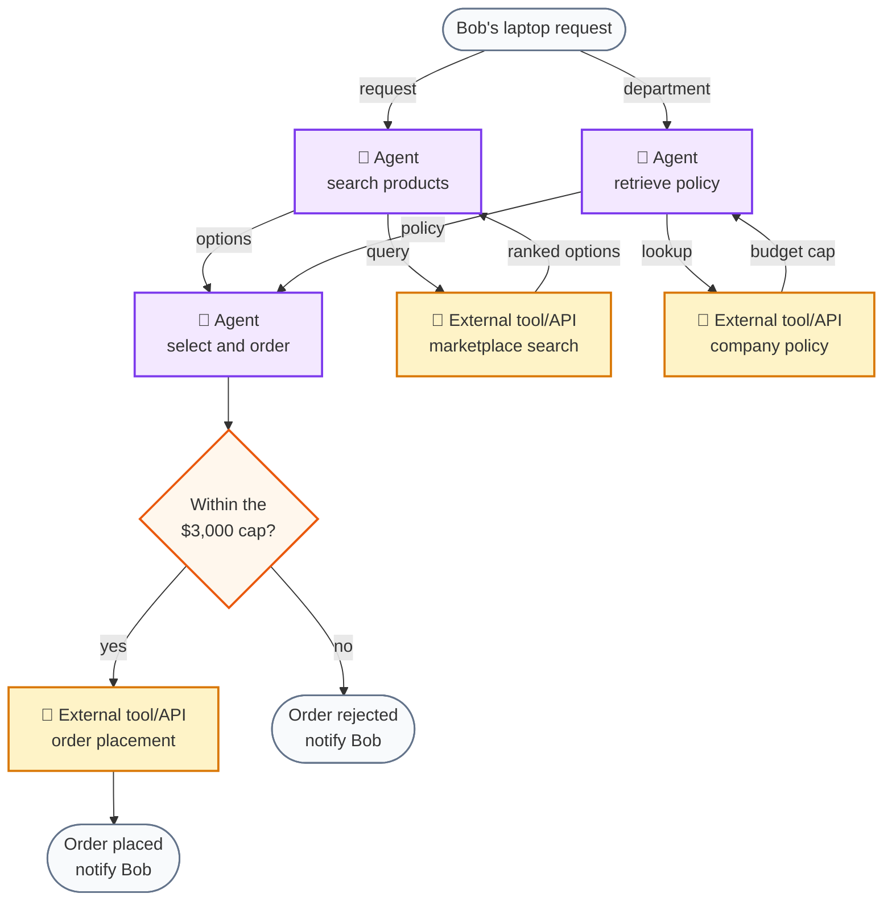
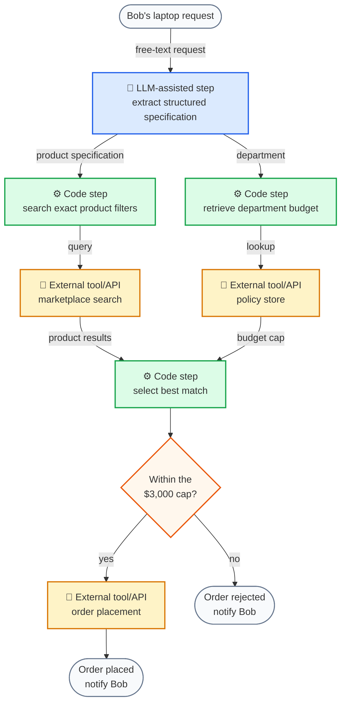

Progress in frontier AI models has allowed coding agents to tackle ever more complex and long-running tasks. Benchmarks are saturating fast, and the trajectory is genuinely impressive.

What makes coding agents so effective is a combination of three things. First, software is largely composed of patterns LLMs have seen countless times during training — syntax, idioms, libraries, algorithms. Second, code gives you *automated evaluation for free*. You run it, and you get a compiler error, a failing test, or a stack trace. The agent doesn't need to know whether it's right — the environment tells it. Third, and most importantly, agents can iterate cheaply. A bad attempt costs a few seconds of compute and nothing irreversible happens. In many benchmarks, coding agents are given nothing but terminal access — like [tbench](https://www.tbench.ai/) — and are left to try things, observe results, and loop until the task is done. That tight feedback loop is what allows them to crack problems that would have seemed out of reach just a year ago.

But this combination — abundant training data, automated feedback, and cheap retries — is specific to code. Most business tasks don't have any of it. There is no compiler for procurement policy. LLMs haven't seen your internal approval chains or vendor contracts during training. And placing a wrong order isn't something you can just undo and retry. To understand what this means in practice, let's walk through a concrete example.

---

## The scenario

Bob from OilVentures sends the following request to his procurement department:

> I need a new laptop for my work. I would like:
> - MacBook Pro
> - M4 Max Chip
> - 16 inch
> - 32GB RAM
> - 1TB Storage
>
> I am working in the finance department. Can you please find the best options for me and make the purchase?

OilVentures, AwesomeMarketplace, Bob, and the request are all fictional.

The procurement department handles requests like this regularly and wants to automate it. Two constraints are relevant:

- **AwesomeMarketplace** (their vendor) requires brand, model, chip, RAM, and storage to filter products.
- **OilVentures policy** caps laptop spend at **$3,000** for the finance department.

We'll look at three ways to automate this.

Across the diagrams, the notation is consistent: **🤖 Agent** means an autonomous component that chooses actions and uses tools; **🧠 LLM-assisted step** means a constrained model call with a defined output; **⚙️ Code step** means deterministic application logic; and **🔌 External tool/API** means a dependency outside the workflow.

---

## 1. The fully agentic approach

A single Procurement Agent gets access to all three tools — marketplace search, company policy, and order placement — and figures out the rest on its own.

```mermaid
flowchart TD
    INPUT(["Bob's laptop request"])
    A1["🤖 Agent<br/>procurement reasoning and tool use"]
    T1["🔌 External tool/API<br/>marketplace search"]
    T2["🔌 External tool/API<br/>company policy"]
    T3["🔌 External tool/API<br/>order placement"]
    OUT1(["Order placed<br/>notify Bob"])
    OUT2(["Order rejected<br/>notify Bob"])

    INPUT -->|"request"| A1
    A1 -->|"search products"| T1
    T1 -->|"product results"| A1
    A1 -->|"check policy"| T2
    T2 -->|"policy data"| A1
    A1 -->|"place order"| T3
    T3 --> OUT1
    A1 -->|"not compliant"| OUT2

    classDef agent fill:#f3e8ff,stroke:#7c3aed,stroke-width:2px
    classDef tool fill:#fef3c7,stroke:#d97706,stroke-width:2px
    classDef terminal fill:#f8fafc,stroke:#64748b,stroke-width:1.5px
    class A1 agent
    class T1,T2,T3 tool
    class INPUT,OUT1,OUT2 terminal
```

This looks elegant, but it has a serious problem: there is no guarantee the agent will check the policy *before* placing the order. It might. It might not. And if it places a non-compliant order, you only find out after the fact. Unlike coding tasks — where a failed test is cheap and reversible — a wrongly submitted purchase order has real consequences. As the ServiceNow CEO [put it](https://open.spotify.com/episode/11xeL3QCAF77z1vxOp0am0?si=fc70f33f0dd64ab4): people forgive other people for making mistakes. They don't forgive software.

---

## 2. The specialised multi-agent approach

Rather than one agent doing everything, we give each task its own dedicated agent with a single tool. Regular code orchestrates the handoffs between them, and Search and Policy agents run in parallel.

```mermaid
flowchart TD
    INPUT(["Bob's laptop request"])
    A1["🤖 Agent<br/>search products"]
    A2["🤖 Agent<br/>retrieve policy"]
    A3["🤖 Agent<br/>select and order"]
    T1["🔌 External tool/API<br/>marketplace search"]
    T2["🔌 External tool/API<br/>company policy"]
    D1{"Within the<br/>$3,000 cap?"}
    T3["🔌 External tool/API<br/>order placement"]
    OUT1(["Order placed<br/>notify Bob"])
    OUT2(["Order rejected<br/>notify Bob"])

    INPUT -->|"request"| A1
    INPUT -->|"department"| A2
    A1 -->|"query"| T1
    T1 -->|"ranked options"| A1
    A2 -->|"lookup"| T2
    T2 -->|"budget cap"| A2
    A1 -->|"options"| A3
    A2 -->|"policy"| A3
    A3 --> D1
    D1 -->|"yes"| T3
    D1 -->|"no"| OUT2
    T3 --> OUT1

    classDef agent fill:#f3e8ff,stroke:#7c3aed,stroke-width:2px
    classDef tool fill:#fef3c7,stroke:#d97706,stroke-width:2px
    classDef decision fill:#fff7ed,stroke:#ea580c,stroke-width:2px
    classDef terminal fill:#f8fafc,stroke:#64748b,stroke-width:1.5px
    class A1,A2,A3 agent
    class T1,T2,T3 tool
    class D1 decision
    class INPUT,OUT1,OUT2 terminal
```

This is better. Each agent has a narrow, well-defined job, and code controls the sequencing — so we know the policy check always happens before the order. But three agent invocations for what is largely a structured task still feels like overkill. The Search and Policy agents are essentially doing retrieval with a thin reasoning wrapper. We're paying the cost of LLM unpredictability where we don't need to.

---

## 3. The hybrid approach: LLM-assisted extraction + code workflow

The key insight is that there is only *one* genuinely hard part of Bob's request: parsing his free-text message into a structured spec the marketplace API can consume. Everything after that — the search, the policy check, the order — can be handled deterministically by regular code.

```mermaid
flowchart TD
    INPUT(["Bob's laptop request"])
    L1["🧠 LLM-assisted step<br/>extract structured specification"]
    C1["⚙️ Code step<br/>search exact product filters"]
    C2["⚙️ Code step<br/>retrieve department budget"]
    T1["🔌 External tool/API<br/>marketplace search"]
    T2["🔌 External tool/API<br/>policy store"]
    C3["⚙️ Code step<br/>select best match"]
    D1{"Within the<br/>$3,000 cap?"}
    T3["🔌 External tool/API<br/>order placement"]
    OUT1(["Order placed<br/>notify Bob"])
    OUT2(["Order rejected<br/>notify Bob"])

    INPUT -->|"free-text request"| L1
    L1 -->|"product specification"| C1
    L1 -->|"department"| C2
    C1 -->|"query"| T1
    T1 -->|"product results"| C3
    C2 -->|"lookup"| T2
    T2 -->|"budget cap"| C3
    C3 --> D1
    D1 -->|"yes"| T3
    D1 -->|"no"| OUT2
    T3 --> OUT1

    classDef llm fill:#dbeafe,stroke:#2563eb,stroke-width:2px
    classDef code fill:#dcfce7,stroke:#16a34a,stroke-width:2px
    classDef tool fill:#fef3c7,stroke:#d97706,stroke-width:2px
    classDef decision fill:#fff7ed,stroke:#ea580c,stroke-width:2px
    classDef terminal fill:#f8fafc,stroke:#64748b,stroke-width:1.5px
    class L1 llm
    class C1,C2,C3 code
    class T1,T2,T3 tool
    class D1 decision
    class INPUT,OUT1,OUT2 terminal
```

For this bounded process, the hybrid is the best fit. Product search, budget lookup, and ordering have explicit rules and a small state space. Code makes those rules reliable and auditable; the LLM only bridges human language and structured data.

### Why workflows still matter

The production lesson below does not invalidate the advantages of workflows. Once an integration or business rule is understood, code can enforce sequencing, retries, and error handling every time. A policy check becomes a hard condition rather than behaviour a model might skip. Deterministic steps are also faster, cheaper, and easier to test and audit.

Scoping the LLM to a narrow task makes evaluation and iteration more precise. When something breaks, you can change the extraction prompt, one branch, or one API call instead of nudging the entire system's behaviour. That predictability is especially valuable for high-consequence actions.

### What the example hides

Our production support system was less tidy. We used an AI-assisted, iterative process to label and analyse roughly 2,300 historical tickets. Most of the volume fell into a handful of broad customer intents, which initially supported the same workflow-first conclusion.

But a concentrated top level did not produce a small workflow. To respond precisely, each broad category had to be split into increasingly specific [sub-intents](/post/first-level-support-automation#step-1-intent-recognition). Reaching an intent leaf was only the beginning: it then combined with the possible [fetch results](/post/first-level-support-automation#step-3-fetch) and customer states. The resulting [plan-generation tree](/post/first-level-support-automation#step-4-plan-generation) became enormous. Every iteration improved known paths, but production kept revealing unseen combinations and more specific intents.

We also tried a more agentic planner. The client relied on about twenty established message templates and expected the system to follow them closely. Given that requirement, deterministic template selection was more reliable than prompt-tuning an LLM to reproduce fixed wording.

That comparison did not give the agent a fair chance. The workflow encoded knowledge extracted from the historical tickets, while the agent could not search those tickets at all. We also evaluated it primarily on template conformity rather than whether a more flexible response could resolve the customer's problem better.

### What I would do differently

In this project, I would give the agentic planner a much better chance before expanding the workflow. I would give it a privacy-safe way to search resolved historical tickets, retrieve relevant examples and templates, and use deterministic business tools. That might have produced a better business outcome on the long tail, even if the responses departed more often from familiar templates.

Templates would be examples unless their exact wording was mandatory. Legal language, policy checks, escalation rules, permissions, and irreversible actions would remain constrained by code; the agent could adapt everything else to the case. I would evaluate correctness, policy compliance, tool use, and resolution quality rather than superficial template conformity.

Then I would use production evidence to decide what to hardcode. Frequent paths and high-consequence decisions would move into workflows; the long tail would remain agentic. This matches the progression described in Will Larson's [Building internal agents](https://lethain.com/agents-series/) series: start with LLM-driven workflows, then introduce code when reliability, speed, or cost requires it.

This is not an argument against workflows. It is an argument about sequencing: use an agent to explore the uncertain space, then turn repeated and high-consequence paths into code.