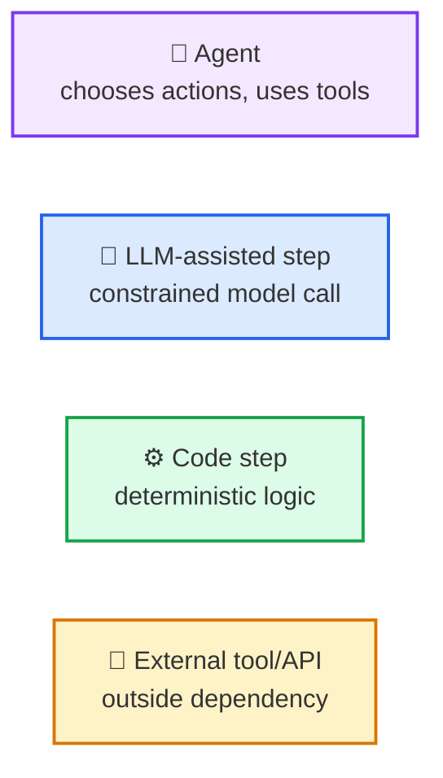
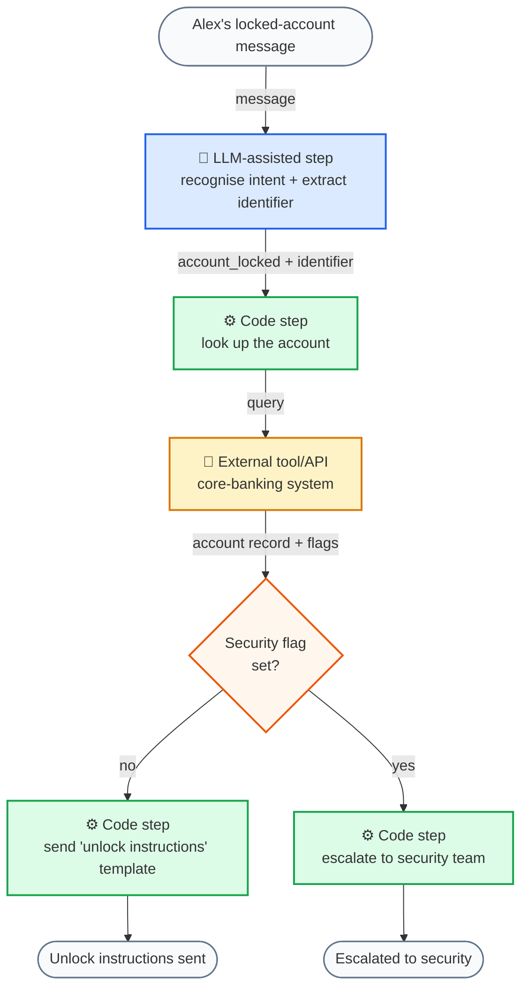

Progress in frontier AI models has allowed coding agents to tackle ever more complex and long-running tasks, and benchmarks are saturating fast.

What makes coding agents so effective is a combination of three things. First, software is largely composed of patterns LLMs have seen countless times during training — syntax, idioms, libraries, algorithms. Second, code gives you *automated evaluation for free*. You run it, and you get a compiler error, a failing test, or a stack trace. The agent doesn't need to know whether it's right — the environment tells it. Third, and most importantly, agents can iterate cheaply. A bad attempt costs a few seconds of compute and nothing irreversible happens. In many benchmarks, coding agents are given nothing but terminal access — like [tbench](https://www.tbench.ai/) — and are left to try things, observe results, and loop until the task is done. That tight [agentic loop](https://www.deeplearning.ai/the-batch/issue-359) is what allows them to crack problems that would have seemed out of reach just a year ago.

But this combination — abundant training data, automated feedback, and cheap retries — is specific to code. Most business tasks don't have any of it. There is no compiler for your bank's security policy. LLMs haven't seen your internal escalation rules or customer records during training. And handing account access to the wrong person isn't something you can just undo and retry.

That difference is why, for business automation, my instinct has been to lean on workflows and keep the LLM on a short leash. The first half of this post walks through one clean slice of a support-automation project I worked on and makes that case. The second half complicates it: across the full system I followed exactly that instinct, built the workflow, and hit its limits — the problem had far more combinations than any tree I could hardcode.

Let's start with the example.

---

## The scenario

*It's a real project; I've changed most of the identifying details.*

Customers wrote in to our first-level support team at Northstar Bank with messages like this:

> Hi, I'm Alex Carter and I bank with your Riverton branch. My account number is NSB01234 and I can't get in any more — it keeps saying the account is locked. Can you help me get back in?

We handled messages like this all day and wanted to automate the reply. Three things mattered:

- **The core-banking system** looks up an account by number (or by name and branch) and returns its status, including any security flags.
- **Bank policy:** if an account carries a fraud or security flag, we must *not* send self-service unlock instructions — we escalate to the security team.
- **We had about twenty reply templates** we'd used for years, including a standard "how to unlock your account" message, and replies were expected to match them.

We looked at two ways to automate it. The diagrams share one notation:

```mermaid
flowchart LR
    LA["🤖 Agent<br/>chooses actions, uses tools"]
    LL["🧠 LLM-assisted step<br/>constrained model call"]
    LC["⚙️ Code step<br/>deterministic logic"]
    LT["🔌 External tool/API<br/>outside dependency"]

    classDef agent fill:#f3e8ff,stroke:#7c3aed,stroke-width:2px
    classDef llm fill:#dbeafe,stroke:#2563eb,stroke-width:2px
    classDef code fill:#dcfce7,stroke:#16a34a,stroke-width:2px
    classDef tool fill:#fef3c7,stroke:#d97706,stroke-width:2px
    class LA agent
    class LL llm
    class LC code
    class LT tool
```

---

## 1. The fully agentic approach

The first design we considered was a single Support Agent with every tool — account lookup, the security-flag check, and the two actions (send unlock instructions, escalate to security) — writing the customer's reply itself.

```mermaid
flowchart TD
    INPUT(["Alex's locked-account message"])
    A1["🤖 Agent<br/>support reasoning and tool use"]
    T1["🔌 External tool/API<br/>account lookup"]
    T2["🔌 External tool/API<br/>security-flag check"]
    T3["🔌 External tool/API<br/>send reply / take action"]
    OUT1(["Unlock instructions sent"])
    OUT2(["Escalated to security"])

    INPUT -->|"message"| A1
    A1 -->|"look up account"| T1
    T1 -->|"account record"| A1
    A1 -->|"check flags"| T2
    T2 -->|"flag status"| A1
    A1 -->|"send unlock steps"| T3
    T3 --> OUT1
    A1 -->|"flagged: escalate"| OUT2

    classDef agent fill:#f3e8ff,stroke:#7c3aed,stroke-width:2px
    classDef tool fill:#fef3c7,stroke:#d97706,stroke-width:2px
    classDef terminal fill:#f8fafc,stroke:#64748b,stroke-width:1.5px
    class A1 agent
    class T1,T2,T3 tool
    class INPUT,OUT1,OUT2 terminal
```

This looks elegant, but it has a serious problem: there is no guarantee the agent checks the security flag *before* sending unlock instructions. It might. It might not. And if it walks a flagged, compromised account through getting back in, you only find out after the fact. Unlike coding tasks — where a failed test is cheap and reversible — handing account access to the wrong person has real consequences.

There is a second, quieter failure mode. The agent composes each reply from scratch, so its wording drifts from the twenty templates we'd used for years. Even when the underlying action is right, a message that doesn't match the established template draws complaints. As the ServiceNow CEO [put it](https://open.spotify.com/episode/11xeL3QCAF77z1vxOp0am0?si=fc70f33f0dd64ab4): people forgive other people for making mistakes. They don't forgive software.

---

## We looked at the data

Before building anything, we labelled and clustered roughly 2,300 past tickets with an AI-assisted, iterative process: about 80% fell into a dozen intents — account access, payments, card services, disputes. The long tail was real, but the head of the distribution dominated, and that is what makes a workflow worth building. (If yours is flat, with every ticket its own snowflake, you have a different problem and probably need a different architecture.)

---

## 2. The workflow approach

Given that structure, we kept code in charge of the sequencing and reserved the LLM for the *one* genuinely hard part of Alex's message: interpreting it — recognising that this is an *account-locked* request and pulling out the identifier (the account number, or the name and branch). Everything after that — the lookup, the flag check, the reply — is deterministic, so code runs the steps in a fixed order and the flag check always happens before any unlock instructions go out.

```mermaid
flowchart TD
    INPUT(["Alex's locked-account message"])
    L1["🧠 LLM-assisted step<br/>recognise intent + extract identifier"]
    C1["⚙️ Code step<br/>look up the account"]
    T1["🔌 External tool/API<br/>core-banking system"]
    D1{"Security flag<br/>set?"}
    C2["⚙️ Code step<br/>send 'unlock instructions' template"]
    C3["⚙️ Code step<br/>escalate to security team"]
    OUT1(["Unlock instructions sent"])
    OUT2(["Escalated to security"])

    INPUT -->|"message"| L1
    L1 -->|"account_locked + identifier"| C1
    C1 -->|"query"| T1
    T1 -->|"account record + flags"| D1
    D1 -->|"no"| C2
    D1 -->|"yes"| C3
    C2 --> OUT1
    C3 --> OUT2

    classDef llm fill:#dbeafe,stroke:#2563eb,stroke-width:2px
    classDef code fill:#dcfce7,stroke:#16a34a,stroke-width:2px
    classDef tool fill:#fef3c7,stroke:#d97706,stroke-width:2px
    classDef decision fill:#fff7ed,stroke:#ea580c,stroke-width:2px
    classDef terminal fill:#f8fafc,stroke:#64748b,stroke-width:1.5px
    class L1 llm
    class C1,C2,C3 code
    class T1 tool
    class D1 decision
    class INPUT,OUT1,OUT2 terminal
```

For this one intent, the hybrid was the clear fit. The lookup, the flag rule, and the two replies have explicit logic and a small state space. Code makes those rules reliable and auditable — and because code selects the reply, the response matches our established template by construction. The LLM only bridges human language and structured data.

### Why workflows win for a bounded problem

Once the distribution checks out, code earns its place at almost every step:

- **Use code where code is enough.** The account lookup and flag check rarely change. A robust integration — exponential backoff, error handling, retries — is a one-time investment, and it will be more reliable than an agent figuring out how to call them on the fly, every time.
- **Scope the LLM to what only an LLM can do.** Recognising the intent and extracting an identifier from free text is a well-defined task. You can build targeted evals, iterate on the prompt, drop to a cheaper model — or swap the LLM for a Named Entity Recognition model if your vocabulary is bounded enough. None of that is possible once the LLM is entangled with lookup, policy, and messaging.
- **Don't ask an LLM to enforce rules it hasn't seen.** Models have seen countless lines of code in training. They have *not* seen your bank's security policy. "Escalate a flagged account instead of unlocking it" is a hard `if` statement — it cannot be reasoned around, hallucinated, or skipped. And because the reply is a fixed template, it matches the established wording every time.
- **Iteration is targeted and predictable.** When a message is misread or a policy changes, the fix is local: edit the extraction prompt, add a branch, adjust one API call — and you know what the next message of that shape will do. With an agent, your only tool is a system-prompt edit, and you can't predict what it does to the cases that already worked.
- **Auditability comes for free.** Every step after interpretation is ordinary code. You can log it, test it, and trace it exactly like any other software.

These advantages are real, and for a bounded intent like this one they are decisive. The trouble starts when the process is not as bounded as a single locked-account ticket makes it look.

## Growing the workflow with a feedback loop

Our production system was messier than a single locked-account ticket, but it started the same way. We did also try a more agentic planner for a while, but its replies kept drifting from those twenty templates and the client noticed — reproducing fixed wording is a deterministic job a workflow does far more reliably. Judged on template conformity, the workflow won easily, so we committed to it and built the [four-step pipeline](/post/first-level-support-automation).

Then we ran it in a setup that made iteration cheap. The system went live in **shadow deployment** — its responses were graded by subject-matter experts but never shown to customers — so a wrong answer had almost no blast radius. That handed me cheap, reversible retries and a graded feedback signal.

But the loop we actually had was not the tight agentic loop coding enjoys; it was an [external feedback loop](https://www.deeplearning.ai/the-batch/issue-359). Production surfaced the cases, experts graded them, and I fed the fixes back in — usually a new DAG branch, added to an eval set and re-run against the whole suite. The trouble is that an external feedback loop is inherently slow: the expert grades arrived days later, so each turn took days, not the seconds-to-minutes a coding agent gets.

## But the problem wasn't bounded

And even that slow loop was fighting a losing battle. The mass really was there: a handful of recurring customer intents accounted for most of the volume. But a *true* workflow needs a deterministic mapping from customer intent plus [fetched data](/post/first-level-support-automation#step-3-fetch) to a helpful response — and to make that mapping precise enough to actually help each customer, we were forced to keep dividing each broad intent into ever more specific [sub-intents](/post/first-level-support-automation#step-1-intent-recognition), then sub-sub-intents. And reaching an intent leaf was only the beginning: each leaf combined with the customer's state, and the resulting [plan-generation tree](/post/first-level-support-automation#step-4-plan-generation) grew enormous. Production kept surfacing paths we hadn't seen: still-more-specific intents, unseen DAG combinations. The head of the distribution was concentrated; the tail was deep — and the tail is where support actually lives.

And notice what that nice loop was actually doing against that tail: using an agent to *extend a hand-coded tree*, one newly-seen path at a time. It made the workflow maintainable; it did not make the problem bounded. Every fix was reactive — a branch added *after* production surfaced a path I hadn't anticipated — so I was always one step behind, growing the tree forever without ever catching up.

There's an echo of Rich Sutton's [*The Bitter Lesson*](http://www.incompleteideas.net/IncIdeas/BitterLesson.html) here: hand-encoded human knowledge — our intent tree — tends to lose over time to general methods that scale with compute, and as models get cheaper and better that trade only tilts further toward the agent.

Eventually the workflow just wasn't expressive enough, so I bolted an agent onto the tree as a fallback for the `other` leaves it couldn't cover ([the fallback in the plan-generation step](/post/first-level-support-automation#step-4-plan-generation)):

```mermaid
flowchart TD
    INPUT(["Customer request"])
    D{"Known intent leaf?"}
    C["⚙️ Code step<br/>hardcoded plan"]
    A["🤖 Agent<br/>fallback for 'other' leaves"]
    OUT(["Response + tool calls"])

    INPUT --> D
    D -->|"known leaf"| C
    D -.->|"'other'"| A
    C --> OUT
    A --> OUT

    classDef agent fill:#f3e8ff,stroke:#7c3aed,stroke-width:2px
    classDef code fill:#dcfce7,stroke:#16a34a,stroke-width:2px
    classDef decision fill:#fff7ed,stroke:#ea580c,stroke-width:2px
    classDef terminal fill:#f8fafc,stroke:#64748b,stroke-width:1.5px
    class A agent
    class C code
    class D decision
    class INPUT,OUT terminal
```

Code was the default; the agent was the dashed exception, reached only when no hardcoded leaf matched — and I let it handle only the scraps the code hadn't reached yet.

## I didn't give the agent a fair chance

Looking back, I never really gave the agent a fair chance — not as that bolted-on fallback, and not in the earlier head-to-head that made us pick the workflow in the first place. That comparison was unfair to the agent, though I didn't see it clearly at the time: I optimised for what the client *said* he wanted instead of what he needed. He wanted responses that matched his templates; what he needed was a system that resolves his end-customers' issues — and those are not the same thing. An agent that wrote a clearer, more helpful answer in its own words still "lost", purely for departing from the template. Part of the job is to give a client what they need, not what they ask for, and here I delivered the latter. In short, we asked the agent to be a worse workflow instead of letting it be a better agent.

## What I would do differently

A workflow with an agent bolted onto a few paths still wasn't flexible enough to express every customer inquiry and state. Next time I would invert the order and try the approach from Will Larson's [Building internal agents](https://lethain.com/agents-series/) series: start with the agent. A path graduates into a workflow only once it shows up often and the agent handles it unreliably — or when the action is irreversible enough that you don't want a model deciding it:

```mermaid
flowchart TD
    INPUT(["Customer request"])
    D{"Frequent + unstable,<br/>or high-consequence?"}
    C["⚙️ Code step<br/>hardened workflow"]
    A["🤖 Agent<br/>search tickets, use tools,<br/>adapt the response"]
    OUT(["Response + tool calls"])

    INPUT --> D
    D -->|"yes"| C
    D -->|"no: long tail"| A
    C --> OUT
    A --> OUT
    A -.->|"production evidence promotes<br/>proven paths into code"| C

    classDef agent fill:#f3e8ff,stroke:#7c3aed,stroke-width:2px
    classDef code fill:#dcfce7,stroke:#16a34a,stroke-width:2px
    classDef decision fill:#fff7ed,stroke:#ea580c,stroke-width:2px
    classDef terminal fill:#f8fafc,stroke:#64748b,stroke-width:1.5px
    class A agent
    class C code
    class D decision
    class INPUT,OUT terminal
```

The dashed edge is the whole point: code paths are grown *out of* proven agent behaviour, not assumed up front.

The agentic approach has real caveats, though:

- **Privacy and security are hard to get right.** To be useful on the long tail, the agent needs to draw on historical tickets — which are full of personal data. An agent that retrieves and reasons over them is a far larger exposure surface than a fixed DAG.
- **The agent doesn't inherently know how to resolve anything.** Neither I, nor OpenAI, nor Anthropic know how Alex Carter gets back into her account — that knowledge lives inside the bank, not in the model's training data, so the agent doesn't know it either. The obvious remedy is to give it the resolved historical tickets to ground its answers. But those tickets are full of conflicting and low-quality resolutions; in the workflow, the DAG was a single, curated source of truth.

So the honest verdict is inconclusive.

The workflow wasn't a mistake — it worked, and it delivered real value. But if I did it again, I'd start from the agent and let production tell me which paths to freeze, not the other way round.