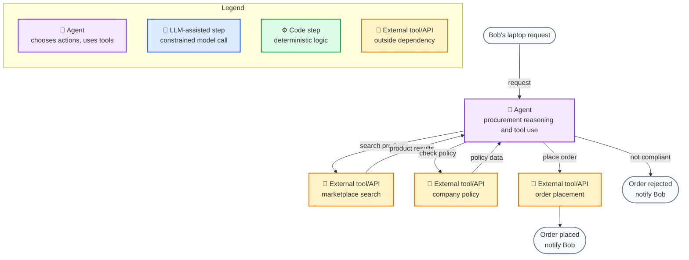

Progress in frontier AI models has allowed coding agents to tackle ever more complex and long-running tasks, and benchmarks are saturating fast.

What makes coding agents so effective is a combination of three things. First, software is largely composed of patterns LLMs have seen countless times during training — syntax, idioms, libraries, algorithms. Second, code gives you *automated evaluation for free*. You run it, and you get a compiler error, a failing test, or a stack trace. The agent doesn't need to know whether it's right — the environment tells it. Third, and most importantly, agents can iterate cheaply. A bad attempt costs a few seconds of compute and nothing irreversible happens. In many benchmarks, coding agents are given nothing but terminal access — like [tbench](https://www.tbench.ai/) — and are left to try things, observe results, and loop until the task is done. That tight feedback loop is what allows them to crack problems that would have seemed out of reach just a year ago.

But this combination — abundant training data, automated feedback, and cheap retries — is specific to code. Most business tasks don't have any of it. There is no compiler for procurement policy. LLMs haven't seen your internal approval chains or vendor contracts during training. And placing a wrong order isn't something you can just undo and retry.

That difference is why, for business automation, my instinct has been to lean on workflows and keep the LLM on a short leash. The first half of this post makes that case with a small, concrete example. The second half complicates it: in a real project I followed exactly that instinct, built the workflow, and hit its limits — the problem had far more combinations than any tree I could hardcode. This is less a verdict on agents *versus* workflows than a story about which one I reached for first, and what I'd try instead next time.

Let's start with the example.

---

## The scenario

Bob from OilVentures sends the following request to his procurement department:

> I need a new laptop for my work. I would like:
> - MacBook Pro
> - M4 Max Chip
> - 16 inch
> - 32GB RAM
> - 1TB Storage
>
> I am working in the finance department. Can you please find the best options for me and make the purchase?

The procurement department handles requests like this regularly and wants to automate it. Two constraints are relevant:

- **AwesomeMarketplace** (their vendor) requires brand, model, chip, RAM, and storage to filter products.
- **OilVentures policy** caps laptop spend at **$3,000** for the finance department.

We'll look at two ways to automate this.

---

## 1. The fully agentic approach

A single Procurement Agent gets access to all three tools — marketplace search, company policy, and order placement — and figures out the rest on its own.

```mermaid
flowchart TD
    subgraph LEGEND["Legend"]
        direction TB
        LA["🤖 Agent<br/>chooses actions, uses tools"]
        LL["🧠 LLM-assisted step<br/>constrained model call"]
        LC["⚙️ Code step<br/>deterministic logic"]
        LT["🔌 External tool/API<br/>outside dependency"]
    end

    INPUT(["Bob's laptop request"])
    A1["🤖 Agent<br/>procurement reasoning and tool use"]
    T1["🔌 External tool/API<br/>marketplace search"]
    T2["🔌 External tool/API<br/>company policy"]
    T3["🔌 External tool/API<br/>order placement"]
    OUT1(["Order placed<br/>notify Bob"])
    OUT2(["Order rejected<br/>notify Bob"])

    INPUT -->|"request"| A1
    A1 -->|"search products"| T1
    T1 -->|"product results"| A1
    A1 -->|"check policy"| T2
    T2 -->|"policy data"| A1
    A1 -->|"place order"| T3
    T3 --> OUT1
    A1 -->|"not compliant"| OUT2

    classDef agent fill:#f3e8ff,stroke:#7c3aed,stroke-width:2px
    classDef llm fill:#dbeafe,stroke:#2563eb,stroke-width:2px
    classDef code fill:#dcfce7,stroke:#16a34a,stroke-width:2px
    classDef tool fill:#fef3c7,stroke:#d97706,stroke-width:2px
    classDef terminal fill:#f8fafc,stroke:#64748b,stroke-width:1.5px
    class LA agent
    class LL llm
    class LC code
    class LT tool
    class A1 agent
    class T1,T2,T3 tool
    class INPUT,OUT1,OUT2 terminal
```

This looks elegant, but it has a serious problem: there is no guarantee the agent will check the policy *before* placing the order. It might. It might not. And if it places a non-compliant order, you only find out after the fact. Unlike coding tasks — where a failed test is cheap and reversible — a wrongly submitted purchase order has real consequences. As the ServiceNow CEO [put it](https://open.spotify.com/episode/11xeL3QCAF77z1vxOp0am0?si=fc70f33f0dd64ab4): people forgive other people for making mistakes. They don't forgive software.

---

## 2. The hybrid approach

The fix is to let code own the sequencing and reserve the LLM for the *one* genuinely hard part of Bob's request: parsing his free-text message into a structured spec the marketplace API can consume. Everything after that — the search, the policy check, the order — can be handled deterministically by regular code, which runs the steps in a fixed order so the policy check always happens before the order.

```mermaid
flowchart TD
    INPUT(["Bob's laptop request"])
    L1["🧠 LLM-assisted step<br/>extract structured specification"]
    C1["⚙️ Code step<br/>search exact product filters"]
    C2["⚙️ Code step<br/>retrieve department budget"]
    T1["🔌 External tool/API<br/>marketplace search"]
    T2["🔌 External tool/API<br/>policy store"]
    C3["⚙️ Code step<br/>select best match"]
    D1{"Within the<br/>$3,000 cap?"}
    T3["🔌 External tool/API<br/>order placement"]
    OUT1(["Order placed<br/>notify Bob"])
    OUT2(["Order rejected<br/>notify Bob"])

    INPUT -->|"free-text request"| L1
    L1 -->|"product specification"| C1
    L1 -->|"department"| C2
    C1 -->|"query"| T1
    T1 -->|"product results"| C3
    C2 -->|"lookup"| T2
    T2 -->|"budget cap"| C3
    C3 --> D1
    D1 -->|"yes"| T3
    D1 -->|"no"| OUT2
    T3 --> OUT1

    classDef llm fill:#dbeafe,stroke:#2563eb,stroke-width:2px
    classDef code fill:#dcfce7,stroke:#16a34a,stroke-width:2px
    classDef tool fill:#fef3c7,stroke:#d97706,stroke-width:2px
    classDef decision fill:#fff7ed,stroke:#ea580c,stroke-width:2px
    classDef terminal fill:#f8fafc,stroke:#64748b,stroke-width:1.5px
    class L1 llm
    class C1,C2,C3 code
    class T1,T2,T3 tool
    class D1 decision
    class INPUT,OUT1,OUT2 terminal
```

For this bounded process, the hybrid is the best fit. Product search, budget lookup, and ordering have explicit rules and a small state space. Code makes those rules reliable and auditable; the LLM only bridges human language and structured data.

### Verify the distribution before you design

Why isn't every request like Bob's a unique snowflake? Because real business processes rarely are. Take a sample of past procurement requests, ask a small LLM to bucket them into a few intent categories — laptops with specs, peripherals, software licences, replacement orders, vendor onboarding — and the vast majority usually fall into a handful of buckets. The long tail is real, but the head of the distribution dominates.

This isn't an assumption; it's something you verify empirically before designing the system. Cluster a few hundred historical requests and look at the coverage. If 80% of your traffic falls into a dozen well-defined intents, the hybrid approach is on solid ground. If your distribution is genuinely flat — every request its own snowflake — you have a different problem, and probably need a different architecture. Skipping this check is how teams end up building agentic monoliths for tasks that turn out to be 90% structured.

### Why workflows win for a bounded problem

Once the distribution checks out, code earns its place at almost every step:

- **Use code where code is enough.** The marketplace search and policy lookup rarely change. A robust integration — exponential backoff, error handling, retries — is a one-time investment, and it will be more reliable than an agent figuring out how to call them on the fly, every time.
- **Scope the LLM to what only an LLM can do.** Extracting a structured spec from free text is a well-defined task. You can build targeted evals, iterate on the prompt, drop to a cheaper model — or swap the LLM for a Named Entity Recognition model if your vocabulary is bounded enough. None of that is possible once the LLM is entangled with search, policy, and ordering.
- **Don't ask an LLM to enforce rules it hasn't seen.** Models have seen countless lines of code in training. They have *not* seen your procurement policy or vendor contracts. A budget cap is a hard `if` statement. It cannot be reasoned around, hallucinated, or skipped.
- **Iteration is targeted and predictable.** When a request is misread or a policy changes, the fix is local: edit the extraction prompt, add a branch, adjust one API call — and you know what the next request of that shape will do. With an agent, your only tool is a system-prompt edit, and you can't predict what it does to the cases that already worked.
- **Auditability comes for free.** Every step after extraction is ordinary code. You can log it, test it, and trace it exactly like any other software.

These advantages are real, and for a bounded process like Bob's they are decisive. The trouble starts when the process is not as bounded as the toy example makes it look.

## Choosing the workflow

Our production support system was messier than Bob's laptop order, but it started the same way. We labelled and analysed roughly 2,300 historical tickets with an AI-assisted, iterative process, and the distribution behaved exactly as the theory predicts: most of the volume fell into a handful of broad customer intents. That looked like a green light for the workflow.

We did also try a more agentic planner for a while. But the client relied on about twenty established message templates and complained whenever a response didn't match them — and reproducing fixed wording is a deterministic job a workflow does far more reliably than an agent. Judged on template conformity, the workflow won easily, so we committed to it and built the [four-step pipeline](/post/first-level-support-automation).

## Growing the workflow with an agentic loop

Then we ran it in a way that, in hindsight, recreated the very conditions the intro says business problems lack. The system went live in **shadow deployment** — its responses were graded by subject-matter experts but never shown to customers — so a wrong answer had almost no blast radius. That handed me two of the three ingredients coding agents rely on: cheap, reversible retries and an automated signal.

On top of that I ran an [agentic loop](https://www.deeplearning.ai/the-batch/issue-359) — an instance of what Andrew Ng calls the *agentic coding loop*. It pulled the experts' free-text feedback, implemented the fix (usually a new DAG branch), added the case to an eval set, and re-ran the whole suite against it. Building the workflow had itself become an ideal task for an agent, and for a while it felt like the system was converging.

## But the problem wasn't bounded

That sense of convergence was an illusion. The mass really was there: a handful of recurring customer intents accounted for most of the volume. But a *true* workflow needs a deterministic mapping from customer intent plus [fetched data](/post/first-level-support-automation#step-3-fetch) to a helpful response — and to make that mapping precise enough to actually help each customer, we were forced to keep dividing each broad intent into ever more specific [sub-intents](/post/first-level-support-automation#step-1-intent-recognition), then sub-sub-intents. And reaching an intent leaf was only the beginning: each leaf combined with the customer's state, and the resulting [plan-generation tree](/post/first-level-support-automation#step-4-plan-generation) grew enormous. Production kept surfacing paths we hadn't seen: still-more-specific intents, unseen DAG combinations. The head of the distribution was concentrated; the tail was deep — and the tail is where support actually lives.

And notice what my nice loop was actually doing against that tail: using an agent to *extend a hand-coded tree*, one newly-seen path at a time. It made the workflow maintainable; it did not make the problem bounded. Every fix was reactive — a branch added *after* production surfaced a path I hadn't anticipated — so I was always one step behind, growing the tree forever without ever catching up.

Eventually the workflow just wasn't expressive enough, so I bolted an agent onto the tree as a fallback for the `other` leaves it couldn't cover ([the fallback in the plan-generation step](/post/first-level-support-automation#step-4-plan-generation)):

```mermaid
flowchart TD
    INPUT(["Customer request"])
    D{"Known intent leaf?"}
    C["⚙️ Code step<br/>hardcoded plan"]
    A["🤖 Agent<br/>fallback for 'other' leaves"]
    OUT(["Response + tool calls"])

    INPUT --> D
    D -->|"known leaf"| C
    D -.->|"'other'"| A
    C --> OUT
    A --> OUT

    classDef agent fill:#f3e8ff,stroke:#7c3aed,stroke-width:2px
    classDef code fill:#dcfce7,stroke:#16a34a,stroke-width:2px
    classDef decision fill:#fff7ed,stroke:#ea580c,stroke-width:2px
    classDef terminal fill:#f8fafc,stroke:#64748b,stroke-width:1.5px
    class A agent
    class C code
    class D decision
    class INPUT,OUT terminal
```

Code was the default; the agent was the dashed exception, reached only when no hardcoded leaf matched — and I let it handle only the scraps the code hadn't reached yet.

## I didn't give the agent a fair chance

Looking back, I never really gave the agent a fair chance — not as that bolted-on fallback, and not in the earlier head-to-head that made us pick the workflow in the first place. That comparison was unfair to the agent in two ways, though I didn't see it clearly at the time. First, the workflow had a built-in head start: we had constructed its intent tree by analysing thousands of historical tickets, so all of that knowledge was already baked into the code — while the agent was never given access to those tickets to search. Second, and worse, I optimised for what the client *said* he wanted instead of what he needed. He wanted responses that matched his templates; what he needed was a system that resolves his end-customers' issues — and those are not the same thing. An agent that wrote a clearer, more helpful answer in its own words still "lost", purely for departing from the template. Part of the job is to give a client what they need, not what they ask for, and here I delivered the latter. In short, we asked the agent to be a worse workflow instead of letting it be a better agent.

## The bitter lesson

Rich Sutton's [*The Bitter Lesson*](http://www.incompleteideas.net/IncIdeas/BitterLesson.html) (2019) argues that, across the history of AI, general methods that scale with computation — search and learning — keep beating systems that carefully encode human knowledge. The hand-built structure feels good and wins in the short run; the general method wins as compute grows.

Our enormous intent-and-plan tree is exactly the kind of hand-encoded human knowledge Sutton warns about. Every hardcoded branch was a bet that we could enumerate the world faster than the world could surprise us — and on the long tail, we kept losing that bet. The agentic alternative, given the ability to search resolved tickets and reason over them, is the general method: it leverages retrieval and model capability instead of our hand-drawn DAG. As models get cheaper and better, that side of the trade keeps getting stronger. Betting everything on the tree may have been betting against the trend.

## What I would do differently

A workflow with an agent bolted onto a few paths still wasn't flexible enough to express every customer inquiry and state. Next time I would invert the order and try the approach from Will Larson's [Building internal agents](https://lethain.com/agents-series/) series: start with the agent. A path graduates into a workflow only once it shows up often and the agent handles it unreliably — or when the action is irreversible enough that you don't want a model deciding it:

```mermaid
flowchart TD
    INPUT(["Customer request"])
    D{"Frequent + unstable,<br/>or high-consequence?"}
    C["⚙️ Code step<br/>hardened workflow"]
    A["🤖 Agent<br/>search tickets, use tools,<br/>adapt the response"]
    OUT(["Response + tool calls"])

    INPUT --> D
    D -->|"yes"| C
    D -->|"no: long tail"| A
    C --> OUT
    A --> OUT
    A -.->|"production evidence promotes<br/>proven paths into code"| C

    classDef agent fill:#f3e8ff,stroke:#7c3aed,stroke-width:2px
    classDef code fill:#dcfce7,stroke:#16a34a,stroke-width:2px
    classDef decision fill:#fff7ed,stroke:#ea580c,stroke-width:2px
    classDef terminal fill:#f8fafc,stroke:#64748b,stroke-width:1.5px
    class A agent
    class C code
    class D decision
    class INPUT,OUT terminal
```

The dashed edge is the whole point: code paths are grown *out of* proven agent behaviour, not assumed up front.

To make the agent good on the long tail, I would give it access to the resolved historical tickets to ground its answers. I'm genuinely unsure that would work, for two reasons. First, privacy and security are very hard to get right: those tickets are full of personal data, and an agent that retrieves and reasons over them is a far larger exposure surface than a fixed DAG. Second, the tickets are stale — leaning on them might nudge the agent toward outdated answers rather than better ones. So the honest verdict is inconclusive.

The workflow wasn't a mistake — it worked, and it delivered real value. But if I did it again, I'd start from the agent and let production tell me which paths to freeze, not the other way round.